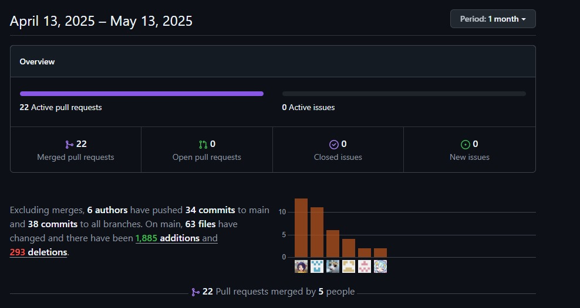

# Universidad Peruana De Ciencas Aplicadas
## 1ASI0572 Desarrollo de Soluciones IoT
### INGENIERÍA DE SOFTWARE

 </img> 

# Informe Trabajo Final
## Docente: Marco Antonio León Baca
## Startup: GlucoTeam
## Producto: Glucova
## Integrantes 

 
 

* **Maria Alejandra Díaz Villacrez  U202118315**
* **Jose Daniel Mario Calderon Huaman    U202213076**
* **Jair Andreé Coraje Bayona    U202118775** 
* **Stefano Alessandro Valenzuela Vallejos    U202214695**
* **Jeremi Jose Antonio Fretel   U202219022**

### Abril 2025
### Ciclo: 2025 - 10
### NRC: 1ASI0572

---

 

## Registro de Versiones del Informe

| Versión | Fecha      | Autor                                                                          | Descripción de modificación                                                                                      |
|---------|------------|--------------------------------------------------------------------------------|------------------------------------------------------------------------------------------------------------------|
| 1.0     | 04/04/2025 | Maria Alejandra Díaz Villacrez                                                            | Se creo la ramificación del repositorio y se adicionó los documentos en su versión inicial previa a la investigacón |
| 1.1    | 04/05/2025 | Maria Alejandra Díaz Villacrez   Jose Daniel Mario Calderon Huaman   Jair Andreé Coraje Bayona   Stefano Alessandro Valenzuela Vallejos   Jeremi Jose Antonio Fretel  Díaz                                                                | Se comienza la redaccion de los capitulos para el entragable parcial |
| 1.2    | 14/05/2025 | Maria Alejandra Díaz Villacrez   Jose Daniel Mario Calderon Huaman   Jair Andreé Coraje Bayona   Stefano Alessandro Valenzuela Vallejos   Jeremi Jose Antonio Fretel  Díaz                                                                | Se hace el despliegue del desarrollo del Frontend y Landing Page.|
| 1.3    | 14/05/2025 | Maria Alejandra Díaz Villacrez   Jose Daniel Mario Calderon Huaman   Jair Andreé Coraje Bayona   Stefano Alessandro Valenzuela Vallejos   Jeremi Jose Antonio Fretel  Díaz                                                                | Se hace el desarrollo del capitulo V de UX/UI. |
| 1.4    | 14/05/2025 | Maria Alejandra Díaz Villacrez   Jose Daniel Mario Calderon Huaman   Jair Andreé Coraje Bayona   Stefano Alessandro Valenzuela Vallejos   Jeremi Jose Antonio Fretel  Díaz                                                                | Se hace termino a la arquitectura del sistema (C4 Diagrams). |
| 1.5    | 07/06/2025 | Maria Alejandra Díaz Villacrez   Jose Daniel Mario Calderon Huaman   Jair Andreé Coraje Bayona   Stefano Alessandro Valenzuela Vallejos   Jeremi Jose Antonio Fretel  Díaz                                                                | Se comenzó la redacción del sprint 2 para el entregable TB2. | 
|1.5    | 06/07/2025 | Maria Alejandra Díaz Villacrez   Jose Daniel Mario Calderon Huaman   Jair Andreé Coraje Bayona   Stefano Alessandro Valenzuela Vallejos   Jeremi Jose Antonio Fretel  Díaz                                                                | Se completo el Sprint 3 para dar finalización al proyecto. |

### Project Report Collaboration Insights

URL del repositorio para el reporte del proyecto: https://github.com/GlucoTeam-IoT/project-report

Github Collaboration Insights proporciona un cronograma que muestra las principales ramas y los procesos de fusión que han ocurrido. Todas las ramas se han generado siguiendo los principios de GitFlow, lo que garantiza una organización efectiva al utilizar un sistema de control de versiones.

- Maria Alejandra Díaz Villacrez (alehandraxx)
- Jose Daniel Mario Calderon Huaman (drkdevv1)
- Jeremi Jose Antonio Fretel (JeremiJose)
- Jair Andreé Coraje Bayona (Jair365)
- Stefano Alessandro Valenzuela Vallejos (AlessandroUPC)

Se divieron las siguientes ramas para la colaboración en el proyecto:

- main
- develop

#### Entregable TP1

A continuación se presentan los gráficos de colaboración de los integrantes del equipo en el repositorio de nuestro 
primer sprint. Estos gráficos ofrecen una representación visual de la cantidad de contribuciones realizadas por cada
miembro del equipo, junto con la fecha en que se llevaron a cabo. Además, se presenta información sobre la cantidad de 
líneas de código que se han modificado en cada uno de los commits.

#### Entregable TB2

## Contenido 

1. [Capítulo I: Introducción](docs/chapter-I.md#capítulo-i-introducción)

    1.1. [Startup Profile](docs/chapter-I.md#11-startup-profile)

    1.1.1. [Descripción de la Startup](docs/chapter-I.md#111-descripción-de-la-startup)

    1.1.2. [Perfiles de integrantes del equipo](docs/chapter-I.md#112-perfiles-de-integrantes-del-equipo)

    1.2. [Solution Profile](docs/chapter-I.md#12-solution-profile)

    1.2.1. [Antecedentes y problemática](docs/chapter-I.md#121-antecedentes-y-problemática)

    1.2.2. [Lean UX Process](docs/chapter-I.md#122-lean-ux-process)

    1.2.2.1. [Lean UX Problem Statements](docs/chapter-I.md#1221-lean-ux-problem-statements)
     
    1.2.2.2. [Lean UX Assumptions](docs/chapter-I.md#1222-lean-ux-assumptions)   

    1.2.2.3. [Lean UX Hypothesis Statements](docs/chapter-I.md#1223-lean-ux-hypothesis-statements)

    1.2.2.4. [Lean UX Canvas](docs/chapter-I.md#1224-lean-ux-canvas)

    1.3. [Segmentos Objetivo](docs/chapter-I.md#13-segmentos-objetivos)

2. [Capítulo II: Requirements Elicitation & Analysis](docs/chapter-II.md#capítulo-ii-requirements-elicitation--analysis)
   
    2.1. [Competidores](docs/chapter-II.md#21-competidores)
    
    2.1.1. [Análisis competitivo](docs/chapter-II.md#211-análisis-competitivo)
   
    2.1.2. [Estrategias y tácticas frente a competidores](docs/chapter-II.md#212-estrategias-y-tácticas-frente-a-competidores)
   
    2.2. [Entrevistas](docs/chapter-II.md#22-entrevistas)
   
    2.2.1. [Diseño de entrevistas](docs/chapter-II.md#221-diseño-de-entrevistas)
   
    2.2.2. [Registro de entrevistas](docs/chapter-II.md#222-registro-de-entrevistas)
   
    2.2.3. [Análisis de entrevistas](docs/chapter-II.md#223-análisis-de-entrevistas)
    
    2.3. [Needfinding](docs/chapter-II.md#23-needfinding)
    
    2.3.1. [User Personas](docs/chapter-II.md#231-user-personas)
    
    2.3.2. [User Task Matrix](docs/chapter-II.md#232-user-task-matrix)
    
    2.3.3. [User Journey Mapping](docs/chapter-II.md#233-user-journey-mapping)
    
    2.3.5. [As-is Scenario Mapping](docs/chapter-II.md#235-as-is-scenario-mapping)
    
    2.4. [Ubiquitous Language](docs/chapter-II.md#24-ubiquitous-language)

3. [Capítulo III: Requirements Specification](docs/chapter-III.md#capítulo-iii-requirements-specification)

    3.1. [To-Be Scenario Mapping](docs/chapter-III.md#31-to-be-scenario-mapping)

    3.2. [User Stories](docs/chapter-III.md#32-user-stories)
   
    3.3. [Impact Mapping](docs/chapter-III.md#33-impact-mapping)
   
    3.4. [Product Backlog](docs/chapter-III.md#34-product-backlog)

4. [Capítulo IV: Solution Software Design](docs/chapter-IV.md#capítulo-iv-solution-software-design)

    4.1. [Strategic-Level Domain-Driven Design](docs/chapter-IV.md#41-strategic-level-domain-driven-design)

    4.1.1. [EventStorming](docs/chapter-IV.md#411-eventstorming)

    4.1.1.1. [Candidate Context Discovery](docs/chapter-IV.md#4111-candidate-context-discovery)

    4.1.1.2. [Domain Message Flows Modeling](docs/chapter-IV.md#4112-domain-message-flows-modeling)

    4.1.1.3. [Bounded Context Canvases](docs/chapter-IV.md#4113-bounded-context-canvases)

    4.1.2. [Context Mapping](docs/chapter-IV.md#412-context-mapping)

    4.1.3. [Software Architecture](docs/chapter-IV.md#413-software-architecture)

    4.1.3.1. [Software Architecture System Landscape Diagram](docs/chapter-IV.md#4131-software-architecture-system-landscape-diagram)

    4.1.3.2. [Software Architecture Context Level Diagrams](docs/chapter-IV.md#4132-software-architecture-context-level-diagrams)

    4.1.3.3. [Software Architecture Container Level Diagrams](docs/chapter-IV.md#4133-software-architecture-container-level-diagrams)

    4.1.3.4. [Software Architecture Deployment Diagrams](docs/chapter-IV.md#4134-software-architecture-deployment-diagrams)

    4.2. [Tactical-Level Domain-Driven Design](docs/chapter-IV.md#42-tactical-level-domain-driven-design)

    4.2.1. [Bounded Context](docs/chapter-IV.md#421-bounded-context)

    4.2.1.1. [Domain Layer](docs/chapter-IV.md#4211-domain-layer)

    4.2.1.2. [Interface Layer](docs/chapter-IV.md#4212-interface-layer)

    4.2.1.3. [Application Layer](docs/chapter-IV.md#4213-application-layer)

    4.2.1.4. [Infrastructure Layer](docs/chapter-IV.md#4214-infrastructure-layer)

    4.2.1.5. [Bounded Context Software Architecture Component Level Diagrams](docs/chapter-IV.md#4215-bounded-context-software-architecture-component-level-diagrams)

    4.2.1.6. [Bounded Context Software Architecture Code Level Diagrams](docs/chapter-IV.md#4216-bounded-context-software-architecture-code-level-diagrams)

    4.2.1.6.1. [Bounded Context Domain Layer Class Diagrams](docs/chapter-IV.md#42161-bounded-context-domain-layer-class-diagrams)

    4.2.1.6.2. [Bounded Context Database Design Diagram](docs/chapter-IV.md#42162-bounded-context-database-design-diagram)

5. [Capítulo V: Solution UI/UX Design](docs/chapter-V.md#capítulo-v-solution-uiux-design)

    5.1. [Style Guidelines](docs/chapter-V.md#51-style-guidelines)
    
    5.1.1. [General Style Guidelines](docs/chapter-V.md#511-general-style-guidelines)
    
    5.1.2. [Web, Mobile and IoT Style Guidelines](docs/chapter-V.md#512-web-mobile-and-iot-style-guidelines)
    
    5.2. [Information Architecture](docs/chapter-V.md#52-information-architecture)
    
    5.2.1. [Organization Systems](docs/chapter-V.md#521-organization-systems)
    
    5.2.2. [Labeling Systems](docs/chapter-V.md#522-labeling-systems)
    
    5.2.3. [SEO Tags and Meta Tags](docs/chapter-V.md#523-seo-tags-and-meta-tags)
    
    5.2.4. [Searching Systems](docs/chapter-V.md#524-searching-systems)
    
    5.2.5. [Navigation Systems](docs/chapter-V.md#525-navigation-systems)
    
    5.3. [Landing Page UI Design](docs/chapter-V.md#53-landing-page-ui-design)
    
    5.3.1. [Landing Page Wireframe](docs/chapter-V.md#531-landing-page-wireframe)
    
    5.3.2. [Landing Page Mock-up](docs/chapter-V.md#532-landing-page-mock-up)
    
    5.4. [Applications UX/UI Design](docs/chapter-V.md#54-applications-uxui-design)
    
    5.4.1. [Applications Wireframes](docs/chapter-V.md#541-applications-wireframes)
    
    5.4.2. [Applications Wireflow Diagrams](docs/chapter-V.md#542-applications-wireflow-diagrams)
    
    5.4.3. [Applications Mock-ups](docs/chapter-V.md#543-applications-mock-ups)
    
    5.4.4. [Applications User Flow Diagrams](docs/chapter-V.md#544-applications-user-flow-diagrams)
    
    5.5. [Applications Prototyping](docs/chapter-V.md#55-applications-prototyping)

6. [Capítulo VI: Product Implementation, Validation & Deployment](docs/chapter-VI.md#capítulo-vi-product-implementation-validation--deployment)

    6.1. [Software Configuration Management](docs/chapter-VI.md#61-software-configuration-management)

    6.1.1. [Software Development Environment Configuration](docs/chapter-VI.md#611-software-development-environment-configuration)

    6.1.2. [Source Code Management](docs/chapter-VI.md#612-source-code-management)

    6.1.3. [Source Code Style Guide & Conventions](docs/chapter-VI.md#613-source-code-style-guide--conventions)

    6.1.4. [Software Deployment Configuration](docs/chapter-VI.md#614-software-deployment-configuration)

    6.2. [Landing Page, Services & Applications Implementation](docs/chapter-VI.md#62-landing-page-services--applications-implementation)

    6.2.1. [Sprint 1](docs/chapter-VI.md#621-sprint-1)

    6.2.1.1. [Sprint Planning 1](docs/chapter-VI.md#6211-sprint-planning-1)

    6.2.1.2. [Aspect Leaders and Collaborators](docs/chapter-VI.md#6212-aspect-leaders-and-collaborators)

    6.2.1.3. [Sprint Backlog 1](docs/chapter-VI.md#6213-sprint-backlog-1)

    6.2.1.4. [Development Evidence for Sprint Review](docs/chapter-VI.md#6214-development-evidence-for-sprint-review)

    6.2.1.5. [Testing Suite Evidence for Sprint Review](docs/chapter-VI.md#6215-testing-suite-evidence-for-sprint-review)

    6.2.1.6. [Execution Evidence for Sprint Review](docs/chapter-VI.md#6216-execution-evidence-for-sprint-review)

    6.2.1.7. [Services Documentation Evidence for Sprint Review](docs/chapter-VI.md#6217-services-documentation-evidence-for-sprint-review)

    6.2.1.8. [Software Deployment Evidence for Sprint Review](docs/chapter-VI.md#6218-software-deployment-evidence-for-sprint-review)

    6.2.1.9. [Team Collaboration Insights during Sprint](docs/chapter-VI.md#6219-team-collaboration-insights-during-sprint)

    6.2.2. [Sprint 2](docs/chapter-VI.md#622-sprint-2)

    6.2.2.1. [Sprint Planning 2](docs/chapter-VI.md#6221-sprint-planning-2)  

    6.2.2.2. [Aspect Leaders and Collaborators](docs/chapter-VI.md#6222-aspect-leaders-and-collaborators)  

    6.2.2.3. [Sprint Backlog 2](docs/chapter-VI.md#6223-sprint-backlog-2)  

    6.2.2.4. [Development Evidence for Sprint Review](docs/chapter-VI.md#6224-development-evidence-for-sprint-review)  

    6.2.2.5. [Testing Suite Evidence for Sprint Review](docs/chapter-VI.md#6225-testing-suite-evidence-for-sprint-review)  

    6.2.2.6. [Execution Evidence for Sprint Review](docs/chapter-VI.md#6226-execution-evidence-for-sprint-review)  

    6.2.2.7. [Services Documentation Evidence for Sprint Review](docs/chapter-VI.md#6227-services-documentation-evidence-for-sprint-review)  

    6.2.2.8. [Software Deployment Evidence for Sprint Review](docs/chapter-VI.md#6228-software-deployment-evidence-for-sprint-review)  
    
    6.2.2.9. [Team Collaboration Insights during Sprint](docs/chapter-VI.md#6229-team-collaboration-insights-during-sprint)  

    6.3. [Validation Interviews](docs/chapter-VI.md#63-validation-interviews)

    6.3.1. [Diseño de Entrevistas](docs/chapter-VI.md#631-diseño-de-entrevistas)

    6.3.2. [Registro de Entrevistas](docs/chapter-VI.md#632-registro-de-entrevistas)

    6.3.3. [Evaluaciones según heurísticas](docs/chapter-VI.md#633-evaluaciones-según-heurísticas)

    6.4. [Video About-the-Product](docs/chapter-VI.md#64-video-about-the-product)

7. [Conclusiones](docs/chapter-VI.md#7-conclusiones)

    7.1. [Conclusiones y recomendaciones](docs/chapter-VI.md#71-conclusiones-y-recomendaciones)

    7.2. [Video About-the-Team](docs/chapter-VI.md#72-video-about-the-team)

8. [Bibliografía](docs/chapter-VI.md#8-bibliografía)

9. [Anexos](docs/chapter-VI.md#9-anexos)
 

## Student Outcome

<table>
  <thead>
    <tr>
      <th>Criterio especifico</th>
      <th>Acciones realizadas</th>
      <th>Conclusiones</th>
    </tr>
  </thead>
  <tbody>
    <tr>
     <!--PRIMER CRITERIO DE STUDENT OUTCOME-->
      <td rowspan="17">
        Trabaja en equipo para 
        proporcionar liderazgo en 
        forma conjunta 
      </td>
       <!--ENTREGA TB1-->
      <!-- Estudiante 1 TB1 -->    
      <td>
        <b>Díaz Villacrez, María Alejandra TB1:</b> 
        Durante el primer entregable, asumí un rol de liderazgo en la fase de investigación con usuarios, específicamente en el segmento de médicos especializados. Coordiné y realicé la entrevista con la Dra. Jacqueline Samanez, endocrinóloga con amplia experiencia, lo que permitió obtener insights valiosos sobre las necesidades reales de los profesionales médicos. Contribuí activamente en la elaboración de los user personas y aporté en la definición de requerimientos basados en las necesidades identificadas. Esta investigación fue fundamental para orientar correctamente la solución tecnológica hacia las verdaderas necesidades de los usuarios médicos, estableciendo una base sólida para el desarrollo del proyecto.  
        <b>Díaz Villacrez, María Alejandra TP1:</b> 
        Durante el desarrollo del proyecto, asumí el liderazgo en la implementación del backend, diseñando y desarrollando la arquitectura de los servicios RESTful que soportan la solución IoT. Me encargué de definir las estructuras de datos y endpoints necesarios para la comunicación entre los dispositivos IoT y la aplicación, asegurando una integración eficiente y escalable. Además, trabajé en estrecha colaboración con el equipo de frontend y UX/UI para garantizar que las funcionalidades del backend respondieran a las necesidades identificadas en las entrevistas y user personas. Este trabajo permitió establecer una base técnica sólida para el proyecto, alineada con los objetivos del equipo.  
        <b>Díaz Villacrez, María Alejandra TB2:</b> 
        Durante el segundo entregable, asumí el liderazgo técnico en el desarrollo e implementación de los web services, componente crítico para la integración entre el frontend, el backend y los dispositivos IoT. Diseñé y documenté exhaustivamente las APIs REST, facilitando así la comunicación eficiente entre todos los miembros del equipo. Me encargué del despliegue de los servicios en entornos de producción, asegurando su correcto funcionamiento y disponibilidad. Paralelamente, tomé la iniciativa en el desarrollo del primer prototipo en Wokwi para nuestro dispositivo IoT, estableciendo las bases para la interacción entre hardware y software.
        </td>
        <td rowspan="5"> 
         <b>CONCLUSIÓN DEL ENTREGABLE TB1</b> 
        El equipo GlucoTeam demostró un efectivo liderazgo colaborativo durante el desarrollo del primer entregable, donde cada integrante asumió responsabilidades específicas según sus fortalezas: investigación con usuarios médicos, diseño y análisis de entrevistas, elaboración de user personas, análisis competitivo y diseño de arquitectura tecnológica. Esta distribución de liderazgos permitió abordar aspectos críticos del proyecto desde múltiples perspectivas, combinando habilidades técnicas y de investigación. El trabajo coordinado facilitó la integración coherente de los hallazgos, estableciendo una base sólida para el desarrollo de la solución IoT orientada al monitoreo de pacientes con diabetes, alineada con necesidades reales identificadas tanto en profesionales médicos como en pacientes. 
        <b>CONCLUSIÓN DEL ENTREGABLE TB2</b> 
         El equipo GlucoTeam evidenció un liderazgo técnico distribuido durante el Sprint 2, donde cada miembro asumió responsabilidades específicas en áreas cruciales: desarrollo de web services y APIs, implementación del prototipo IoT, mejoras en el frontend, optimización de la experiencia de usuario y gestión de la integración entre componentes. Esta especialización permitió aprovechar las fortalezas individuales mientras se mantenía una visión unificada del proyecto. El liderazgo compartido facilitó la resolución ágil de desafíos técnicos complejos y permitió avanzar simultáneamente en múltiples frentes de desarrollo, consolidando una arquitectura IoT coherente y funcional.
      </td>   
    </tr>
    <!-- Estudiante 2 TB1 --> 
    <tr> 
      <td>
      <b>Antonio Fretel, Jeremi Jose TB1:</b>   
      Durante el desarrollo del proyecto, me encargué de realizar la entrevista clave que sirvió de base para varios entregables posteriores. A partir de esta información, participé activamente en la elaboración del To-Be Scenario, proyectando cómo debería ser la experiencia del usuario en el futuro. Además, colaboré en la redacción de las User Stories, asegurando que se reflejaran correctamente las necesidades identificadas. También contribuí en la creación del Impact Mapping, conectando objetivos de negocio con funcionalidades específicas para priorizar mejor los esfuerzos del equipo. Finalmente, participé en la definición del Product Backlog, organizando y jerarquizando las tareas de acuerdo a su valor para el usuario y el proyecto. Esta experiencia me permitió fortalecer mis habilidades de análisis y estructuración de requerimientos, así como trabajar de forma alineada con el equipo.  
      <b>Antonio Fretel, Jeremi Jose TP1:</b>   
      En la entrega TP1, participé activamente en la implementación del frontend, enfocándome en la integración de las interfaces con los datos obtenidos en la investigación inicial. Colaboré en los ajustes de los wireflows basados en feedback del equipo, así como en la revisión de los diagramas C4 para asegurar su consistencia técnica con la interfaz desarrollada. 
    </td> 
    </tr>
    <!-- Estudiante 3 TB1-->
     <tr>   
      <td>
        <b>Calderon Huaman, Jose Daniel Mario TB1:</b> 
        Durante el primer entregable, realicé un trabajo activo en equipo liderando la elaboración del Capítulo I del proyecto, el cual abarcó desde la descripción inicial de la startup hasta la definición de los segmentos objetivo. Asumí un rol propositivo y de liderazgo compartido al desarrollar secciones clave como la problemática, los perfiles del equipo, el perfil de la solución y los elementos del proceso Lean UX, como las problem statements, assumptions, hipótesis y el Lean UX Canvas. Además, promoví la colaboración entre los integrantes para alinear criterios y asegurar coherencia en el enfoque del proyecto. Esta experiencia me permitió ejercer liderazgo de forma conjunta, contribuyendo al desarrollo estratégico de la propuesta y facilitando la organización efectiva del equipo en las etapas iniciales.
         <b>Calderon Huaman, Jose Daniel Mario TP1:</b> 
        En TP1, participé en la construcción del frontend, enfocándome en la implementación de visualizaciones estadísticas de los reportes del paciente. Contribuí en la integración con la interfaz y Landing Page, además, me aseguré que los gráficos y elementos visuales cumplieran con los estándares de usabilidad establecidos por el equipo de UX/UI. También colaboré en la validación final de los wireflows e hice observaciones sobre la arquitectura del sistema.
      </td>    
    </tr>
    <!-- Estudiante 4 TB1-->
     <tr>   
      <td>
      <b>Coraje Bayona, Jair TB1:</b> 
       Durante el desarrollo del proyecto, tuve una comunicación activa con mi equipo para fomentar el trabajo de cada uno, apoyando en la elaboracion del diseño de las entrevistas, y el analisis de estas, gracias a esto pudimos desarrollar a los user personas por cada uno de los sectores objetivos junto a sus journey maps y empathy maps, lo que nos permitio avanzar hacia el as-is scenario, además se aporto en el desarrollo del analisis competitivo, donde verificamos las foortalezas y debilidades frente a nuestros competidores. Este primer entregable me ayudo en fortalecer el trabajo en equipo y la colaboración continua.
        <b>Coraje Bayona, Jair TP1:</b> 
       En la entrega TP1, me enfoqué en la implementación de funcionalidades clave del frontend, incluyendo el módulo de registro y autenticación de usuarios. Aporté en el despliegue de la landing page y su conexión con el backend. También participé en el diseño de la experiencia de usuario (UX) en dichas funcionalidades, trabajando en conjunto con el equipo para que los wireflows reflejaran adecuadamente el flujo de acceso del usuario. Finalmente, contribuí en la revisión y corrección de los diagramas C4 en base a los ajustes técnicos aplicados.
       </td>   
    </tr>
    <!-- Estudiante 5 TB1-->
    <tr>   
      <td>
        <b>Valenzuela Vallejos, Stefano Alessandro Nombre TB1:</b> 
        Durante el desarrollo del proyecto en el curso de IoT, trabajé de manera colaborativa con el equipo, proporcionando liderazgo en la elaboración de los diagramas C4 y el diseño de la estrategia de implementación del software. Me encargué de la creación de los diagramas que detallan la arquitectura del sistema y su despliegue, asegurando que todos los componentes estuvieran bien estructurados y fueran fácilmente comprensibles. Además, contribuyó a la arquitectura del software, analizando y proponiendo soluciones que optimizaran la comunicación entre los dispositivos y garantizaran un rendimiento eficiente. Esta experiencia me permitió fortalecer mis habilidades de trabajo en equipo y liderazgo, al coordinar y guiar las decisiones técnicas para lograr una solución IoT robusta y escalable.
         <b>Valenzuela Vallejos, Stefano Alessandro Nombre TP1:</b> 
        En TP1, asumí nuevamente un rol técnico principal al liderar el despliegue del frontend en conjunto con la landing page. Coordiné el equipo para asegurar una correcta integración con el backend y validé que todos los wireflows desarrollados respondieran a los escenarios reales de uso definidos en entregables previos. También actualicé los diagramas C4 conforme a los cambios técnicos en la arquitectura, asegurando que se reflejara correctamente la estructura y comunicación entre los componentes. Esta participación consolidó la visión técnica del sistema y la coherencia entre diseño e implementación.
      </td>   
    </tr>
    <tbody>
    <tr>
     <!--SEGUNDO CRITERIO DE STUDENT OUTCOME-->
      <td rowspan="17">
        Crea un entorno colaborativo e 
        inclusivo, establece metas, 
        planifica tareas y cumple 
        objetivos. 
      </td>
       <!--ENTREGA TB1-->
      <!-- Estudiante 1 TB1 -->    
      <td>
        <b>Díaz Villacrez, María Alejandra TB1:</b> 
        Para fomentar un ambiente de trabajo colaborativo, implementé reuniones periódicas de alineamiento donde todos los miembros pudieran compartir sus avances y propuestas. Establecí metas claras para la fase de investigación de usuarios, dividiendo el trabajo equitativamente entre el equipo para abordar los diferentes segmentos objetivos. Me encargué de la planificación detallada de las entrevistas, creando un guion estructurado que permitió obtener información consistente de los profesionales médicos. Además, cumplí con los plazos establecidos para la entrega de la documentación y análisis de las entrevistas, contribuyendo significativamente a que el equipo completara el primer entregable dentro del cronograma previsto y con la calidad esperada. 
        <b>Díaz Villacrez, María Alejandra TP1:</b> 
        Para fomentar un entorno colaborativo, organicé reuniones técnicas donde compartí avances y desafíos relacionados con el backend, asegurando que todos los miembros del equipo comprendieran su funcionamiento y pudieran integrarlo con sus respectivas áreas. Establecí metas claras para el desarrollo de las APIs, dividiendo las tareas en sprints manejables y priorizando funcionalidades críticas como la autenticación de usuarios y la gestión de datos médicos. Gracias a una planificación detallada y comunicación constante, logramos cumplir con los objetivos establecidos dentro del cronograma, asegurando que el backend estuviera listo para las pruebas de integración con el resto del sistema.  
        <b>Díaz Villacrez, María Alejandra TB2:</b> 
        Para este segundo sprint, establecí un enfoque colaborativo mediante la creación de documentación detallada y accesible de los web services, lo que permitió a todos los miembros del equipo comprender y utilizar las APIs desarrolladas sin obstáculos. Definí metas claras y específicas para el desarrollo de cada endpoint, organizando el trabajo en módulos funcionales con plazos definidos. Implementé un sistema de pruebas que permitía validar cada servicio antes de su integración, asegurando así la calidad del código. Para el desarrollo del prototipo IoT en Wokwi, planifiqué iteraciones incrementales que fueron compartidas con el equipo para recibir retroalimentación constantemente, lo que generó un ambiente inclusivo donde todos pudieron contribuir con ideas para mejorar la solución.
        </td>
        <td rowspan="5"> 
         <b>CONCLUSIÓN DEL ENTREGABLE TB1</b> 
        El equipo implementó metodologías efectivas para mantener un entorno colaborativo e inclusivo, caracterizado por reuniones periódicas de alineamiento, comunicación constante y espacios para que cada miembro expresara sus ideas. La planificación se ejecutó mediante el establecimiento de metas claras y la asignación equitativa de tareas específicas con plazos definidos, lo que permitió avanzar de manera organizada y eficiente. Este enfoque metódico en la planificación facilitó el cumplimiento oportuno de los entregables, manteniendo altos estándares de calidad en la documentación y análisis. El compromiso colectivo con la organización y los objetivos compartidos resultó fundamental para completar exitosamente el primer entregable del proyecto, sentando las bases para un desarrollo tecnológico centrado en las necesidades de los usuarios.  
        <b>CONCLUSIÓN DEL ENTREGABLE TB2</b> 
        Durante el segundo sprint, el equipo estableció procesos colaborativos efectivos mediante documentación detallada, comunicación constante y revisiones cruzadas del trabajo. Se implementaron metodologías ágiles para establecer metas específicas, medibles y alcanzables para cada componente del sistema (web services, frontend, prototipo IoT). La planificación se estructuró en ciclos cortos con entregables incrementales, permitiendo validaciones tempranas y ajustes oportunos. Este enfoque favoreció un ambiente donde todos los miembros contribuyeron activamente, compartiendo conocimientos específicos y respetando los tiempos establecidos. 
      </td>   
    </tr>
    <!-- Estudiante 2 TB1 --> 
    <tr> 
      <td>
      <b>Antonio Fretel, Jeremi Jose TB1:</b>   
      Durante el desarrollo del proyecto, fomenté un entorno colaborativo e inclusivo al compartir los hallazgos obtenidos en la entrevista que realicé, lo cual permitió al equipo tener una base sólida para avanzar en los siguientes entregables. Junto a mis compañeros, establecimos metas claras para construir el To-Be Scenario, alineando nuestras ideas sobre la experiencia futura del usuario. A partir de ahí, planificamos las tareas para la elaboración de las User Stories, donde me aseguré de que reflejaran diversas perspectivas y necesidades identificadas. También colaboré activamente en el Impact Mapping, conectando los objetivos del proyecto con acciones concretas, lo que nos ayudó a definir prioridades de forma estratégica. Finalmente, participé en la estructuración del Product Backlog, garantizando una planificación clara que nos permitió cumplir con los objetivos establecidos en tiempo y forma. Esta experiencia reforzó mi capacidad para organizar el trabajo en equipo de manera efectiva y empática.   <b>Antonio Fretel, Jeremi Jose TP1:</b>   
      Durante el segundo entregable, Contribuí al diseño y validación de wireflows, integrando elementos UX que faciliten la interacción del usuario final. Asimismo, participé en el despliegue inicial de la solución en entorno de prueba y apoyé en la verificación de la lógica visual del frontend. También propuse mejoras en los diagramas C4, reforzando el cumplimiento de los objetivos planteados por el equipo.
    </td>   
    </tr>
    <!-- Estudiante 3 TB1-->
     <tr>   
      <td>
        <b>Calderon Huaman, Jose Daniel Mario TB1:</b> 
        Durante el primer entregable, realicé un trabajo centrado en fomentar un entorno colaborativo e inclusivo dentro del equipo, participando activamente en la definición de metas y la planificación de tareas relacionadas con el Capítulo I del proyecto. Coordiné la elaboración de secciones fundamentales como la descripción de la startup, los perfiles de los integrantes, el perfil de la solución, y los distintos elementos del proceso Lean UX. A través de una comunicación clara y abierta, promoví la participación de todos los miembros, asegurando que cada aporte fuera considerado y valorado. Gracias a una planificación estructurada, logramos cumplir con los objetivos planteados en el cronograma, manteniendo la coherencia y calidad del entregable.
         <b>Calderon Huaman, Jose Daniel Mario TP1:</b> 
        En el segundo entregable, apoyé de forma activa en la planificación del despliegue del frontend y la validación del diseño de la landing page. Colaboré en la estructuración y revisión de wireflows propuestos por el equipo UX/UI, asegurando la alineación con los objetivos del usuario. Asimismo, contribuí a la revisión y corrección del diagrama C4, ajustando los niveles de detalle técnico necesarios para garantizar su implementación adecuada. Este trabajo consolidó nuestra planificación y permitió cumplir con los entregables en los plazos establecidos.
      </td>    
    </tr>
    <!-- Estudiante 4 TB1-->
     <tr>   
      <td>
      <b>Coraje Bayona, Jair TB1:</b> 
       Durante el desarrollo de este primer entregable, me enfoque en mantener el ambiente colaborativo de cada miembro del equipo, donde cada uno expreso sus aportes de manera verbal, asi como aportar el proyecto por medio de las entrevistas. Estableci metas concisas y tareas para el desarrollo de este entregable, lo que permitio que el equipo avance con tiempo cada parte del proyecto, logrando cumplir las tareas a tiempo y por ende el objetivo principal también.</td>   
        <b>Coraje Bayona, Jair TP1:</b> 
       Durante el segundo entregable, trabajé colaborativamente en el diseño y validación de la experiencia de usuario en la landing page, centrando mi esfuerzo en los aspectos visuales y de navegación. También contribuí en la diagramación de wireflows, garantizando que las rutas de usuario fueran intuitivas y funcionales. Aporté en la corrección del diagrama C4, especialmente en los componentes de interacción entre usuario y sistema. Este proceso fortaleció la cohesión del equipo y nos permitió cumplir con las metas propuestas.
    </td>   
    </tr>
    <!-- Estudiante 5 TB1-->
    <tr>   
      <td>
        <b>Valenzuela Vallejos, Stefano Alessandro Nombre TB1</b> 
        En el desarrollo del proyecto de IoT, me aseguré de crear un entorno colaborativo e inclusivo, donde todos los miembros del equipo pudieran expresar sus ideas y contribuir de manera activa al proceso. Establecí metas claras y definí tareas específicas, lo que permitió al equipo avanzar de manera organizada y eficiente. A través de una planificación detallada, aseguré que cada etapa del proyecto se cumpliera dentro de los plazos establecidos y que los objetivos se alcanzaran con éxito. Mi enfoque en la colaboración y la inclusión fomentó un ambiente donde todos se sintieron comprometidos con el proyecto, lo que resultó en una ejecución efectiva y en la obtención de los resultados esperados.
         <b>Valenzuela Vallejos, Stefano Alessandro Nombre TP1</b> 
        Durante esta fase del proyecto, lideré la implementación del frontend y el despliegue de la landing page, asegurando su correcto funcionamiento en diferentes entornos. Además, coordiné con el equipo de UX/UI para la definición de los wireflows, validando su funcionalidad e integración con la lógica de la solución. También me encargué de la revisión técnica y actualización de los diagramas C4, incorporando mejoras identificadas durante la implementación. Este trabajo consolidó la arquitectura del proyecto, garantizando su alineación con los requerimientos técnicos y de experiencia de usuario.
      </td>   
    </tr>
</table>

