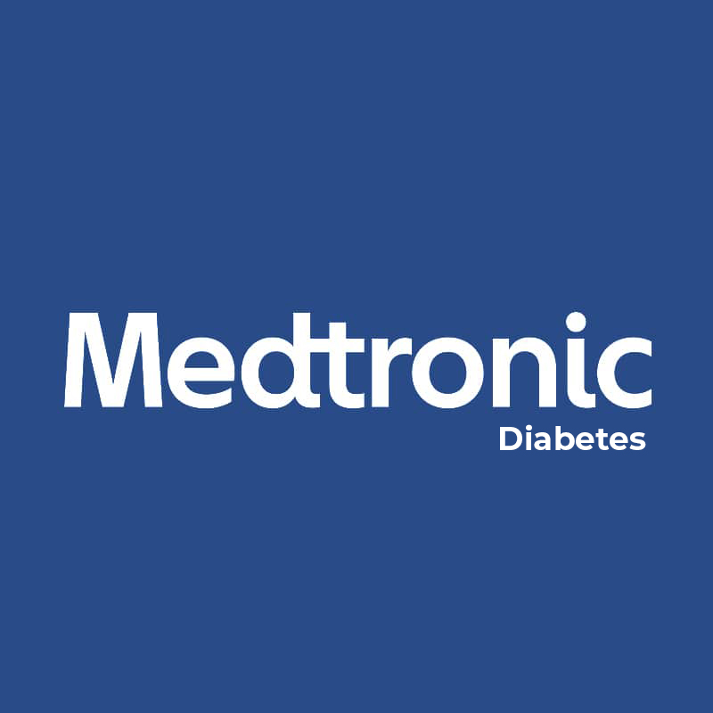

# Capítulo II: Requirements Elicitation & Analysis.
## 2.1. Competidores. 
En este apartado el equipo realizará investigaciones sobre nuestros potenciales competidores en el mercado.
### 2.1.1. Análisis competitivo.

<table>  
    <thead>
        <tr>
            <th colspan="6">Competitive Analysis Landscape</th>
        </tr>
        <tr>
            <th colspan="2">Competitive Analysis Landscape</th>
            <td colspan="4" style="text-align: justify">
                Se realiza con el objetivo de reconocer y comprender mejor las fortalezas, debilidades y estrategias de nuestros principales competidores que utilizan tecnologías IoT en el monitoreo de enfermedades crónicas como la diabetes tipo 2. Esto nos permite identificar oportunidades y amenazas en el mercado para definir una estrategia diferenciadora.
            </td>
        </tr>
    </thead>
    <tbody style="text-align: center">
        <tr>
            <th colspan="2"></th>
            <th><strong>Glucova</strong> </th>
            <th><strong>Dexcom</strong> </th>
            <th><strong>FreeStyle Libre</strong> </th>
            <th><strong>Medtronic Diabetes</strong> </th>
        </tr>
        <tr>
            <th rowspan="2"><strong>Perfil</strong></th>
            <td>Overview</td>
            <td>Glucova es una aplicación móvil que se conecta con dispositivos IoT para monitorear niveles de glucosa, integrando funcionalidades para pacientes y médicos en una plataforma unificada.</td>
            <td>Dexcom G6 es un sistema continuo de monitoreo de glucosa (CGM) que utiliza sensores IoT para enviar datos a una app móvil.</td>
            <td>FreeStyle Libre ofrece sensores IoT que permiten escanear los niveles de glucosa sin pinchazos frecuentes.</td>
            <td>Medtronic Diabetes ofrece soluciones CGM y bombas inteligentes integradas para el control integral de la diabetes.</td>
        </tr>
        <tr>
            <td>Ventaja competitiva</td>
            <td>Integración directa entre paciente y médico con enfoque en seguimiento personalizado, interfaz amigable y bajo costo.</td>
            <td>Medición continua sin necesidad de escanear; alertas inteligentes en tiempo real.</td>
            <td>Fácil de usar, sin calibración manual; informes automáticos desde la nube.</td>
            <td>Integración de monitoreo y administración de insulina en un solo dispositivo.</td>
        </tr>
        <!-- PERFIL DE MARKETING -->
        <tr>
            <th rowspan="2"><strong>Perfil de Marketing</strong></th>
            <td>Mercado objetivo</td>
            <td>Pacientes con diabetes tipo 2 y médicos especialistas que buscan un control remoto accesible.</td>
            <td>Personas con diabetes tipo 1 y 2, incluyendo adolescentes.</td>
            <td>Pacientes con diabetes tipo 2 que buscan facilidad y libertad de movimiento.</td>
            <td>Pacientes con diagnóstico crónico que requieren control médico riguroso.</td>
        </tr>
        <tr>
            <td>Estrategias de marketing</td>
            <td>Promoción en redes sociales, colaboraciones con clínicas locales y ferias de salud.</td>
            <td>Enfocado en la precisión y conectividad con apps de salud.</td>
            <td>Campañas en redes sociales y testimonios de usuarios reales.</td>
            <td>Alianzas con hospitales y programas de aseguradoras médicas.</td>
        </tr>
        <!-- PERFIL DE PRODUCTO -->
        <tr>
            <th rowspan="3"><strong>Perfil del producto</strong></th>
            <td>Funcionalidad IoT</td>
            <td>Lectura continua desde sensores conectados vía Bluetooth y sincronización en la nube para consulta médica.</td>
            <td>Transmisión continua por Bluetooth, con alertas personalizables.</td>
            <td>Sensores con NFC para escaneo con smartphones.</td>
            <td>Interfaz visual en tiempo real, conectada con apps y dispositivos médicos.</td>
        </tr>
        <tr>
            <td>Precio y costos</td>
            <td>App gratuita; sensores a bajo costo por suscripción mensual (estimado $20–$30 USD).</td>
            <td>USD $300 por sensor + subscripción app.</td>
            <td>USD $150 por sensor por 14 días.</td>
            <td>USD $600 promedio mensual (seguro puede cubrir parte).</td>
        </tr>
        <tr>
            <td>Canales de distribución</td>
            <td>Web, app móvil (Android), convenios con clínicas y farmacias locales.</td>
            <td>Web, App Store, clínicas asociadas.</td>
            <td>Distribución en farmacias, web y app propia.</td>
            <td>Hospitales, médicos certificados y e-commerce.</td>
        </tr>
        <!-- ANÁLISIS SWOT -->
        <tr>
            <th rowspan="4"><strong>Análisis SWOT</strong></th>
            <td>Fortalezas</td>
            <td>Interfaz sencilla, bajo costo, atención a mercado hispanohablante.</td>
            <td>Alta precisión, integración con otras apps de salud.</td>
            <td>Fácil acceso y precio competitivo.</td>
            <td>Prestigio de marca y alianzas médicas sólidas.</td>
        </tr>
        <tr>
            <td>Debilidades</td>
            <td>Aún en etapa de desarrollo y validación clínica.</td>
            <td>Costo elevado para algunos mercados.</td>
            <td>Limitaciones en conectividad (solo NFC).</td>
            <td>Dependencia de infraestructura hospitalaria.</td>
        </tr>
        <tr>
            <td>Oportunidades</td>
            <td>Expansión a comunidades rurales y alianzas con clínicas emergentes.</td>
            <td>Expansión a nuevos mercados emergentes.</td>
            <td>Integración con dispositivos móviles más económicos.</td>
            <td>Desarrollo de apps para médicos y pacientes.</td>
        </tr>
        <tr>
            <td>Amenazas</td>
            <td>Competencia con grandes marcas tecnológicas, como wearables.</td>
            <td>Competencia con wearables más accesibles.</td>
            <td>Obsolescencia tecnológica rápida.</td>
            <td>Altos costos de mantenimiento y actualización.</td>
        </tr>
        <tr>
            <td colspan="6"></td>
        </tr>
    </tbody>
</table>

### 2.1.2. Estrategias y tácticas frente a competidores.

Luego de haber realizado el análisis de nuestra solución con respecto a soluciones ya existentes, nuestero equipo procederá a planteaer estrategias y tácnicas que debemos poner en marcha para sobresalir de las otras soluciones.

<table>
    <thead>
        <tr>
            <th colspan="3">Matriz CAME para el desarrollo de estrategias en base al análisis FODA</th>
        </tr>
    </thead>
    <tbody>
        <tr>
            <th rowspan="2">Análisis FODA cruzado</th>
            <th>Oportunidades</th>
            <th>Amenazas</th>
        </tr>
        <tr>
            <td>
                - Expansión a comunidades rurales y clínicas emergentes. 
                - Aumento en el uso de dispositivos IoT para salud. 
                - Creciente interés por soluciones móviles en el monitoreo de enfermedades crónicas. 
                - Potenciales alianzas con farmacias y servicios de salud digital.
            </td>
            <td> 
                - Presencia de marcas consolidadas con grandes presupuestos. 
                - Ritmo acelerado de innovación tecnológica. 
                - Posible resistencia del usuario a soluciones no avaladas clínicamente. 
                - Competencia con dispositivos wearables más accesibles o conocidos.
            </td>
        </tr>
        <tr>
            <th>Fortalezas</th>
            <th>Estrategia (FO) – Estrategias Ofensivas</th>
            <th>Estrategia (FA) – Estrategias Defensivas</th>
        </tr>
        <tr>
            <td>
                - Interfaz intuitiva y de fácil uso. 
                - Costos bajos frente a competidores. 
                - Conectividad con dispositivos IoT mediante Bluetooth. 
                - Segmentación específica en pacientes con Diabetes tipo 2 y médicos tratantes.
            </td>
            <td>
                <strong>Mantener Fortalezas</strong>   
                - Impulsar campañas de marketing orientadas a usuarios de bajos recursos y zonas rurales. 
                - Aprovechar la interfaz sencilla como ventaja competitiva en entornos donde la alfabetización digital es baja. 
                - Ampliar la conectividad IoT para integrar más sensores compatibles.
            </td>
            <td>
                <strong>Explotar Oportunidades</strong>   
                - Resaltar el costo accesible como barrera superada frente a soluciones costosas. 
                - Fortalecer la presencia en comunidades desatendidas con convenios institucionales locales. 
                - Apoyarse en testimonios reales para reducir la resistencia a nuevas tecnologías.
            </td>
        </tr>
        <tr>
            <th>Debilidades</th>
            <th>Estrategia (DO) – Estrategias de Reorientación</th>
            <th>Estrategia (DA) – Estrategias de Supervivencia</th>
        </tr>
        <tr>
            <td>
                - Aún en etapa de desarrollo y sin validación clínica formal. 
                - Baja visibilidad de marca en el sector salud. 
                - Recursos limitados para inversión en marketing masivo.
            </td>
            <td> 
                <strong>Afrontar Amenazas</strong>   
                - Buscar colaboraciones con universidades y centros médicos para obtener validación académica. 
                - Participar en ferias y convocatorias de innovación para ganar exposición. 
                - Ofrecer funcionalidades diferenciadoras desde el diseño para competir con marcas ya establecidas.
            </td>
            <td>
                <strong>Corregir Debilidades</strong>   
                - Establecer una hoja de ruta clara para validación clínica progresiva. 
                - Priorizar estrategias de marketing de bajo costo (redes sociales, contenido educativo, alianzas con influencers médicos). 
                - Identificar inversores o incubadoras para asegurar financiación estratégica.
            </td>
        </tr>
    </tbody>
</table>

## 2.2. Entrevistas.

En este punto el equipo realizará entrevistas a nuestros segmentos objetivos previamente identificados con el fin de poder conocer y empatizar con las necesidades de los mismos.

### 2.2.1. Diseño de entrevistas.

**Segmento objetivo 1: Pacientes con diabetes Tipo 2**

* **Preguntas demográficas:**
1. ¿Cuál es su nombre completo?
2. ¿Cuál es su edad?
3. ¿En qué distrito vive?
4. ¿Cuál es su ocupación actual?
5. ¿Hace cuánto tiempo fue diagnosticado con Diabetes tipo 2?

* **Preguntas sobre sus preferencias:**
6. ¿Actualmente utiliza algún dispositivo o aplicación para monitorear su nivel de glucosa? ¿Cuál?
7. ¿Con qué frecuencia mide su nivel de glucosa?
8. ¿Lleva un registro de sus niveles? ¿Cómo lo hace (libreta, app, Excel, etc.)?

* **Preguntas sobre la solución:**
9. ¿Qué tan fácil o difícil le resulta entender los resultados que obtiene de estos dispositivos?
10. ¿Qué funcionalidades le gustaría que tuviera una app o dispositivo para ayudarle con su control de glucosa?

**Segmento objetivo 2: Médicos especializados**
1. ¿Cuál es su nombre completo?
2. ¿Qué especialidad médica ejerce?
3. ¿En qué clínica u hospital labora actualmente?
4. ¿Cuántos años de experiencia tiene tratando pacientes con Diabetes tipo 2?
5. ¿Cuántos pacientes con esta condición atiende aproximadamente al mes?

* **Preguntas sobre la solución:**
6. ¿Qué métodos utilizan sus pacientes para monitorear sus niveles de glucosa actualmente?
7. ¿Considera útil recibir los datos de monitoreo de glucosa de sus pacientes a través de una app?
8. ¿Qué tipo de información considera más relevante recibir (niveles diarios, gráficas, alertas)?
9. ¿Ha recomendado alguna app o dispositivo de monitoreo a sus pacientes? ¿Cuál y por qué?
10. ¿Qué características considera indispensables en una aplicación orientada al control de la diabetes?

### 2.2.2. Registro de entrevistas.

## Entrevistas a segmento objetivo 1: Pacientes con diabetes Tipo 2

<table>
        <thead>
            <tr>
                <th>Entrevistado 1</th>
                <th>Matias Munives</th>
            </tr>
            <tr>
                <th>Entrevistador </th>
                <th>Jair Coraje</th>
            </tr>
        </thead>
        <tbody>
            <tr>
                <td>Edad</td>
                <td>30</td>
            </tr>
            <tr>
                <td>Distrito</td>
                <td>Carabayllo</td>
            </tr>
            <tr>
                <td></td>
                <td><strong>Resumen:</strong> Matías Joan Munieves, paciente de 30 años diagnosticado con diabetes tipo 2 hace cinco años, se mide la glucosa diariamente con un glucómetro proporcionado por el centro de salud, pero no utiliza ninguna aplicación. Expresó dificultad para interpretar los resultados y desea una app que le brinde explicaciones claras, alertas visuales, consejos personalizados, recordatorios automáticos y registro sin intervención manual, valorando una experiencia educativa y organizada. </td>
            </tr>
            <tr>
                <td>Timing de la entrevista</td>
                <td></td>
            </tr>
            <tr>
                <td>URL de la entrevista</td>
                <td></td>
            </tr>
        </tbody>
            <thead>
            <tr>
                <th>Entrevistado 2</th>
                <th>Nombre</th>
            </tr>
            <tr>
                <th>Entrevistador </th>
                <th>Nombre</th>
            </tr>
        </thead>
        <tbody>
            <tr>
                <td>Edad</td>
                <td></td>
            </tr>
            <tr>
                <td>Distrito</td>
                <td></td>
            </tr>
            <tr>
                <td></td>
                <td><strong>Resumen:</strong> </td>
            </tr>
            <tr>
                <td>Timing de la entrevista</td>
                <td></td>
            </tr>
            <tr>
                <td>URL de la entrevista</td>
                <td></td>
            </tr>
        </tbody>
                <thead>
            <tr>
                <th>Entrevistado 3</th>
                <th>Nombre</th>
            </tr>
            <tr>
                <th>Entrevistador </th>
                <th>Nombre</th>
            </tr>
        </thead>
        <tbody>
            <tr>
                <td>Edad</td>
                <td></td>
            </tr>
            <tr>
                <td>Distrito</td>
                <td></td>
            </tr>
            <tr>
                <td></td>
                <td><strong>Resumen:</strong> </td>
            </tr>
            <tr>
                <td>Timing de la entrevista</td>
                <td></td>
            </tr>
            <tr>
                <td>URL de la entrevista</td>
                <td></td>
            </tr>
        </tbody>
</table>

## Entrevista a segmento objetivo 2: Médicos especializados

<table>
               <thead>
            <tr>
                <th>Entrevistado 1</th>
                <th>Fabian Reyes</th>
            </tr>
            <tr>
                <th>Entrevistador </th>
                <th>Estefano Valenzuela</th>
            </tr>
        </thead>
        <tbody>
            <tr>
                <td>Edad</td>
                <td>20</td>
            </tr>
            <tr>
                <td>Distrito</td>
                <td>Lima</td>
            </tr>
            <tr>
                <td></td>
                <td><strong>Resumen:</strong> Fabian Reyes, interno de medicina con experiencia en endocrinología, atiende mensualmente a 20-25 pacientes con diabetes tipo 2 y utiliza glucómetros tradicionales en su práctica. Considera muy útil una aplicación como GlucoBA para recibir datos de monitoreo de glucosa, especialmente si ofrece gráficas de evolución, alertas por valores anormales y la posibilidad de compartir información con el médico. Destaca LibreLink como referente por su facilidad de uso y registro automático.  </td>
            </tr>
            <tr>
                <td>Timing de la entrevista</td>
                <td></td>
            </tr>
            <tr>
                <td>URL de la entrevista</td>
                <td></td>
            </tr>
        </tbody>
            <thead>
            <tr>
                <th>Entrevistado 2</th>
                <th>Nombre</th>
            </tr>
            <tr>
                <th>Entrevistador </th>
                <th>Nombre</th>
            </tr>
        </thead>
        <tbody>
            <tr>
                <td>Edad</td>
                <td></td>
            </tr>
            <tr>
                <td>Distrito</td>
                <td></td>
            </tr>
            <tr>
                <td></td>
                <td><strong>Resumen:</strong> </td>
            </tr>
            <tr>
                <td>Timing de la entrevista</td>
                <td></td>
            </tr>
            <tr>
                <td>URL de la entrevista</td>
                <td></td>
            </tr>
        </tbody>
                <thead>
            <tr>
                <th>Entrevistado 3</th>
                <th>Nombre</th>
            </tr>
            <tr>
                <th>Entrevistador </th>
                <th>Nombre</th>
            </tr>
        </thead>
        <tbody>
            <tr>
                <td>Edad</td>
                <td></td>
            </tr>
            <tr>
                <td>Distrito</td>
                <td></td>
            </tr>
            <tr>
                <td></td>
                <td><strong>Resumen:</strong> </td>
            </tr>
            <tr>
                <td>Timing de la entrevista</td>
                <td></td>
            </tr>
            <tr>
                <td>URL de la entrevista</td>
                <td></td>
            </tr>
        </tbody>
</table>

### 2.2.3. Análisis de entrevistas.

## 2.3. Needfinding. 

### 2.3.1. User Personas.

A continuación, se construirán los User Persona de cada segmento objetivo de nuestra plataforma. Para ello, se utilizarán los datos recolectados de las entrevistas realizadas.

<strong>User Persona - Paciente con diabetes Tipo 2 :</strong>  

  <strong>User Persona - Medico Especializado:</strong>  

### 2.3.2. User Task Matrix.

<body>
    <h2>User Task Matrix</h2>
    <table>
        <tr>
            <th rowspan="2">User Task</th>
            <th colspan="2">Juan Luis Molina</th>
            <th colspan="2">Fernando Montoya</th>
        </tr>
        <tr>
            <th>Frecuencia</th>
            <th>Importancia</th>
            <th>Frecuencia</th>
            <th>Importancia</th>
        </tr>
        <tr>
            <td>Revisar niveles de glucosa del paciente</td>
            <td>Often</td>
            <td>High</td>
            <td>Occasionally</td>
            <td>High</td>
        </tr>
        <tr>
            <td>Registrar niveles de glucosa</td>
            <td>Rarely</td>
            <td>Medium</td>
            <td>Often</td>
            <td>High</td>
        </tr>
        <tr>
            <td>Interpretar resultados de glucosa</td>
            <td>Very Often</td>
            <td>High</td>
            <td>Sometimes</td>
            <td>High</td>
        </tr>
        <tr>
            <td>Compartir datos con el médico</td>
            <td>Sometimes</td>
            <td>High</td>
            <td>Sometimes</td>
            <td>High</td>
        </tr>
        <tr>
            <td>Recibir alertas por niveles fuera de rango</td>
            <td>Sometimes</td>
            <td>High</td>
            <td>Often</td>
            <td>High</td>
        </tr>
        <tr>
            <td>Consultar recomendaciones automáticas</td>
            <td>Rarely</td>
            <td>Medium</td>
            <td>Often</td>
            <td>High</td>
        </tr>
        <tr>
            <td>Generar o recibir reportes clínicos</td>
            <td>Often</td>
            <td>High</td>
            <td>Rarely</td>
            <td>Medium</td>
        </tr>
        <tr>
            <td>Recibir recordatorios de medicación/control</td>
            <td>Rarely</td>
            <td>Low</td>
            <td>Very Often</td>
            <td>High</td>
        </tr>
    </table>
</body>

### 2.3.3. User Journey Mapping.

<strong>User Journey Mapping - Paciente con diabetes Tipo 2 :</strong>  

  <strong>User Journey Mapping - Medico Especializado:</strong>  

### 2.3.4. Empathy Mapping.

<strong>Empathy Mapping - Paciente con diabetes Tipo 2 :</strong>  

  <strong>Empathy Mapping - Medico Especializado:</strong>  

### 2.3.5. As-is Scenario Mapping.

<strong>As-is Scenario Mapping - Paciente con diabetes Tipo 2 :</strong>  

  <strong>As-is Scenario Mapping - Medico Especializado:</strong>  

## 2.4. Ubiquitous Language.

El **lenguaje ubicuo** es una parte fundamental de la estrategia de UX. Se refiere al conjunto de términos y frases que se utilizan de manera consistente en toda la aplicación para referirse a conceptos, acciones y elementos clave. El lenguaje ubicuo tiene los siguientes beneficios:

- **Mejora la usabilidad**: Los usuarios pueden comprender fácilmente la aplicación y navegar por ella sin confusiones.
  
- **Aumenta la accesibilidad**: El uso de un lenguaje claro y conciso facilita el uso de la aplicación para personas con diferentes niveles de alfabetización y habilidades cognitivas.
  
- **Refuerza la marca**: Un lenguaje único y consistente ayuda a crear una identidad de marca fuerte y memorable.
  
- **Promueve la colaboración**: Facilita la comunicación entre los equipos de diseño, desarrollo y marketing.

**Glosario:**

