# Capítulo IV: Solution Software Design

## 4.1. Strategic-Level Domain-Driven Design

Dentro de esta sección se evidencia el proceso que usamos para descomponer nuestro software en bounded contexts. Utilizando las herramientas de EventStorming y Bounded Context Canvas. 
### 4.1.1. EventStorming
Para la elaboración del EventStorming, el equipo se organizó para encontrar una primera aproximación al modelado del dominio de nuestro proyecto. Durante este proceso seguimos una serie de 9 pasos.

**Paso 1: Collect Domain Events**
En este primer paso, identificamos todos los eventos relevantes del dominio que ocurren en nuestro sistema. Estos eventos representan hechos importantes que suceden durante el proceso de negocio y los capturamos con post-its de color naranja.

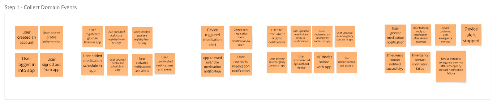 

**Paso 2: Timeline**
Organizamos todos los eventos identificados en una línea temporal, colocándolos en orden cronológico para visualizar mejor el flujo del proceso y entender la secuencia natural de acciones en el sistema.

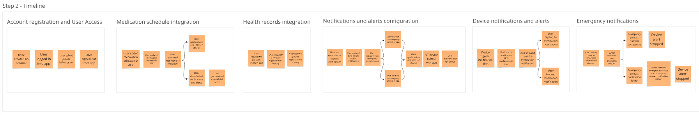 

**Paso 3: Pain and Pivotal points**
Identificamos los puntos problemáticos (pain points) y los momentos clave (pivotal points) en nuestro proceso. Estos representan áreas que requieren atención especial o que son críticas para el funcionamiento del sistema.

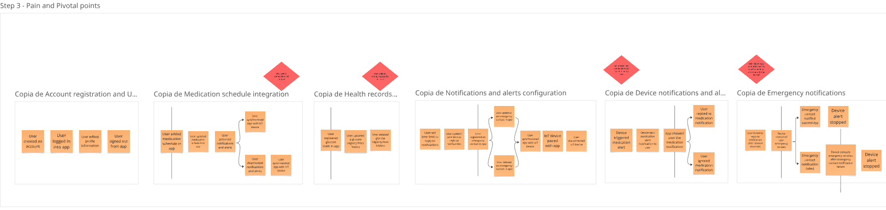 

**Paso 4: Commands**
Agregamos los comandos (representados con post-its azules) que desencadenan los eventos. Estos comandos son las acciones que los usuarios o sistemas externos realizan para provocar cambios en el sistema.

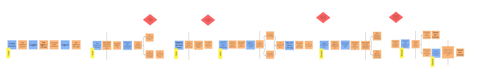 

**Paso 5: Policies**
Definimos las políticas o reglas de negocio (con post-its morados) que reaccionan a ciertos eventos y generan nuevos eventos como resultado. Estas políticas automatizan decisiones basadas en eventos previos.

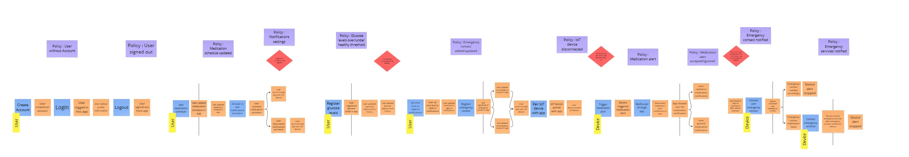 

**Paso 6: Read models**
Identificamos los modelos de lectura o vistas que los usuarios necesitan para tomar decisiones. Estos representan la información que debe estar disponible en determinados puntos del proceso.

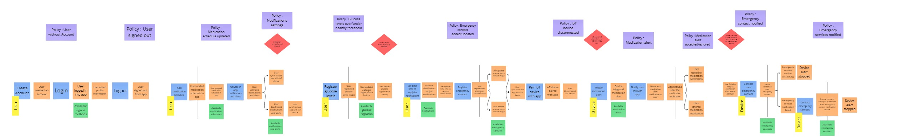 

**Paso 7: External System**
Marcamos los sistemas externos (con post-its rosados) que interactúan con nuestra solución. Estos son componentes fuera de nuestro control directo pero que tienen influencia en el proceso.

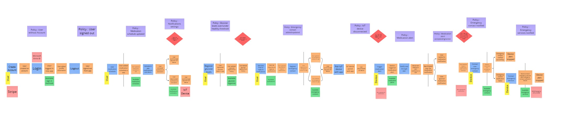 

**Paso 8: Aggregates**
Agrupamos los comandos y eventos relacionados en unidades lógicas llamadas agregados (representados con post-its amarillos). Cada agregado encapsula un conjunto coherente de funcionalidades.

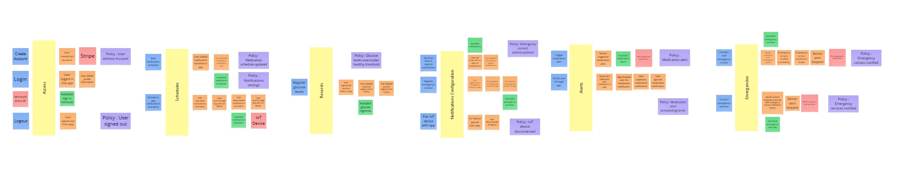 

**Paso 9: Bounded Context**
Finalmente, identificamos los contextos delimitados o bounded contexts, que son áreas de responsabilidad distintas dentro del sistema. 

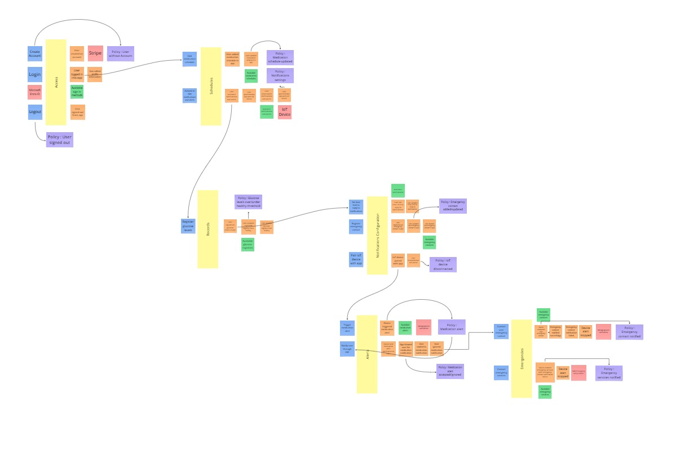 

#### 4.1.1.1. Candidate Context Discovery

A partir del EventStorming realizado en Miro, nuestro equipo llevó a cabo una sesión de Candidate Context Discovery para identificar los bounded contexts de nuestra solución. Utilizamos principalmente la técnica look-for-pivotal-events durante la sesión.

**Proceso de identificación**

Comenzamos revisando el modelo completo que habíamos construido, prestando especial atención a los eventos pivote y agregados identificados.

 
Detección de agrupaciones naturales: Identificamos patrones y agrupaciones naturales de comandos, eventos y políticas que trabajaban sobre las mismas entidades o procesos.

 

Nos enfocamos en eventos clave como las configuraciones de notificaciones y alertas que marcan claramente transiciones entre diferentes contextos
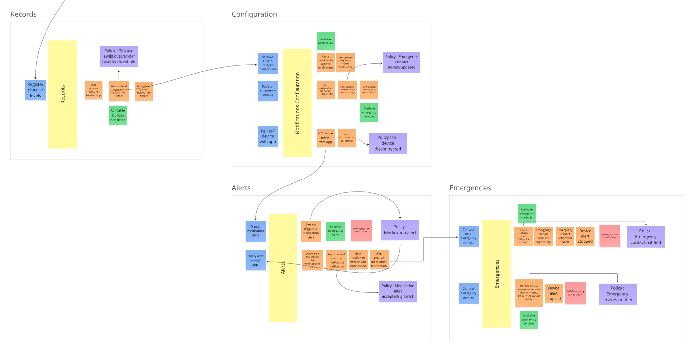 
Definición de límites: Trazamos fronteras alrededor de los grupos identificados, estableciendo los límites iniciales de nuestros bounded contexts.

Nomenclatura y validación: Nombramos cada bounded context identificado según su responsabilidad principal y validamos que tuvieran coherencia interna y límites claros.

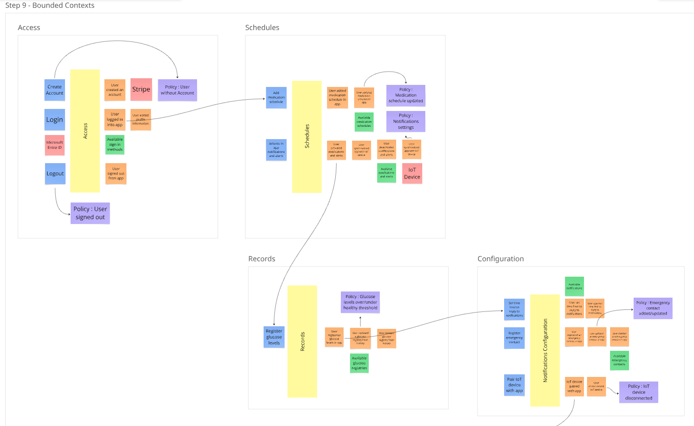 

Como resultado de este proceso, identificamos los siguientes bounded contexts para nuestra solución:

- Access: Responsable del acceso a los usuarios al sistema.
- Schedules: Permite a los usuarios crear/personalizar sus horarios de toma de medicamentos y sincronizar su dispositivo IoT con los horarios para las notificaciones.
- Records: Gestiona los registros del usuario correspondientes a sus niveles de glucos.
- Configurations: Maneja las configuraciones y notificaciones del sistema cuando el usuario no responde a una alerta en un tiempo determinado, registro de contactos de emergencia y sincronizacion con el dispositivo IoT.
- Alerts: Responsable de las alertas del dispositivo con la aplicación, notifica al usuario mediante mensajes/push notifications.
- Emergencies: Encargado de los contactos de emergencia y medidas preventivas en caso el usuario se encuentre en una emergencia.

Esta identificación nos proporcionó una base sólida para continuar con el modelado más detallado de cada contexto y sus interacciones.

#### 4.1.1.2. Domain Message Flows Modeling

#### 4.1.1.3. Bounded Context Canvases

### 4.1.2. Context Mapping

### 4.1.3. Software Architecture

#### 4.1.3.1. Software Architecture System Landscape Diagram
Este diagrama ofrece una visión general de alto nivel de todos los actores y sistemas involucrados en el ecosistema de Glucova. Incluye a los usuarios clave (Supervisor y Especialista Encargado), el sistema principal Glucova, y sistemas externos como Stripe. Permite comprender cómo interactúan estos elementos entre sí, proporcionando una perspectiva global de la arquitectura del sistema.​

  

#### 4.1.3.2. Software Architecture Context Level Diagrams
Este diagrama detalla cómo el sistema Glucova se relaciona con sus usuarios (Supervisor, Especialista Encargado y Paciente) y con sistemas externos como Azure IoT Hub, el Dispositivo IoT y Stripe. Proporciona una comprensión clara del entorno en el que opera Glucova y las interacciones clave que tiene con otros sistemas y actores.​

  

#### 4.1.3.3. Software Architecture Container Level Diagrams
Este diagrama descompone el sistema Glucova en sus principales contenedores o componentes, como la Aplicación Web, Aplicación Móvil, API REST, Base de Datos, Servicio de Autenticación, Aplicación Embebida (IoT), Servicio de Notificaciones y Servicio de Logs. Muestra cómo estos contenedores interactúan entre sí y con sistemas externos, proporcionando una visión detallada de la arquitectura interna de Glucova.​

  

#### 4.1.3.4. Software Architecture Deployment Diagrams
En esta parte se representa cómo se organizan físicamente los componentes de un sistema de software dentro del entorno donde será ejecutado.

  

## 4.2. Tactical-Level Domain-Driven Design

### 4.2.1. Bounded Context: Alerts

Este bounded context abarca todas las funcionalidades relacionadas con el sensor IoT. Incluye la gestión de sensores y envío de alertas, así como la
sincronización con la aplicación móvil y web.

### Clase Principal: `DeviceAlertSystem`

**Descripción**:  
Sistema de alertas responsable de detectar y notificar niveles críticos de glucosa al usuario y especialistas.

### Atributos

| Nombre                | Tipo de Dato                 | Descripción                                                  |
|-----------------------|------------------------------|--------------------------------------------------------------|
| `alertID`             | `String`                     | Identificador único de la alerta                             |
| `alertType`           | `String`                     | Tipo de alerta: "ALTA", "BAJA", "NORMAL"                     |
| `glucoseLevel`        | `Float`                      | Nivel de glucosa detectado                                   |
| `timestamp`           | `DateTime`                   | Fecha y hora en la que se generó la alerta                   |
| `status`              | `AlertStatus`                | Estado de la alerta (CREATED, SENT, ACKNOWLEDGED, ESCALATED) |
| `notificationChannel` | `List<NotificationChannel>`  | Canales para enviar la alerta                                |

### Relaciones

- **Composición**: `MonitoringDevice` (el dispositivo que envía los datos)
- **Agregación**: `User` (persona que recibe la alerta)
- **Agregación**: `Contact` (persona de emergencia notificada si no hay respuesta)

### Métodos

- `generateAlert()`: Evalúa el nivel de glucosa y crea una alerta si está fuera del rango.
- `sendNotification()`: Envía la notificación al usuario a través de canales definidos.
- `escalateAlert()`: Notifica a un contacto de emergencia si el usuario no responde.
- `acknowledge()`: Marca la alerta como respondida o controlada.

---

### Clases Relacionadas

#### MonitoringDevice

**Descripción**:  
Dispositivo que mide los niveles de glucosa.

##### Atributos

| Nombre         | Tipo de Dato | Descripción                      |
|----------------|--------------|----------------------------------|
| `deviceID`     | `String`     | Identificador del dispositivo    |
| `deviceName`   | `String`     | Nombre del dispositivo           |
| `location`     | `String`     | Ubicación del dispositivo        |
| `batteryLevel` | `Int`        | Nivel de batería del dispositivo |

##### Métodos

- `sendData()`: Envía los datos de glucosa.
- `syncSchedule()`: Sincroniza el horario de medicación.

#### User

##### Atributos

| Nombre     | Tipo de Dato | Descripción                 |
|------------|--------------|-----------------------------|
| `userID`   | `String`     | Identificador del usuario   |
| `name`     | `String`     | Nombre del usuario          |
| `phone`    | `String`     | Número de teléfono          |
| `email`    | `String`     | Correo electrónico          |

##### Métodos

- `receiveAlert(alert: DeviceAlertSystem)`: Recibe una alerta del sistema.

#### Contact

##### Atributos

| Nombre       | Tipo de Dato | Descripción                          |
|--------------|--------------|--------------------------------------|
| `contactID`  | `String`     | Identificador del contacto           |
| `relation`   | `String`     | Relación con el usuario              |
| `phone`      | `String`     | Número de teléfono del contacto      |

##### Métodos

- `notifyEmergency(alert: DeviceAlertSystem)`: Notifica al contacto en caso de emergencia.

####  NotificationChannel *(Interfaz o Clase Abstracta)*

#### Métodos

- `send(message: String, recipient: User)`: Envía un mensaje al usuario.

#### AlertStatus *(Enum)*

- `CREATED`
- `SENT`
- `ACKNOWLEDGED`
- `ESCALATED`

#### 4.2.1.1. Domain Layer
En el núcleo del sistema Glucova, la clase central identificada es `DeviceAlertSystem`, que representa el sensor inteligente utilizado para el monitoreo continuo de pacientes con diabetes. Esta entidad encapsula las reglas de negocio fundamentales relacionadas con la adquisición y gestión de datos fisiológicos críticos.

#### Reglas de Negocio

- **Componentes Obligatorios**: El dispositivo debe integrar sensores esenciales, incluyendo:
  - Sensor de localización
  - Sensor de alerta

- **Condiciones de Operación**: La funcionalidad completa del dispositivo se garantiza únicamente cuando:
  - Está conectado a la aplicación móvil correspondiente.
  - Dispone de una conexión activa a Internet para la transmisión y sincronización de datos.

Este diseño asegura que el dispositivo opere de manera eficiente dentro del ecosistema de Glucova, facilitando en tiempo real del estado de salud del paciente al respectivo encargado.
#### 4.2.1.2. Interface Layer
##### Entites
- DeviceAlertSystem: Representa la alerta del monitor de diabetes
##### Value Objects
- Alert: Representa la alerta enviada.
- Location: Representa la ubicación geográfica de un dispositivo.
##### Enums
- SensorType: Enumera los tipos de sensores disponibles.
##### Factories
- DeviceFactory: Fabrica para crear instancias de dispositivos.
##### Interfaces
- DeviceRepository: Interfaz para la gestión de datos.

#### 4.2.1.3. Application Layer
En esta sección se presentan las interfaces serán consumidas por la aplicación cliente para realizar cambios relacionados a los datos de la pulsera
- **DeviceController**: Define las funciones que serán consumidos por la aplicación cliente para realizar cambios relacionados a los datos de la pulsera.

**Aplicacition Layer** En esta sección presentamos los commandHandlers y EventHandlers encargados de manejar los comandos y eventos respectivos tras las solicitudes realizadas a las implementaciones de las interfaces del ítem anterior.
- **CreateDeviceCommandHandler**: Maneja el comando de crear un nuevo dispositivo.
- **DeviceCreatedEventHandler**: Maneja el evento de creación de un nuevo dispositivo.
#### 4.2.1.4. Infrastructure Layer
En esta sección presentamos las clases que se encargan de conectar con servicios externos:
- **LocationServiceProvider**: Proveedor de servicios externos para obtener datos de ubicación.
- **NotificationServiceProvider**: Proveedor de servicios externos para enviar notificaciones

#### 4.2.1.5. Bounded Context Software Architecture Component Level Diagrams

#### 4.2.1.6. Bounded Context Software Architecture Code Level Diagrams

##### 4.2.1.6.1. Bounded Context Domain Layer Class Diagrams
A continuación, presentamos el diagrama de clases del dominio considerado para el **DeviceAlertSystem**

##### 4.2.1.6.2. Bounded Context Database Design Diagram
A continuación, presentamos el diagrama de base de datos para el sistema, considerado el **DeviceAlertSystem**

