# Capítulo IV: Solution Software Design

## 4.1. Strategic-Level Domain-Driven Design

Dentro de esta sección se evidencia el proceso que usamos para descomponer nuestro software en bounded contexts. Utilizando las herramientas de EventStorming y Bounded Context Canvas. 
### 4.1.1. EventStorming
Para la elaboración del EventStorming, el equipo se organizó para encontrar una primera aproximación al modelado del dominio de nuestro proyecto. Durante este proceso seguimos una serie de 9 pasos.

**Paso 1: Collect Domain Events**
En este primer paso, identificamos todos los eventos relevantes del dominio que ocurren en nuestro sistema. Estos eventos representan hechos importantes que suceden durante el proceso de negocio y los capturamos con post-its de color naranja.

 

**Paso 2: Timeline**
Organizamos todos los eventos identificados en una línea temporal, colocándolos en orden cronológico para visualizar mejor el flujo del proceso y entender la secuencia natural de acciones en el sistema.

 

**Paso 3: Pain and Pivotal points**
Identificamos los puntos problemáticos (pain points) y los momentos clave (pivotal points) en nuestro proceso. Estos representan áreas que requieren atención especial o que son críticas para el funcionamiento del sistema.

 

**Paso 4: Commands**
Agregamos los comandos (representados con post-its azules) que desencadenan los eventos. Estos comandos son las acciones que los usuarios o sistemas externos realizan para provocar cambios en el sistema.

 

**Paso 5: Policies**
Definimos las políticas o reglas de negocio (con post-its morados) que reaccionan a ciertos eventos y generan nuevos eventos como resultado. Estas políticas automatizan decisiones basadas en eventos previos.

 

**Paso 6: Read models**
Identificamos los modelos de lectura o vistas que los usuarios necesitan para tomar decisiones. Estos representan la información que debe estar disponible en determinados puntos del proceso.

 

**Paso 7: External System**
Marcamos los sistemas externos (con post-its rosados) que interactúan con nuestra solución. Estos son componentes fuera de nuestro control directo pero que tienen influencia en el proceso.

 

**Paso 8: Aggregates**
Agrupamos los comandos y eventos relacionados en unidades lógicas llamadas agregados (representados con post-its amarillos). Cada agregado encapsula un conjunto coherente de funcionalidades.

 

**Paso 9: Bounded Context**
Finalmente, identificamos los contextos delimitados o bounded contexts, que son áreas de responsabilidad distintas dentro del sistema. 

 

#### 4.1.1.1. Candidate Context Discovery

A partir del EventStorming realizado en Miro, nuestro equipo llevó a cabo una sesión de Candidate Context Discovery para identificar los bounded contexts de nuestra solución. Utilizamos principalmente la técnica look-for-pivotal-events durante la sesión.

**Proceso de identificación**

Comenzamos revisando el modelo completo que habíamos construido, prestando especial atención a los eventos pivote y agregados identificados.

 
Detección de agrupaciones naturales: Identificamos patrones y agrupaciones naturales de comandos, eventos y políticas que trabajaban sobre las mismas entidades o procesos.

 

Nos enfocamos en eventos clave como las configuraciones de notificaciones y alertas que marcan claramente transiciones entre diferentes contextos
 
Definición de límites: Trazamos fronteras alrededor de los grupos identificados, estableciendo los límites iniciales de nuestros bounded contexts.

Nomenclatura y validación: Nombramos cada bounded context identificado según su responsabilidad principal y validamos que tuvieran coherencia interna y límites claros.

 

Como resultado de este proceso, identificamos los siguientes bounded contexts para nuestra solución:

- Access: Responsable del acceso a los usuarios al sistema.
- Schedules: Permite a los usuarios crear/personalizar sus horarios de toma de medicamentos y sincronizar su dispositivo IoT con los horarios para las notificaciones.
- Records: Gestiona los registros del usuario correspondientes a sus niveles de glucos.
- Configurations: Maneja las configuraciones y notificaciones del sistema cuando el usuario no responde a una alerta en un tiempo determinado, registro de contactos de emergencia y sincronizacion con el dispositivo IoT.
- Alerts: Responsable de las alertas del dispositivo con la aplicación, notifica al usuario mediante mensajes/push notifications.
- Emergencies: Encargado de los contactos de emergencia y medidas preventivas en caso el usuario se encuentre en una emergencia.

Esta identificación nos proporcionó una base sólida para continuar con el modelado más detallado de cada contexto y sus interacciones.

#### 4.1.1.2. Domain Message Flows Modeling

Los Domain Message Flows modelan las interacciones entre los diferentes bounded contexts, mostrando cómo se comunican entre sí mediante comandos, eventos y consultas. A continuación, presentamos los flujos de mensaje para cuatro escenarios clave de nuestra aplicación:

**Scenario 1: Access platform as a new user**

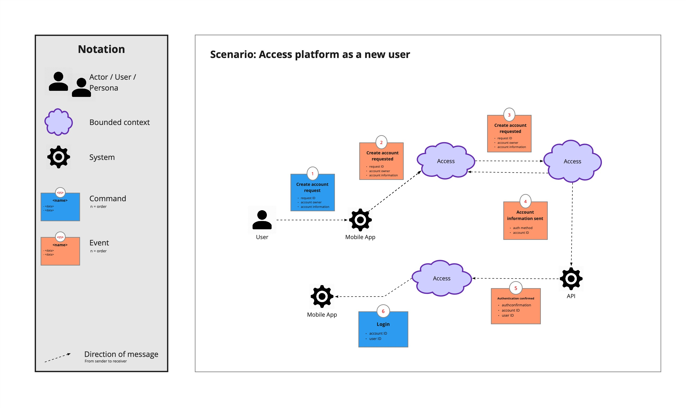 

**Scenario 2: Add a glucose registry to history**

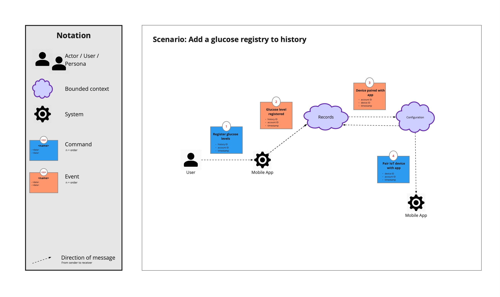 

**Scenario 3: Add medication schedule**

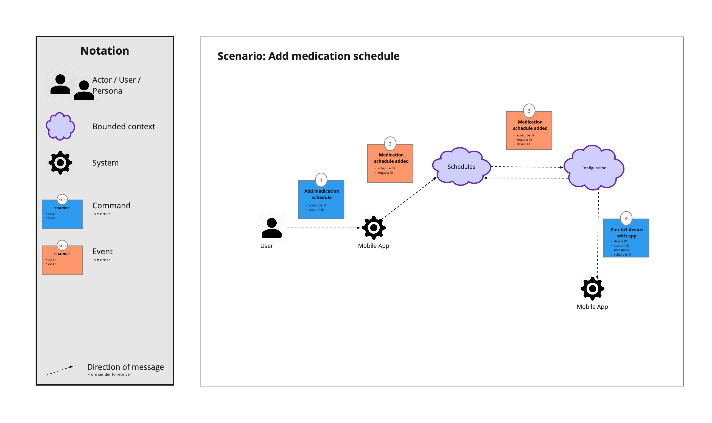 

**Scenario 4: Call an emergency contact**

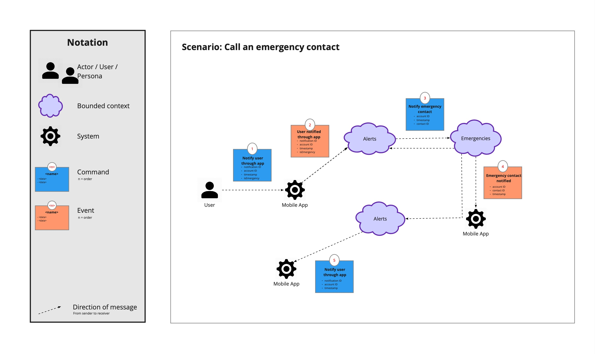 

Estos flujos de mensaje son fundamentales para entender cómo los diferentes componentes de nuestro sistema interactúan entre sí, permitiéndonos identificar posibles cuellos de botella, optimizar la comunicación y garantizar que la arquitectura responda adecuadamente a los casos de uso principales.

#### 4.1.1.3. Bounded Context Canvases

Los Bounded Context Canvases son herramientas visuales que nos permiten documentar las características fundamentales de cada contexto delimitado, capturando su propósito estratégico, modelo de dominio, lenguaje ubicuo, políticas y relaciones con otros contextos. A continuación, presentamos los canvases para nuestros cuatro bounded contexts identificados, que nos ayudaron a definir claramente las responsabilidades y límites de cada uno.

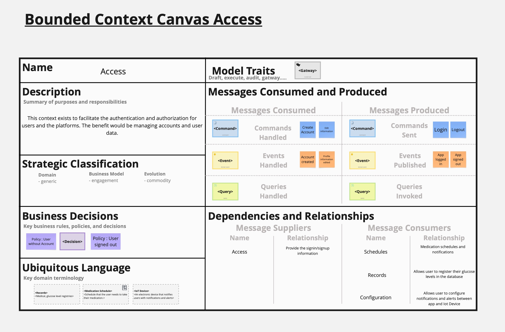 

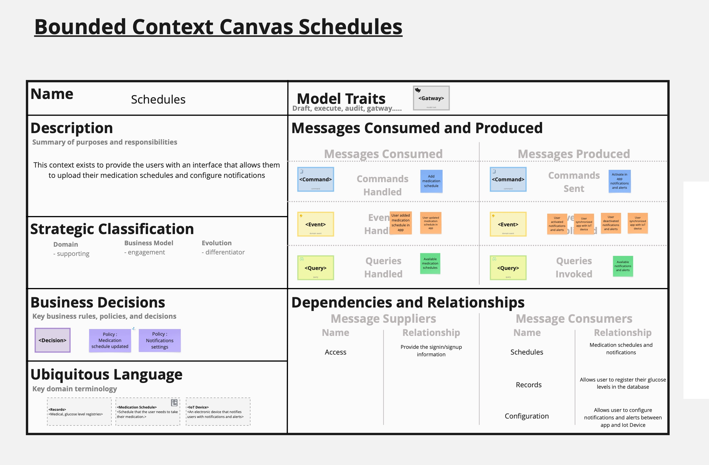 

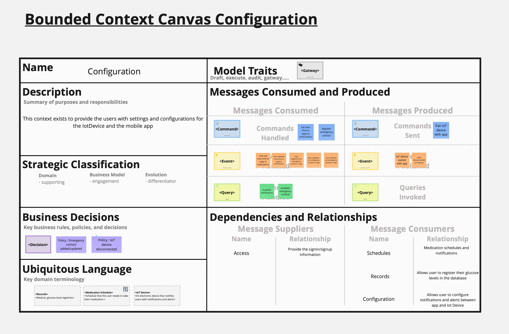 

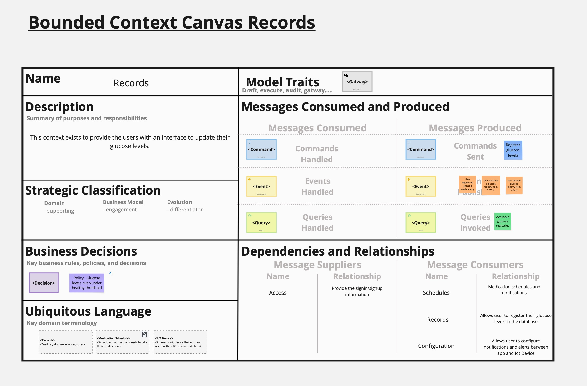 

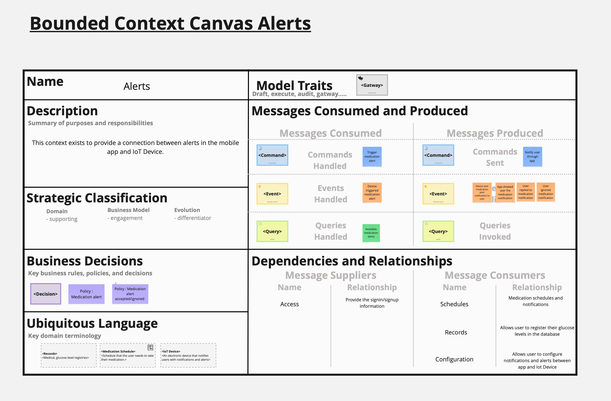 

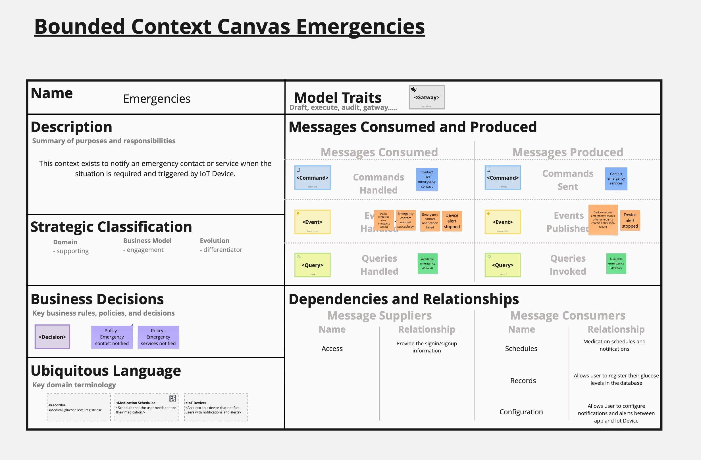 

Estos canvases fueron herramientas fundamentales para definir la arquitectura de nuestra solución, permitiéndonos visualizar cada contexto como una unidad coherente con responsabilidades claras y bien definidas. Además, nos ayudaron a identificar los puntos de integración entre contextos que luego refinamos en el Context Mapping.

### 4.1.2. Context Mapping

Después de identificar nuestros bounded contexts a través del EventStorming, procedimos a analizar las relaciones entre ellos para desarrollar un context mapping efectivo. Este proceso fue crucial para entender cómo los diferentes contextos interactúan entre sí y para definir claramente sus responsabilidades y límites.

**Exploración de Alternativas de Diseño**

Durante nuestras sesiones de trabajo, analizamos múltiples alternativas de diseño planteándonos las siguientes preguntas:

- Primera alternativa: Context Map Inicial

Nuestra primera aproximación fue un context map sencillo basado directamente en los bounded contexts identificados en el EventStorming:

 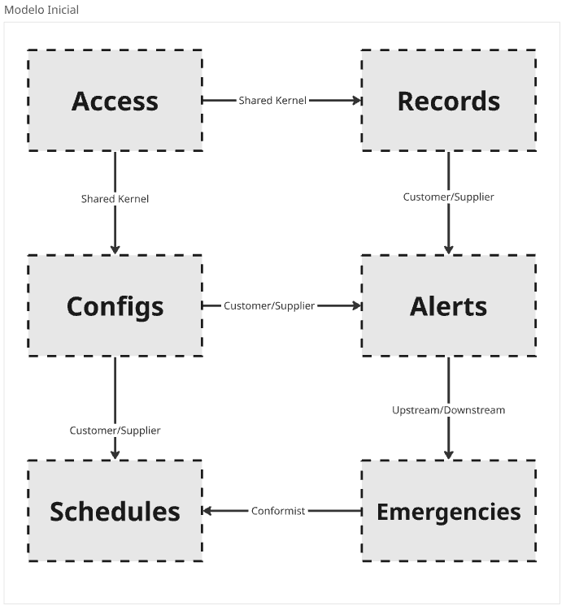 

En este modelo inicial, identificamos las siguientes relaciones entre contextos:

1. Access → Todos los demás contexts: Patrón Shared Kernel, ya que la información de autenticación y usuarios es fundamental para todos los demás contextos.

2. Records → Alerts: Patrón Customer/Supplier, donde Records (Supplier) proporciona los datos de glucosa que Alerts (Customer) utiliza para evaluar condiciones y generar alertas.

3. Configurations → Alerts y Schedules: Patrón Customer/Supplier, donde Configurations (Supplier) proporciona parámetros de configuración que afectan el comportamiento de Alerts y Schedules (Customers).

4. Alerts → Emergencies: Patrón Upstream/Downstream, donde Alerts (Upstream) detecta situaciones anómalas que pueden desencadenar acciones en Emergencies (Downstream).

5. Schedules → Records: Patrón Conformist, donde los registros deben ajustarse a los horarios establecidos para la toma de medicamentos y mediciones.

- Segunda alternativa: Consolidación de Emergencies y Alerts

Nos planteamos: "¿Qué pasaría si tomamos capabilities de Emergencies y Alerts para formar un nuevo context más cohesivo?"

 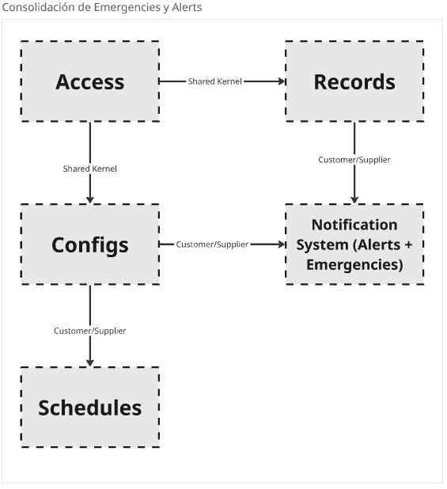 

En esta alternativa:

1. Fusionamos Emergencies y Alerts en un nuevo context llamado "Notification System"
2. Esto simplificaría la lógica de escalación de alertas y reduciría la comunicación entre contextos
3. Sin embargo, identificamos que las responsabilidades son conceptualmente distintas: Alerts se enfoca en la detección de condiciones anómalas, mientras que Emergencies gestiona protocolos de emergencia específicos

- Tercera alternativa: Introducción de un Anti-corruption Layer

Nos preguntamos: "¿Qué pasaría si aislamos los core capabilities y protegemos la integridad del modelo de dominio?"

 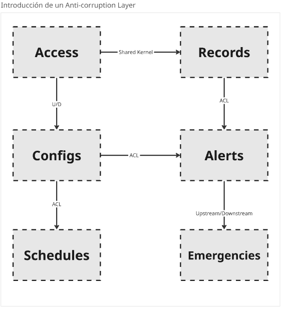 

En esta alternativa:

1. Introdujimos un patrón Anti-corruption Layer entre Records y Alerts para garantizar que los cambios en el modelo de datos de Records no afecten la lógica de Alerts
2. También aplicamos este patrón entre Configurations y los demás contextos que dependen de la configuración
3. Esto proporciona mayor flexibilidad para la evolución independiente de cada contexto

- Cuarta alternativa: Shared Service para Notificaciones

Nos planteamos: "¿Qué pasaría si creamos un shared service para reducir la duplicación entre múltiples bounded contexts?"

 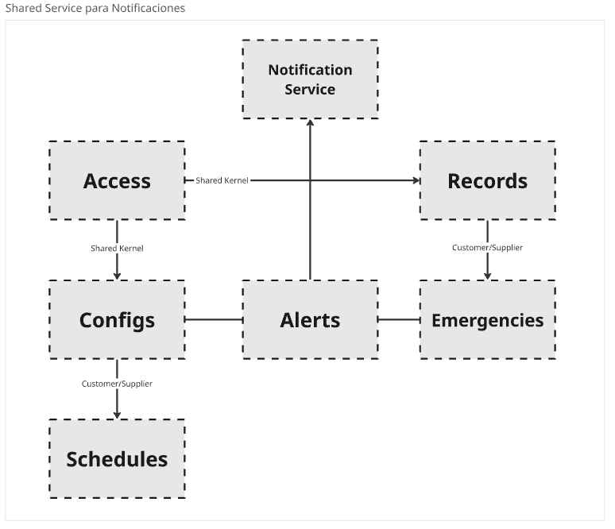 

En esta alternativa:

1. Extraemos la funcionalidad de envío de notificaciones (común en Alerts, Schedules y Emergencies) a un nuevo context "Notification Service"
2. Esto eliminaría la duplicación de código relacionado con el envío de notificaciones
3. Los tres contextos originales se convierten en consumidores de este servicio compartido

**Evaluación de Alternativas**

Tras analizar las diferentes alternativas, evaluamos cada una considerando los siguientes criterios:

1. Cohesión y acoplamiento: ¿Qué tan cohesivos son los contextos resultantes y qué nivel de acoplamiento existe entre ellos?
2. Alineación con el negocio: ¿Cómo se alinean los contextos con las necesidades del negocio y los usuarios?
3. Facilidad de evolución: ¿Qué tan fácil será evolucionar los contextos de manera independiente?
4. Complejidad técnica: ¿Cuánta complejidad técnica implica cada alternativa?

**Context Map Final**

Después de evaluar las alternativas, seleccionamos una combinación de elementos de la tercera y cuarta alternativa como nuestra solución óptima:

 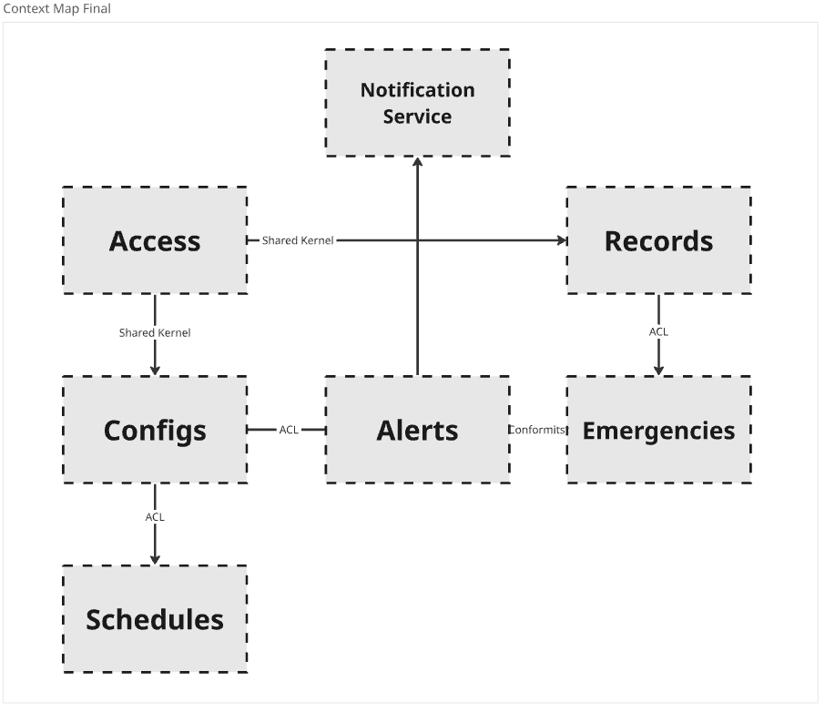 

Nuestro context map final incluye:

1. Shared Kernel para Access: Mantuvimos Access como un componente compartido que proporciona servicios de autenticación y autorización a todos los demás contextos.

2. Records como Upstream Provider: Records se mantiene como el proveedor principal de datos de glucosa, con un Anti-corruption Layer que protege a los consumidores de los cambios en su modelo interno.

3. Notification Service como Shared Service: Implementamos un servicio compartido de notificaciones para eliminar duplicación entre Alerts, Schedules y Emergencies.

4. Configurations con Customer/Supplier: Configurations mantiene una relación clara de Customer/Supplier con los contextos que dependen de sus configuraciones.

5. Emergencies con Conformist: Emergencies adopta un enfoque Conformist hacia Alerts, adaptándose a su modelo para simplificar la integración.

Esta estructura final nos proporciona un equilibrio entre cohesión, bajo acoplamiento y flexibilidad para evolucionar cada contexto de manera independiente, mientras mantenemos claridad en las responsabilidades y relaciones entre ellos.

### 4.1.3. Software Architecture

#### 4.1.3.1. Software Architecture System Landscape Diagram
Este diagrama ofrece una visión general de alto nivel de todos los actores y sistemas involucrados en el ecosistema de Glucova. Incluye a los usuarios clave (Supervisor y Especialista Encargado), el sistema principal Glucova, y sistemas externos como Stripe. Permite comprender cómo interactúan estos elementos entre sí, proporcionando una perspectiva global de la arquitectura del sistema.​

  

#### 4.1.3.2. Software Architecture Context Level Diagrams
Este diagrama detalla cómo el sistema Glucova se relaciona con sus usuarios (Supervisor, Especialista Encargado y Paciente) y con sistemas externos como Azure IoT Hub, el Dispositivo IoT y Stripe. Proporciona una comprensión clara del entorno en el que opera Glucova y las interacciones clave que tiene con otros sistemas y actores.​

  

#### 4.1.3.3. Software Architecture Container Level Diagrams
Este diagrama descompone el sistema Glucova en sus principales contenedores o componentes, como la Aplicación Web, Aplicación Móvil, API REST, Base de Datos, Servicio de Autenticación, Aplicación Embebida (IoT), Servicio de Notificaciones y Servicio de Logs. Muestra cómo estos contenedores interactúan entre sí y con sistemas externos, proporcionando una visión detallada de la arquitectura interna de Glucova.​

  

#### 4.1.3.4. Software Architecture Deployment Diagrams
En esta parte se representa cómo se organizan físicamente los componentes de un sistema de software dentro del entorno donde será ejecutado.

  

## 4.2. Tactical-Level Domain-Driven Design

### 4.2.1. Bounded Context: Alerts

Este bounded context abarca todas las funcionalidades relacionadas con el sensor IoT. Incluye la gestión de sensores y envío de alertas, así como la
sincronización con la aplicación móvil y web.

### Clase Principal: `DeviceAlertSystem`

**Descripción**:  
Sistema de alertas responsable de detectar y notificar niveles críticos de glucosa al usuario y especialistas.

### Atributos

| Nombre                | Tipo de Dato                 | Descripción                                                  |
|-----------------------|------------------------------|--------------------------------------------------------------|
| `alertID`             | `String`                     | Identificador único de la alerta                             |
| `alertType`           | `String`                     | Tipo de alerta: "ALTA", "BAJA", "NORMAL"                     |
| `glucoseLevel`        | `Float`                      | Nivel de glucosa detectado                                   |
| `timestamp`           | `DateTime`                   | Fecha y hora en la que se generó la alerta                   |
| `status`              | `AlertStatus`                | Estado de la alerta (CREATED, SENT, ACKNOWLEDGED, ESCALATED) |
| `notificationChannel` | `List<NotificationChannel>`  | Canales para enviar la alerta                                |

### Relaciones

- **Composición**: `MonitoringDevice` (el dispositivo que envía los datos)
- **Agregación**: `User` (persona que recibe la alerta)
- **Agregación**: `Contact` (persona de emergencia notificada si no hay respuesta)

### Métodos

- `generateAlert()`: Evalúa el nivel de glucosa y crea una alerta si está fuera del rango.
- `sendNotification()`: Envía la notificación al usuario a través de canales definidos.
- `escalateAlert()`: Notifica a un contacto de emergencia si el usuario no responde.
- `acknowledge()`: Marca la alerta como respondida o controlada.

---

### Clases Relacionadas

#### MonitoringDevice

**Descripción**:  
Dispositivo que mide los niveles de glucosa.

##### Atributos

| Nombre         | Tipo de Dato | Descripción                      |
|----------------|--------------|----------------------------------|
| `deviceID`     | `String`     | Identificador del dispositivo    |
| `deviceName`   | `String`     | Nombre del dispositivo           |
| `location`     | `String`     | Ubicación del dispositivo        |
| `batteryLevel` | `Int`        | Nivel de batería del dispositivo |

##### Métodos

- `sendData()`: Envía los datos de glucosa.
- `syncSchedule()`: Sincroniza el horario de medicación.

#### User

##### Atributos

| Nombre     | Tipo de Dato | Descripción                 |
|------------|--------------|-----------------------------|
| `userID`   | `String`     | Identificador del usuario   |
| `name`     | `String`     | Nombre del usuario          |
| `phone`    | `String`     | Número de teléfono          |
| `email`    | `String`     | Correo electrónico          |

##### Métodos

- `receiveAlert(alert: DeviceAlertSystem)`: Recibe una alerta del sistema.

#### Contact

##### Atributos

| Nombre       | Tipo de Dato | Descripción                          |
|--------------|--------------|--------------------------------------|
| `contactID`  | `String`     | Identificador del contacto           |
| `relation`   | `String`     | Relación con el usuario              |
| `phone`      | `String`     | Número de teléfono del contacto      |

##### Métodos

- `notifyEmergency(alert: DeviceAlertSystem)`: Notifica al contacto en caso de emergencia.

####  NotificationChannel *(Interfaz o Clase Abstracta)*

#### Métodos

- `send(message: String, recipient: User)`: Envía un mensaje al usuario.

#### AlertStatus *(Enum)*

- `CREATED`
- `SENT`
- `ACKNOWLEDGED`
- `ESCALATED`

#### 4.2.1.1. Domain Layer
En el núcleo del sistema Glucova, la clase central identificada es `DeviceAlertSystem`, que representa el sensor inteligente utilizado para el monitoreo continuo de pacientes con diabetes. Esta entidad encapsula las reglas de negocio fundamentales relacionadas con la adquisición y gestión de datos fisiológicos críticos.

#### Reglas de Negocio

- **Componentes Obligatorios**: El dispositivo debe integrar sensores esenciales, incluyendo:
  - Sensor de localización
  - Sensor de alerta

- **Condiciones de Operación**: La funcionalidad completa del dispositivo se garantiza únicamente cuando:
  - Está conectado a la aplicación móvil correspondiente.
  - Dispone de una conexión activa a Internet para la transmisión y sincronización de datos.

Este diseño asegura que el dispositivo opere de manera eficiente dentro del ecosistema de Glucova, facilitando en tiempo real del estado de salud del paciente al respectivo encargado.

#### 4.2.1.2. Interface Layer
##### Entites
- DeviceAlertSystem: Representa la alerta del monitor de diabetes
##### Value Objects
- Alert: Representa la alerta enviada.
- Location: Representa la ubicación geográfica de un dispositivo.
##### Enums
- SensorType: Enumera los tipos de sensores disponibles.
##### Factories
- DeviceFactory: Fabrica para crear instancias de dispositivos.
##### Interfaces
- DeviceRepository: Interfaz para la gestión de datos.

#### 4.2.1.3. Application Layer
En esta sección se presentan las interfaces serán consumidas por la aplicación cliente para realizar cambios relacionados a los datos de la pulsera
- **DeviceController**: Define las funciones que serán consumidos por la aplicación cliente para realizar cambios relacionados a los datos de la pulsera.

**Aplicacition Layer** En esta sección presentamos los commandHandlers y EventHandlers encargados de manejar los comandos y eventos respectivos tras las solicitudes realizadas a las implementaciones de las interfaces del ítem anterior.
- **CreateDeviceCommandHandler**: Maneja el comando de crear un nuevo dispositivo.
- **DeviceCreatedEventHandler**: Maneja el evento de creación de un nuevo dispositivo.

#### 4.2.1.4. Infrastructure Layer
En esta sección presentamos las clases que se encargan de conectar con servicios externos:
- **LocationServiceProvider**: Proveedor de servicios externos para obtener datos de ubicación.
- **NotificationServiceProvider**: Proveedor de servicios externos para enviar notificaciones

#### 4.2.1.5. Bounded Context Software Architecture Component Level Diagrams

- ###### Glucova - Access Context

  

- ###### Glucova - Alerts Context

  

- ###### Glucova - Configurations Context

  

- ###### Glucova - Records Context.png

  

- ###### Glucova - Schedules Context

  

#### 4.2.1.6. Bounded Context Software Architecture Code Level Diagrams

##### 4.2.1.6.1. Bounded Context Domain Layer Class Diagrams
A continuación, presentamos el diagrama de clases del dominio considerado para el **DeviceAlertSystem**

##### 4.2.1.6.2. Bounded Context Database Design Diagram
A continuación, presentamos el diagrama de base de datos para el sistema, considerado el **DeviceAlertSystem**

