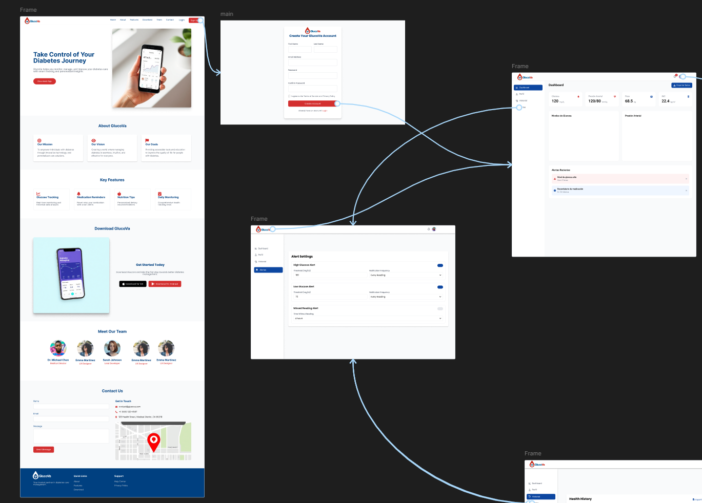

# Capítulo V: Solution UI/UX Design

## 5.1. Style Guidelines

### 5.1.1. General Style Guidelines

#### Introducción
Las siguientes pautas de estilo han sido diseñadas para garantizar la coherencia y la claridad en la interfaz de usuario de la aplicación de cuidado de personas mayores. Estas pautas abarcan aspectos como tipografía, colores, escritura y espaciado, con el objetivo de proporcionar una experiencia de usuario intuitiva y fácil de usar para los cuidadores.

#### Tipografía
- **Fuente**: Inter
- **Tamaños**: Seleccionar entre los tamaños disponibles para asegurar una legibilidad adecuada en diferentes dispositivos y tamaños de pantalla.
- **Estilos**: Utilizar estilos como negrita o cursiva para resaltar información importante.
- **Espaciado entre letras y líneas**: Ajustar según sea necesario para mejorar la legibilidad, especialmente en textos largos.

 
#### Colores
#### Colores Principales (Índigo y Complementarios)
- **Índigo-500 #6366f1** → Color primario para botones y elementos interactivos.
- **Índigo-700 #4547c0** → Para hover o estados activos.
- **Índigo-300 #9ee0f6** → Fondos claros o highlights.
- **Índigo-900 #282960** → Textos o acentos oscuros.

#### Colores Neutros y Utilitarios
- **Blanco #FFFFFF** → Fondos y espacios limpios.
- **Negro #000000** → Textos principales.
- **Gris claro #F9FAFB** → Fondos secundarios.
- **Gris medio #485563** → Bordes o elementos discretos.

#### Acentos y Alertas
- **Rojo #D32F2F** → Errores o advertencias.
- **Magenta #D105DB** → Llamadas a la acción (ej: "Premium").

#### Significado y Uso
La paleta de índigo transmite confianza y profesionalismo, ideal para interfaces enfocadas en usabilidad. Combínala con neutros para equilibrio y acentos vibrantes para jerarquía visual.

 

#### Espaciado
- **Espaciado entre componentes**: Utilizar un espaciado con métricas de 4^n (por ejemplo, 8px, 12px, 16px, 24px, 32px) para garantizar una disposición equilibrada y armoniosa de los elementos en la interfaz de usuario.
- Estas pautas de estilo deben aplicarse de manera consistente en toda la aplicación para garantizar una experiencia de usuario coherente y fácil de usar para los cuidadores.
 

#### Escritura
- **Claridad comunicativa**: Implementar un estilo de redacción directo y comprensible que transmita eficazmente la información esencial para los cuidadores.
- **Accesibilidad lingüística**: Prescindir de tecnicismos y terminología especializada que pudiera dificultar la comprensión para usuarios sin formación específica en cuidados geriátricos.
- **Uniformidad tonal**: Asegurar que toda la plataforma mantenga un estilo de comunicación homogéneo, favoreciendo una experiencia integrada y coherente para el usuario.

#### Branding
Para representar nuestro producto GlucoVa, se desarrolló un logo que fusiona elementos clave de nuestra propuesta de valor: una gota de sangre que simboliza la medición de glucosa, junto con un icono de conectividad wifi en su interior. Esta combinación visual transmite de forma inmediata la naturaleza del producto como un dispositivo de monitoreo continuo de glucosa con capacidad de transmisión de datos en tiempo real.
La gota, elemento universal asociado a la sangre y pruebas de glucosa, se convierte en un contenedor inteligente gracias al símbolo wifi que incorpora, comunicando el concepto de tecnología conectada al servicio de la salud.

 

A partir de este concepto central, se diseñaron distintas variaciones cromáticas que se adaptan a diferentes contextos y necesidades de comunicación:

- **Versión en rojo sobre fondo rojo**: Utiliza el blanco para el logo y texto, maximizando el contraste y la visibilidad. El rojo, color asociado tradicionalmente con la sangre y la salud, refuerza la identidad del producto relacionado con el monitoreo de glucosa.

- **Versión en rojo sobre fondo blanco**: Mantiene el contorno de la gota en rojo mientras el símbolo wifi interno aparece en azul, creando un contraste que destaca ambos elementos. El nombre "GlucoVa" se presenta con "Gluco" en azul y "Va" en rojo, enfatizando la dualidad del producto.

- **Versión en azul sobre fondo azul**: Presenta el logo y texto en blanco, transmitiendo profesionalismo médico y tecnológico. El azul profundo comunica confianza, estabilidad y fiabilidad, atributos esenciales para un dispositivo médico.

- **Versión en blanco sobre fondo negro**: Ofrece máximo contraste y elegancia, ideal para comunicaciones premium o aplicaciones donde se busca un impacto visual contundente.

 

El sistema de identidad de GlucoVa ofrece versatilidad manteniendo coherencia de marca en todas sus aplicaciones. El logotipo presenta una tipografía moderna donde "Va" aparece destacado en rojo para transmitir dinamismo y acción.

La flexibilidad cromática permite adaptar la marca a diversos entornos y materiales promocionales, conservando siempre su esencia identificable: la innovadora fusión entre monitoreo de glucosa y conectividad inalámbrica.

El diseño minimalista pero conceptualmente potente refleja los valores fundamentales del producto:
- Precisión
- Conectividad constante
- Simplicidad de uso
- Compromiso con el bienestar del usuario
 
### 5.1.2. Web, Mobile and IoT Style Guidelines

#### Patrones de Diseño Visual
- **Patrón F para interfaces informativas**: Implementamos el patrón de diseño en F para secciones donde predomina la presentación de datos en formato de lista, optimizando la eficiencia de lectura y facilitando el escaneo rápido de información relevante sobre los monitoreos de glucosa.
   
- **Patrón Z para landing page**: La página de inicio sigue un patrón de diseño en Z, guiando naturalmente la atención del usuario a través de los elementos clave de nuestra propuesta de valor, desde la identificación de la marca hasta la llamada a la acción principal.
 

Los elementos a utilizar para las aplicación son los siguientes: 
 

 

 

## 5.2. Information Architecture

### 5.2.1. Organization Systems

#### Estructura Organizativa de GlucoVa

Nuestra aplicación GlucoVa implementa una arquitectura de información jerárquica y basada en categorías que optimiza la accesibilidad de los datos de monitoreo de glucosa. Los sistemas de organización están diseñados considerando las necesidades específicas de usuarios diabéticos y sus cuidadores, priorizando la claridad y el acceso rápido a la información crítica.

#### Estructura Jerárquica Principal

- **GlucoVa** - Sistema central de monitoreo continuo de glucosa
  
  - **Dashboard** - Centro de control y visualización de datos
    - Panel de métricas en tiempo real
    - Resumen de actividad diaria
    - Alertas y notificaciones activas
  
  - **Monitoreo de Glucosa** - Gestión completa de datos
    - Niveles actuales e históricos
    - Análisis de tendencias
    - Exportación de informes médicos
  
  - **Perfil del Paciente** - Gestión de información personal y médica
    - Datos demográficos
    - Historial médico relevante
    - Configuración de parámetros de monitoreo
  
  - **Sistema de Alertas** - Mecanismos de notificación y seguimiento
    - Configuración de umbrales personalizados
    - Gestión de contactos de emergencia
    - Histórico de eventos críticos

#### Esquemas de Categorización

Implementamos un sistema de categorización múltiple que permite a los usuarios acceder a la información según diferentes criterios:

1. **Categorización Temporal**:
   - En tiempo real
   - Historial diario
   - Tendencias semanales
   - Análisis mensuales
   - Reportes trimestrales para consultas médicas

2. **Categorización por Estado**:
   - Niveles normales (rango seguro)
   - Alertas de precaución (niveles límite)
   - Alertas críticas (intervención necesaria)
   - Eventos programados (recordatorios)

3. **Categorización por Audiencia**:
   - Vista del paciente (simplificada)
   - Vista del cuidador (detallada)
   - Vista médica (datos completos y análisis)

Esta estructura organizacional facilita la navegación intuitiva y el acceso rápido a la información crítica, permitiendo que tanto pacientes como cuidadores puedan tomar decisiones informadas sobre el manejo de la diabetes.

### 5.2.2. Labeling Systems

Esta sección describe los sistemas de etiquetado implementados en las diferentes plataformas de GlucoVa, diseñados para facilitar la navegación y comprensión de la información relacionada con el monitoreo de glucosa.

#### Landing Page

En el encabezado de la página de inicio, se encuentran las siguientes etiquetas de navegación:

- **Home**: Redirecciona al banner principal donde se presenta GlucoVa con una imagen impactante y un mensaje conciso sobre el monitoreo continuo de glucosa.

- **About**: Dirige a la sección que explica detalladamente qué es GlucoVa, su tecnología de monitoreo sin pinchazos y sus beneficios principales para pacientes diabéticos.

- **Features**: Muestra las características distintivas del sistema, incluyendo el monitoreo en tiempo real, alertas personalizables y reportes para profesionales médicos.

- **Download**: Sección para descargar la aplicación móvil, con opciones para sistemas iOS y Android.

- **Team**: Presenta al equipo de desarrollo y especialistas médicos detrás de GlucoVa.

- **Contact**: Formulario de contacto para consultas y soporte técnico.

- **Login/Sign Up**: Botones destacados para acceder o registrarse en la plataforma.

#### Aplicación Web

La aplicación web de GlucoVa presenta un menú lateral con las siguientes secciones:

- **Dashboard**: Pantalla principal que muestra un resumen de las métricas clave del paciente: nivel de glucosa actual, presión arterial, peso e IMC, con indicadores visuales del estado de cada métrica.

- **Perfil**: Gestión de la información personal y médica del paciente, configuraciones de cuenta y preferencias de notificación.

- **Historial**: Visualización de datos históricos de glucosa con gráficos interactivos, permitiendo filtrar por periodos de tiempo y exportar informes.

- **Alertas**: Centro de gestión de notificaciones donde se pueden configurar umbrales personalizados para alertas de niveles altos o bajos de glucosa.

#### Aplicación Móvil

La aplicación móvil presenta un menú de navegación inferior con acceso a:

- **Inicio**: Muestra las métricas principales del paciente, incluyendo nivel actual de glucosa, presión arterial, peso e IMC, junto con las tendencias recientes.

- **Historial**: Acceso a los registros históricos de niveles de glucosa y otras métricas relevantes.

- **Alertas**: Centro de notificaciones que muestra eventos recientes como niveles altos de glucosa o recordatorios de medicación.

- **Perfil**: Gestión de la información personal, configuraciones de dispositivo y preferencias de la aplicación.

Cada etiqueta está diseñada siguiendo los principios de claridad, consistencia y familiaridad, utilizando iconografía intuitiva y terminología accesible para usuarios de todas las edades, especialmente considerando a personas mayores con diabetes que pueden no estar familiarizadas con tecnologías complejas.

### 5.2.3. SEO Tags and Meta Tags
 

Además de las metaetiquetas, hemos implementado una estructura semántica con etiquetas HTML5 adecuadas:

- `<header>`: Contiene el logotipo, navegación principal y llamado a la acción
- `<nav>`: Menú de navegación principal con enlaces a secciones clave
- `<main>`: Contenido principal sobre el producto y sus beneficios
- `<section>`: Separa las diferentes áreas temáticas (características, testimonios, etc.)
- `<footer>`: Información de contacto, enlaces legales y sociales

Para mejorar la indexación del sitio por parte de los motores de búsqueda, hemos incluido:

- **Sitemap XML**: Mapa completo del sitio accesible para rastreadores
- **Schema.org markup**: Microdata para identificar el tipo de producto médico y sus características
- **Canonical URLs**: Evita problemas de contenido duplicado
- **Breadcrumbs**: Facilita la navegación y mejora la estructura para bots de búsqueda

### 5.2.4. Searching Systems
La aplicación GlucoVa incorpora sistemas de búsqueda avanzados que permiten a los usuarios acceder rápidamente a información crítica sobre el monitoreo de glucosa y otros parámetros de salud. Estos sistemas están diseñados para maximizar la eficiencia y minimizar el tiempo necesario para encontrar datos relevantes.
#### Búsqueda por Tipo de Medición

El sistema permite filtrar los datos según diferentes métricas de salud:

- **Niveles de Glucosa**: Visualización de todas las mediciones de glucosa con codificación por colores según los rangos (normal, alto, bajo)
- **Presión Arterial**: Seguimiento de los registros de presión sistólica y diastólica
- **Peso**: Monitoreo de cambios en el peso corporal e IMC

 

#### Alertas Personalizables

El sistema de búsqueda se complementa con un robusto mecanismo de alertas que permite:

- Configurar umbrales personalizados para niveles altos y bajos de glucosa
- Establecer la frecuencia de notificaciones (cada 15 minutos, 30 minutos, etc.)
- Personalizar el método de alerta (sonido, vibración o ambos)

 

### 5.2.5. Navigation Systems
#### Para poder navegar dentro de la aplicación, se va a añadir las siguientes secciones:

## 5.3. Landing Page UI Design
La Landing Page de GlucoVa funciona como punto de conversión estratégico, presentando nuestra propuesta de valor mediante mensajes concisos y elementos visuales impactantes. Desarrollamos versiones responsivas optimizadas tanto para navegación móvil como de escritorio, asegurando una experiencia convincente que transforma visitantes en potenciales usuarios del sistema de monitoreo continuo.

### 5.3.1. Landing Page Wireframe
Nuestro Landing Page implementa un diseño adaptativo que optimiza la presentación de GlucoVa tanto en dispositivos móviles como en escritorio. Con una navegación fija y estructura minimalista, priorizamos la accesibilidad a la información esencial, manteniendo una experiencia visual coherente en todas las plataformas.

### 5.3.2. Landing Page Mock-up
Presentamos el prototipo inicial de nuestra Landing Page, donde implementamos la paleta cromática índigo definida en nuestras guías de estilo. El diseño incorpora elementos visuales estratégicamente seleccionados que refuerzan el mensaje sobre el monitoreo continuo de glucosa, facilitando la comprensión de las ventajas tecnológicas que ofrece GlucoVa.

## 5.4. Applications UX/UI Design

### 5.4.1. Applications Wireframes
A continuación, se muestran los diseños elaborados de acuerdo a las funcionalidades de la aplicación.

#### Mobile Application Wireframes

#### Logeo de Usuario

#### Editar Perfil

#### Configurar Alerta

#### Ver Medicion

#### Web Application Wireframes
#### Logeo y Registro de un Usuario

#### Actualizar Perfil

#### Configurar Alerta

### 5.4.2. Applications Wireflow Diagrams
#### User Goal 1: Verificar métricas de glucosa

- **Happy Path:**
  Visualización de niveles de glucosa dentro del rango normal (70-180 mg/dL). El usuario puede revisar el historial y tendencias sin recibir alertas.

- **Unhappy Path:**
  El sistema detecta y notifica niveles fuera de rango (glucosa alta > 180 mg/dL o baja < 70 mg/dL), requiriendo acción inmediata del usuario.

#### User Goal 2: Configurar parámetros de alertas personalizadas

- **Happy Path:**
  Usuario establece umbrales personalizados para alertas de glucosa (límite superior: 180 mg/dL, límite inferior: 70 mg/dL) y configura frecuencia de notificaciones cada 15 minutos.

- **Unhappy Path:**
  La aplicación no permite guardar configuraciones incoherentes (límite inferior mayor que superior) y muestra mensaje de error solicitando corrección.

#### User Goal 3: Completar perfil médico para personalización

- **Happy Path:**
  Usuario ingresa información personal y médica completa (nombre, fecha nacimiento, tipo de diabetes, peso, altura) y la aplicación personaliza rangos y recomendaciones.

- **Unhappy Path:**
  Usuario omite datos importantes como tipo de diabetes o zonas de peligro, limitando la precisión del monitoreo y generando alertas de perfil incompleto.

### 5.4.3. Applications Mock-ups
A continuación, se presentan los mock-ups de la aplicación GlucoVa, diseñados para brindar una experiencia de usuario intuitiva y atractiva. 

#### Mobile Application Mock-ups

#### Logeo de Usuario

#### Editar Perfil

#### Configurar Alerta

#### Ver Historial

#### Web Application Mock-ups

#### Registrar Usuario:

#### Editar Perfil:

#### Ver Historial y Realizar Alerta:

### 5.4.4. Applications User Flow Diagrams
#### User Goal 1: Verificar métricas de glucosa

- **Happy Path:**
  Visualización de niveles de glucosa dentro del rango normal (70-180 mg/dL). El usuario puede revisar el historial y tendencias sin recibir alertas.

- **Unhappy Path:**
  El sistema detecta y notifica niveles fuera de rango (glucosa alta > 180 mg/dL o baja < 70 mg/dL), requiriendo acción inmediata del usuario.

#### User Goal 2: Configurar parámetros de alertas personalizadas

- **Happy Path:**
  Usuario establece umbrales personalizados para alertas de glucosa (límite superior: 180 mg/dL, límite inferior: 70 mg/dL) y configura frecuencia de notificaciones cada 15 minutos.

- **Unhappy Path:**
  La aplicación no permite guardar configuraciones incoherentes (límite inferior mayor que superior) y muestra mensaje de error solicitando corrección.

#### User Goal 3: Completar perfil médico para personalización

- **Happy Path:**
  Usuario ingresa información personal y médica completa (nombre, fecha nacimiento, tipo de diabetes, peso, altura) y la aplicación personaliza rangos y recomendaciones.

- **Unhappy Path:**
  Usuario omite datos importantes como tipo de diabetes o zonas de peligro, limitando la precisión del monitoreo y generando alertas de perfil incompleto.

<table>
    <thead>
        <tr>
            <th>User Goal </th>
            <th>Como usuario deseo poder registrarme en la aplicacion para poder acceder a sus beneficios</th>
        </tr>
    </thead>
    <tbody>
        <tr>
            <td>Task Flow</td>
            <td></td>
        </tr>
        <tr>
            <td>User Flow</td>
            <td></td>
        </tr>
</table>
<table>
    <thead>
        <tr>
            <th>User Goal</th>
            <th>Como usuario deseo poder visualizar mi perfil y a su vez poder editarlo</th>
        </tr>
    </thead>
    <tbody>
        <tr>
            <td>Task Flow</td>
            <td></td>
        </tr>
        <tr>
            <td>User Flow</td>
            <td></td>
        </tr>
</table>

<table>
    <thead>
        <tr>
            <th>User Goal</th>
            <th>Como usuario deseo setear una alerta para mantenerme advertido</th>
        </tr>
    </thead>
    <tbody>
        <tr>
            <td>Task Flow</td>
            <td></td>
        </tr>
        <tr>
            <td>User Flow</td>
            <td></td>
        </tr>
</table>

## 5.5. Applications Prototyping
Enlace del prototipo Figma: https://www.figma.com/proto/UNEzJ9s5wbYGMDJ9zfTBHK/Untitled?node-id=2-461&starting-point-node-id=2%3A461&t=hd6Gpzpw4UIrp1EU-1

#### USER GOAL 1:
Como usuario deseo poder registrarme en la aplicacion para poder acceder a sus beneficios

LINK :https://upcedupe-my.sharepoint.com/:v:/g/personal/u202118315_upc_edu_pe/Ead6wHWY9zJFlhA98UTwZfIB5_8WQkMhznA2_N6F7EsdxA?nav=eyJyZWZlcnJhbEluZm8iOnsicmVmZXJyYWxBcHAiOiJPbmVEcml2ZUZvckJ1c2luZXNzIiwicmVmZXJyYWxBcHBQbGF0Zm9ybSI6IldlYiIsInJlZmVycmFsTW9kZSI6InZpZXciLCJyZWZlcnJhbFZpZXciOiJNeUZpbGVzTGlua0NvcHkifX0&e=YGeStM

#### USER GOAL 2:
Coloresomo usuario deseo poder visualizar mi perfil y a su vez poder editarlo

LINK : https://upcedupe-my.sharepoint.com/:v:/g/personal/u202118315_upc_edu_pe/Ea9nTSm4hpVBuCIwcNcSyfUBlt-5Ea9xqe3NoaYjs_GiHQ?nav=eyJyZWZlcnJhbEluZm8iOnsicmVmZXJyYWxBcHAiOiJPbmVEcml2ZUZvckJ1c2luZXNzIiwicmVmZXJyYWxBcHBQbGF0Zm9ybSI6IldlYiIsInJlZmVycmFsTW9kZSI6InZpZXciLCJyZWZlcnJhbFZpZXciOiJNeUZpbGVzTGlua0NvcHkifX0&e=dNk7rZ

#### USER GOAL 3:
Como usuario deseo setear una alerta para mantenerme advertido

LINK : https://upcedupe-my.sharepoint.com/:v:/g/personal/u202118315_upc_edu_pe/EUPbu8UDANdPoMX8JDpvFkEBSzSiAu3aW0yt8SC6WccomA?nav=eyJyZWZlcnJhbEluZm8iOnsicmVmZXJyYWxBcHAiOiJPbmVEcml2ZUZvckJ1c2luZXNzIiwicmVmZXJyYWxBcHBQbGF0Zm9ybSI6IldlYiIsInJlZmVycmFsTW9kZSI6InZpZXciLCJyZWZlcnJhbFZpZXciOiJNeUZpbGVzTGlua0NvcHkifX0&e=EZdeNj