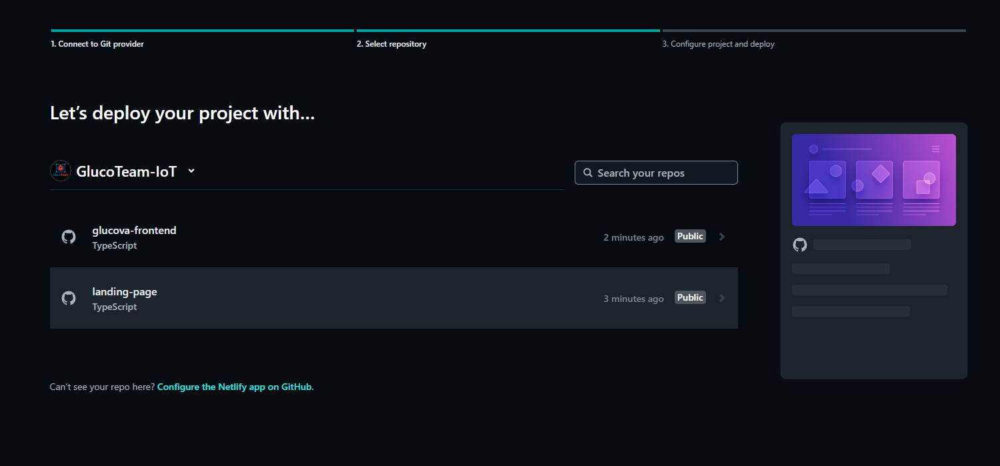

# Capítulo VI: Product Implementation, Validation & Deployment

## 6.1. Software Configuration Management

### 6.1.1. Software Development Environment Configuration

A continuación, describiremos los productos de software que hemos empleado durante el desarrollo del proyecto.

#### Project Management

- **Metodología Scrum**:  
  Seguimos un enfoque basado en Scrum para la gestión del proyecto, organizando el trabajo en sprints y realizando reuniones de planificación, revisión y retrospectiva.

#### Requirements Management

- **Trello**:  
  Utilizamos Trello (disponible en: https://trello.com/) para organizar y gestionar los requisitos del proyecto. Creamos un **product backlog** donde priorizamos las historias de usuario utilizando la técnica de estimación **Fibonacci**. Además, organizamos las tareas en diferentes secciones según las épicas, lo que facilitó la planificación y el seguimiento del progreso.

#### Product UX/UI Design

- **Figma**:  
  La plataforma de Figma (disponible en: https://www.figma.com/) nos ayudó a desarrollar los wireframes, mockups y prototyping del mobile applications.

- **Miro**:  
  Miro (disponible en: https://miro.com/) nos fue de utilidad para poder realizar los As-Is Scenario Mapping y To-Be Scenario Mapping para cada uno de los segmentos objetivos.

- **UXPressia**:  
  La plataforma UXPressia (disponible en: https://uxpressia.com/) se empleó para la creación de los User Personas, Empathy Maps, Journey Maps e Impact Maps. Hemos hecho uso de las plantillas que UXPressia nos ofrece para elaborar cada una de ellas. Nos permitió exportar lo que se realizó para incluirlo en el trabajo.

#### Software Development

- **Landing Page**:  
  Para el desarrollo se utilizaron las tecnologías:  
  React (disponible en: https://reactjs.org/), TypeScript (disponible en: https://www.typescriptlang.org/), Tailwind (disponible en: https://tailwindcss.com/) y Framer Motion (disponible en: https://www.framer.com/motion/).

- **Frontend Web App**:  
  Para el desarrollo se utilizaron las tecnologías:  
  React (disponible en: https://reactjs.org/), TypeScript (disponible en: https://www.typescriptlang.org/), Tailwind (disponible en: https://tailwindcss.com/) y Framer Motion (disponible en: https://www.framer.com/motion/).

#### Software Deployment

- **Netlify**:  
  Para implementar el despliegue de la Landing Page, se llevó a cabo la conexión entre el repositorio de GitHub (disponible en: https://github.com/) y Netlify (disponible en: https://www.netlify.com/). Esto permite que Netlify maneje automáticamente la implementación de la Landing Page cada vez que se realice una actualización en el repositorio.

#### Software Documentation

- **GitHub**:  
  Plataforma empleada tanto como para la creación de la documentación y de la Landing page. Nuestro equipo eligió esta plataforma debido a que nos permite trabajar de manera colaborativa. Más información en GitHub (disponible en: https://github.com/).

### 6.1.2. Source Code Management

La administración y estructuración de las múltiples modificaciones se realizaron mediante la creación de un repositorio en GitHub para el proyecto. Nuestra organización se estructuró de la siguiente manera:

- **Organización**: https://github.com/GlucoTeam-IoT

- **Repositorio de la Landing Page**: https://github.com/GlucoTeam-IoT/landing-page

- **Repositorio del Frontend Web Application**: https://github.com/GlucoTeam-IoT/glucova-frontend

- **Repositorio del Project report**: https://github.com/GlucoTeam-IoT/project-report

Además, con el objetivo de mejorar el control sobre la creación de ramas y la implementación de cambios en el código fuente, se procedió a utilizar Gitflow.

De esta forma, se establecieron 2 ramas principales: `main` y `develop`.

**Ramas principales:**

- **Rama `main`**: En esta rama se almacenan las versiones oficiales de nuestro repositorio para pasarlas a producción.
- **Rama `develop`**: Esta rama se utiliza como punto de integración para las ramas de `feature`. Una vez que el equipo considera que el código está listo, se fusiona con la rama `main`.

**Ramas auxiliares:**

- **Ramas `feature`**: En estas ramas se desarrollan las características generales que se integrarán en la rama `develop`. Estas características corresponden a funcionalidades específicas solicitadas por los usuarios, tanto en la página de inicio como en la aplicación web. Por ejemplo, la rama `feature/chapter-I`.

### 6.1.3. Source Code Style Guide & Conventions

#### Convenciones de Source Code

- **TypeScript**:

  - Utilizamos `strict mode` para garantizar un código más seguro y menos propenso a errores.
  - Usamos tipos específicos en lugar de `any` para mantener la tipificación estricta.

- **React**:

  - Los componentes funcionales se escriben utilizando funciones flecha.
  - Los nombres de los componentes siguen el formato PascalCase (por ejemplo, `UserProfile`).
  - Se utiliza `prop-types` o interfaces de TypeScript para validar las props de los componentes.

- **Tailwind CSS**:
  - Las clases de Tailwind se organizan siguiendo un orden lógico: primero las relacionadas con el diseño (layout), luego las de estilo visual (color, borde, etc.).
  - Se evita el uso de clases personalizadas en CSS siempre que sea posible, priorizando las utilidades de Tailwind.

#### Convenciones de Commits

Nuestro equipo sigue las **Convenciones de Commits**, adoptando el formato de los “Conventional Commits” en su versión 1.0.0 (disponible en: https://www.conventionalcommits.org/en/v1.0.0/). Esto asegura una fácil comprensión y trazabilidad de los cambios realizados en el código. La estructura utilizada es la siguiente:

```
<type>[scope opcional]: <description>
```

- **type**: Indica el tipo de modificación realizada, como `feat` (nueva funcionalidad), `fix` (corrección de errores), `docs` (documentación), entre otros.
- **scope**: Define el alcance del cambio realizado en el código (opcional).
- **description**: Proporciona un resumen breve y claro de los cambios implementados.

Ejemplo de commit:

```
feat(navbar): add responsive design for mobile devices
```

#### Convenciones de Versionado

Para la gestión de versiones, seguimos el estándar **Semantic Versioning 2.0.0**. Las versiones se presentan en el formato `(X.Y.Z)` con las siguientes interpretaciones:

- **X (Major)**: Cambios importantes que no son compatibles con versiones anteriores. Iniciamos en `0` durante la etapa de desarrollo inicial y transicionamos a `1` cuando la versión esté lista para su lanzamiento público. Al incrementar `X`, los valores de `Y` y `Z` se reinician a `0`.
- **Y (Minor)**: Cambios secundarios que son compatibles con versiones anteriores, como nuevas funcionalidades. Al incrementar `Y`, el valor de `Z` se reinicia a `0`.
- **Z (Patch)**: Correcciones menores de errores o parches que no afectan la compatibilidad.

Ejemplo de versión:

```
1.2.3
```

En este caso:

- `1` indica una versión principal.
- `2` representa una versión secundaria con nuevas funcionalidades.
- `3` refleja correcciones menores o parches.

Estas convenciones nos permiten mantener un control claro y organizado sobre el desarrollo y las actualizaciones del proyecto.

### 6.1.4. Software Deployment Configuration

- Entrar a Netlify y presionar la opción de “Import an existing project”


- Después seleccionar la opcion de “Deploy con github”


- Luego seleccionamos nuestra organización y dentro de ella buscar el repositorio del proyecto que deseamos subir a producción



- Finalmente presionar el botón con el nombre de proyecto a desplegar

- Enlace de la Landing page desplegada: https://glucova.netlify.app/

-Enlace del Frontend Web Application desplegado: <>

## 6.2. Landing Page, Services & Applications Implementation

### 6.2.1. Sprint 1

#### 6.2.1.1. Sprint Planning 1
En esta sección especificaremos los aspectos principales del Sprint Planning Meeting. A continuación se coloca el cuadro de resumen del sprint planning meeting:

| **Sprint #**                          | Sprint 1                                   |
|--------------------------------------|--------------------------------------------|
| **Sprint Planning Background**       |                                            |
| **Date**                             | 2025-05-03                                 |
| **Time**                             | 10:00 AM/PM                                |
| **Location**                         | Lima, Perú |
| **Prepared By**                      | Valenzuela Vallejos, Stefano Alessandro              |
| **Attendees (to planning meeting)**  |Maria Alejandra Díaz Villacrez <br> Jose Daniel Mario Calderon Huaman <br> Jair Andreé Coraje Bayona <br> Stefano Alessandro Valenzuela Vallejos <br> Jeremi Jose Antonio Fretel  |
| **Sprint n – 1 Review Summary**      | No aplica, ya que este es el Sprint inicial del proyecto. |
| **Sprint n – 1 Retrospective Summary** | No aplica, ya que este es el Sprint inicial del proyecto. |
| **Sprint Goal & User Stories**       |                                            |
| **Sprint n Goal**                    | **Nuestro enfoque** está en entregar la primera versión funcional del sistema, incluyendo el registro, inicio de sesión y visualizaciones básicas de salud. <br> **Creemos que** esto brinda confianza y utilidad a los cuidadores y familiares. <br>**Esto se confirmará cuando** los usuarios puedan registrarse, iniciar sesión y visualizar los reportes iniciales y ubicación del paciente a través del landing page desplegado. |
| **Sprint n Velocity**                | 25 |
| **Sum of Story Points**              | 25 |

#### 6.2.1.2. Aspect Leaders and Collaborators
En esta sección el equipo incluiremos la elaboración de un artefacto Leadership-andCollaboration Matrix (LACX), que indique por cada aspecto dentro del alcance del Sprint.

| Team Member (Last Name, First Name)       | GitHub Username | Acceso a la cuenta	 Leader (L) / Collaborator (C) | Registro de cuenta Leader (L) / Collaborator (C) | Estadísticas del paciente	Leader (L) / Collaborator (C) | Último reporte del paciente	 Leader (L) / Collaborator (C) | Captura de ubicación Leader (L) / Collaborator (C) | 
|-------------------------------------------|-----------------|---------------------------------------------|---------------------------------------------|-----|---------------------------------------------|---------------------------------------------|
| Valenzuela Vallejos, Alessandro             | AlessandroUPC   | L                                           | L                                        | L |                               C              | C
| Coraje Bayona, Jair André              |  Jair365         | C                                           | C                                           | C | L                                           | C
| Calderón Huamán, José Daniel           |   drkdevv1        | C                                           | C                                           | C | C                                           | L

#### 6.2.1.3. Sprint Backlog 1
A continuación, la estructura de la tabla para el Sprint 1 :

| Sprint # | Sprint 1 | 
|----------------|------------------|

| User Story Id | User Story Title                                                 | Work-Item / Task Id | Work-Item / Task Title                                               | Description                                                                                                                                       | Estimation (Hours) | Assigned To                          | Status        |
|---------------|------------------------------------------------------------------|----------------------|----------------------------------------------------------------------|---------------------------------------------------------------------------------------------------------------------------------------------------|---------------------|---------------------------------------|----------------|
| US001         | Acceso a la cuenta (Web application)                            | T1                   | Desarrollar función de validación de credenciales del usuario        | Implementar función para acceder a cuenta de usuario y verificar credenciales y datos.                                                           | 4                   | Jair Andreé Coraje Bayona             | Done           |
| US003         | Registro de cuenta (Web Application)                            | T2                   | Desarrollar función de registro de usuario                           | Implementar función para registro en el sistema.                                                                                                  | 4                   | Jair Andreé Coraje Bayona             | Done           |
| US010         | Sección About Us                                                | T3                   | Desarrollar visualización de la información del grupo                | Implementar función para mostrar que los desarrolladores tienen experiencia en desarrollo de software.                                            | 3                   | Jose Daniel Mario Calderon Huaman     | Done           |
| US011         | Sección About the Product                                       | T4                   | Desarrollar visualización de la información del producto             | Implementar función para visualizar información del producto y verificar funcionalidades antes de probarlo.                                       | 3                   | Jose Daniel Mario Calderon Huaman     | Done           |
| US012         | Sección Contacto                                                | T5                   | Desarrollar recuadro de contacto                                     | Implementar función para enviar un mensaje y reportar errores o problemas.                                                                       | 2                   | Jose Daniel Mario Calderon Huaman     | Done           |
| US032         | Estadísticas sobre reportes del paciente (Frontend)             | T6                   | Desarrollar visualizaciones estadísticas                             | Implementar tabla de visualizaciones estadísticas para analizar el estado de salud del paciente mediante datos históricos.                        | 5                   | Jose Daniel Mario Calderon Huaman     | Done           |
| US033         | Consulta del último reporte del paciente (Frontend)             | T7                   | Desarrollar función para mostrar el último reporte del paciente      | Implementar función que muestre el reporte más reciente del paciente con información actualizada sobre su condición.                             | 5                   | Jair Andreé Coraje Bayona             | To-Review      |
| US034         | Captura de Ubicación                                            | T8                   | Desarrollar función de transmisión de la ubicación del usuario       | Implementar transmisión de la posición del usuario para facilitar la localización en emergencias.                                                | 5                   | Jose Daniel Mario Calderon Huaman     | Done           |


Enlace del Trello Sprint 1: https://trello.com/b/qBZuOZ98/upc-pre-202510-1asi0572-2952-glucoteam-trello#

#### 6.2.1.4. Development Evidence for Sprint Review

A continuación, se presenta una tabla con información de ejemplo sobre los repositorios y commits realizados durante el sprint:

<table>
    <thead>
        <tr>
            <th>Repository</th>
            <th>Branch</th>
            <th>Commit ID</th>
            <th>Commit Message</th>
            <th>Commit Message Body</th>
            <th>Committed on (Date)</th>
        </tr>
    </thead>
    <tbody>
        <tr>
            <td>GlucoTeam-IoT/glucova-frontend</td>
            <td>develop</td>
            <td>6c0eb853b9f65f53c9c197cf474798e2121b5271</td>
            <td>fix: fix styles for alert setting</td>
            <td></td>
            <td>2025-05-13</td>
        </tr>
        <tr>
            <td>GlucoTeam-IoT/glucova-frontend</td>
            <td>develop</td>
            <td>df7e92560ca72239a317ac34f0c5cc0e07ad1e63</td>
            <td>feat: add Alert Setting page and route in app.tsx</td>
            <td></td>
            <td>2025-05-13</td>
        </tr>
        <tr>
            <td>GlucoTeam-IoT/glucova-frontend</td>
            <td>develop</td>
            <td>081408f38e14314c780b549d74bc79a5c283f9eb</td>
            <td>feat: add alert settings form</td>
            <td></td>
            <td>2025-05-13</td>
        </tr>
        <tr>
            <td>GlucoTeam-IoT/glucova-frontend</td>
            <td>develop</td>
            <td>c7018becf4763d005d95db1e4736da4b770ee34c</td>
            <td>feat: add altert settings types and services</td>
            <td></td>
            <td>2025-05-13</td>
        </tr>
        <tr>
            <td>GlucoTeam-IoT/project-report</td>
            <td>develop</td>
            <td>7c675a83c676d21c5db2c243f173ee5cc424588d</td>
            <td>docs(readme): update student outcome</td>
            <td></td>
            <td>2025-05-13</td>
        </tr>
        <tr>
            <td>GlucoTeam-IoT/landing-page</td>
            <td>develop</td>
            <td>31f1b4a33535e122095f04a3e4fed41d46ac4162</td>
            <td>docs: update README.md</td>
            <td></td>
            <td>2025-05-08</td>
        </tr>
        <tr>
            <td>GlucoTeam-IoT/landing-page</td>
            <td>develop</td>
            <td>6ac8f50a0d05c490b71b736b8525a3edacb328ba</td>
            <td>fix: update document title</td>
            <td></td>
            <td>2025-05-08</td>
        </tr>
        <tr>
            <td>GlucoTeam-IoT/landing-page</td>
            <td>develop</td>
            <td>d05e9324284018166a5b9fa7b62578eaa8cb4494</td>
            <td>feat: add framer-motion and hamburger-react for enhanced mobile navigation</td>
            <td></td>
            <td>2025-05-08</td>
        </tr>
        <tr>
            <td>GlucoTeam-IoT/landing-page</td>
            <td>develop</td>
            <td>66cd38a2a1ebe43a8a1d6f2093b8a607ba81aeef</td>
            <td>refactor: reorganize Landing component structure for improved readability</td>
            <td></td>
            <td>2025-05-08</td>
        </tr>
        <tr>
            <td>GlucoTeam-IoT/project-report</td>
            <td>develop</td>
            <td>870e726a963237fd6a0e75c49424df7aa6cab75d</td>
            <td>docs: Correction and improvement of the writing of Chapter 4</td>
            <td></td>
            <td>2025-05-08</td>
        </tr>
        <tr>
            <td>GlucoTeam-IoT/project-report</td>
            <td>develop</td>
            <td>bb3257512fef9568e3e2c59c85228c59651ee08b</td>
            <td>Docs: Add interview purpose by segment</td>
            <td></td>
            <td>2025-05-07</td>
        </tr>
        <tr>
            <td>GlucoTeam-IoT/project-report</td>
            <td>develop</td>
            <td>845c3bc78ad063ad6376a00024a8f3b682d2c5a8</td>
            <td>docs: test update</td>
            <td></td>
            <td>2025-05-07</td>
        </tr>
    </tbody>
</table>

Enlace del github: https://github.com/orgs/GlucoTeam-IoT/repositories

#### 6.2.1.5. Testing Suite Evidence for Sprint Review
A continuación, se presenta una tabla con información del repositorio de las pruebas, y los commits realizados durante el sprint:


| Repository            | Branch             | Commit Id | Commit Message                  | Commit Message Body                                                                 | Commited on (Date) |
|-----------------------|--------------------|-----------|----------------------------------|--------------------------------------------------------------------------------------|---------------------|
| GlucoTeam-IoT/GlucoTeam-acceptance-tests  | develop | 10f4f4eef88c494a28b0d3adf243e0a91541a403   | feat: add initial Gherkin scenarios for user login| - | 14/05/2025        |
| GlucoTeam-IoT/GlucoTeam-acceptance-tests  | develop | 9c29455e7e93e7d2d7a08a8d64e364076e19e59e   | feat: Implement login functionality with valid and invalid credentials validation | - | 14/05/2025        |
| GlucoTeam-IoT/GlucoTeam-acceptance-tests  | develop | c1025c1f441cb869f54f12ec9fefc28759361642   | feat: Add user registration functionality with validation for existing emails and weak passwords | - | 14/05/2025        |
| GlucoTeam-IoT/GlucoTeam-acceptance-tests  | develop | c2113e94ae7750870fbdc2673817b00581cb918b   | feat: Implement patient report statistics table and handle no data scenario | - | 14/05/2025        |
| GlucoTeam-IoT/GlucoTeam-acceptance-tests  | develop | d20684cc54df8314d1c204b258d53d014bab21be   | feat: Implement latest patient report view and handle no recent report scenario | - | 14/05/2025        |
| GlucoTeam-IoT/GlucoTeam-acceptance-tests  | develop | 5d42f094ff687eddcebed90f8a947c310788b0c2   | feat: Implement user location capture and handle location access and network issues | - | 14/05/2025        |

Enlace del github: https://github.com/GlucoTeam-IoT/GlucoTeam-acceptance-tests/commits/develop

#### 6.2.1.6. Execution Evidence for Sprint Review

**Evidencia de ejecución del Landing Page:**

Como evidencia de la ejecución de la landing:


Enlace: https://glucova.netlify.app/
<br>
**Evidencia de ejecución Frontend Web Application desplegado:**

Enlace: <>

<br>
#### 6.2.1.7. Services Documentation Evidence for Sprint Review

#### 6.2.1.8. Software Deployment Evidence for Sprint Review

**Evidencia del despliegue del Landing Page:**

Como evidencia del despliegue de la landing:


Enlace: https://glucova.netlify.app/

#### 6.2.1.9. Team Collaboration Insights during Sprint

Durante el Sprint I del proyecto Glucova, el equipo se enfocó en el desarrollo de la landing page y la aplicación web frontend. Para ello, se utilizó Visual Studio Code como editor de código y Git como herramienta de control de versiones. El trabajo se organizó mediante tareas del backlog y se gestionó a través de un flujo de trabajo basado en ramas secundarias (feature/), lo que permitió un desarrollo paralelo eficiente.

A continuación, se presentan los aportes de los integrantes en cada uno de los repositorios:

**Frontend Web Application:**


**Landing Page:**


**Project Report:**


## 6.3. Validation Interviews

### 6.3.1. Diseño de Entrevistas

### 6.3.2. Registro de Entrevistas

### 6.3.3. Evaluaciones según heurísticas

## 6.4. Video About-the-Product

## 7. Conclusiones

### 7.1. Conclusiones y recomendaciones

**Conclusiones:**

- A lo largo del desarrollo del proyecto, se logró implementar una solución basada en Internet de las Cosas (IoT) que permite monitorear los niveles de glucosa en sangre y emitir alertas en tiempo real ante situaciones críticas, mejorando así la seguridad y calidad de vida de las personas con diabetes.
- El uso de arquitectura en capas, como se presentó en los diagramas C4, permitió una clara separación de responsabilidades entre interfaz, lógica de aplicación, dominio e infraestructura, facilitando la escalabilidad y mantenibilidad del sistema.
- El trabajo en equipo fue clave para el éxito del proyecto. Se logró una colaboración efectiva en la planificación, el diseño y el desarrollo, fomentando un entorno inclusivo y participativo.
- Las entrevistas realizadas y el enfoque en la experiencia del usuario aseguraron que el sistema cubriera necesidades reales del público objetivo, validando su utilidad y viabilidad.

**Recomendaciones:**

- Para futuras versiones del proyecto, se recomienda incluir inteligencia artificial que permita anticipar posibles eventos de riesgo con base en patrones históricos de medición.
- Considerar la integración del sensor con servicios de emergencia o aplicaciones móviles de terceros para una mejor respuesta ante situaciones críticas.
- Continuar con pruebas de campo que validen el comportamiento del sistema en diferentes contextos y condiciones ambientales.
- Desarrollar una versión portable y de bajo consumo energético que pueda ser usada de forma continua por los usuarios.

---

### 7.2. Video About-the-Team

> Puedes ver nuestro video de presentación del equipo y el proyecto en el siguiente enlace:  
> [Video About-the-Team]()

---

### 8. Bibliografía

- Evans, E. (2004). _Domain-Driven Design: Tackling Complexity in the Heart of Software_. Addison-Wesley.
- Newman, S. (2015). _Building Microservices: Designing Fine-Grained Systems_. O’Reilly Media.
- Fielding, R. (2000). _Architectural Styles and the Design of Network-based Software Architectures_ (Doctoral dissertation, University of California).
- IEEE Standards Association. (2020). _IEEE Standard for Software and System Test Documentation_.
- Organización Mundial de la Salud (OMS). (2023). _Informe mundial sobre la diabetes_. Recuperado de [https://www.who.int/es/news-room/fact-sheets/detail/diabetes](https://www.who.int/es/news-room/fact-sheets/detail/diabetes)
- Mayo Clinic. (2023). _Diabetes - Síntomas y causas_. Recuperado de [https://www.mayoclinic.org/es/diseases-conditions/diabetes/symptoms-causes/syc-20371444](https://www.mayoclinic.org/es/diseases-conditions/diabetes/symptoms-causes/syc-20371444)

---

### 9. Anexos

<table>
    <thead>
        <tr>
            <th>Sección</th>
            <th>Características del video</th>
            <th>Sobre el contenido</th>
            <th>Integración y entrega</th>
        </tr>
    </thead>
    <tbody>
        <tr>
            <td>Capítulo II</td>
            <td>
                Cantidad de videos: 1 <br> 
                Nomenclatura: Needfinding Interviews <br>
                Formato: Needfinding Interviews.mp4 <br>
                Duración: 21:40
            </td>
            <td>
                En este video se visualizarán las entrevistas realizadas a los distintos segmentos establecidos en el informe.
            </td>
            <td>
                Link: 
                <a href="https://upcedupe-my.sharepoint.com/:v:/g/personal/u202214695_upc_edu_pe/Eao6yknAZXBCiO9G8dnmag8Bj83wFn--OjyjVKAQa41NUA?nav=eyJyZWZlcnJhbEluZm8iOnsicmVmZXJyYWxBcHAiOiJPbmVEcml2ZUZvckJ1c2luZXNzIiwicmVmZXJyYWxBcHBQbGF0Zm9ybSI6IldlYiIsInJlZmVycmFsTW9kZSI6InZpZXciLCJyZWZlcnJhbFZpZXciOiJNeUZpbGVzTGlua0NvcHkifX0&e=fafxFo" target="_blank">
                    Needfinding Interviews
                </a> 
                <br><br>
                 
            </td>
        </tr>
    </tbody>
</table>


