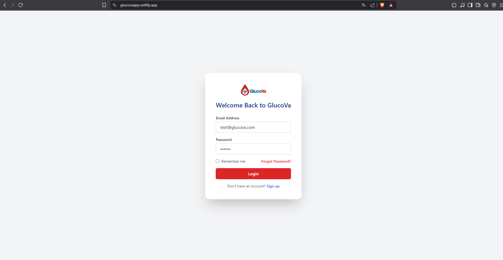
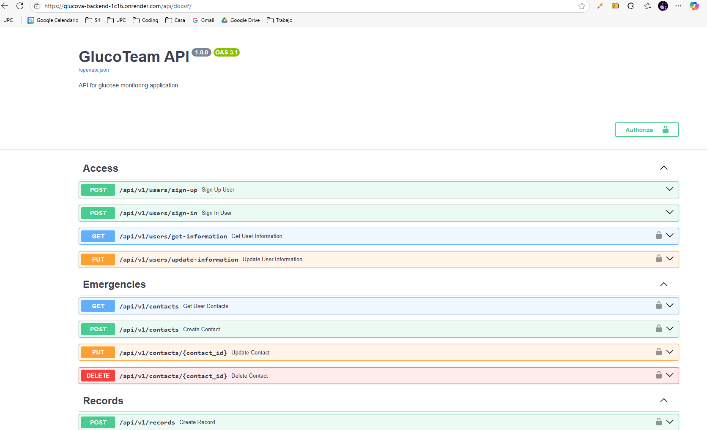

# Capítulo VI: Product Implementation, Validation & Deployment

## 6.1. Software Configuration Management

### 6.1.1. Software Development Environment Configuration

A continuación, describiremos los productos de software que hemos empleado durante el desarrollo del proyecto.

#### Project Management

- **Metodología Scrum**:  
  Seguimos un enfoque basado en Scrum para la gestión del proyecto, organizando el trabajo en sprints y realizando reuniones de planificación, revisión y retrospectiva.

#### Requirements Management

- **Trello**:  
  Utilizamos Trello (disponible en: https://trello.com/) para organizar y gestionar los requisitos del proyecto. Creamos un **product backlog** donde priorizamos las historias de usuario utilizando la técnica de estimación **Fibonacci**. Además, organizamos las tareas en diferentes secciones según las épicas, lo que facilitó la planificación y el seguimiento del progreso.

#### Product UX/UI Design

- **Figma**:  
  La plataforma de Figma (disponible en: https://www.figma.com/) nos ayudó a desarrollar los wireframes, mockups y prototyping del mobile applications.

- **Miro**:  
  Miro (disponible en: https://miro.com/) nos fue de utilidad para poder realizar los As-Is Scenario Mapping y To-Be Scenario Mapping para cada uno de los segmentos objetivos.

- **UXPressia**:  
  La plataforma UXPressia (disponible en: https://uxpressia.com/) se empleó para la creación de los User Personas, Empathy Maps, Journey Maps e Impact Maps. Hemos hecho uso de las plantillas que UXPressia nos ofrece para elaborar cada una de ellas. Nos permitió exportar lo que se realizó para incluirlo en el trabajo.

#### Software Development

- **Landing Page**:  
  Para el desarrollo se utilizaron las tecnologías:  
  React (disponible en: https://reactjs.org/), TypeScript (disponible en: https://www.typescriptlang.org/), Tailwind (disponible en: https://tailwindcss.com/) y Framer Motion (disponible en: https://www.framer.com/motion/).

- **Frontend Web App**:  
  Para el desarrollo se utilizaron las tecnologías:  
  React (disponible en: https://reactjs.org/), TypeScript (disponible en: https://www.typescriptlang.org/), Tailwind (disponible en: https://tailwindcss.com/) y Framer Motion (disponible en: https://www.framer.com/motion/).

#### Software Deployment

- **Netlify**:  
  Para implementar el despliegue de la Landing Page, se llevó a cabo la conexión entre el repositorio de GitHub (disponible en: https://github.com/) y Netlify (disponible en: https://www.netlify.com/). Esto permite que Netlify maneje automáticamente la implementación de la Landing Page cada vez que se realice una actualización en el repositorio.

#### Software Documentation

- **GitHub**:  
  Plataforma empleada tanto como para la creación de la documentación y de la Landing page. Nuestro equipo eligió esta plataforma debido a que nos permite trabajar de manera colaborativa. Más información en GitHub (disponible en: https://github.com/).

### 6.1.2. Source Code Management

La administración y estructuración de las múltiples modificaciones se realizaron mediante la creación de un repositorio en GitHub para el proyecto. Nuestra organización se estructuró de la siguiente manera:

- **Organización**: https://github.com/GlucoTeam-IoT

- **Repositorio de la Landing Page**: https://github.com/GlucoTeam-IoT/landing-page

- **Repositorio del Frontend Web Application**: https://github.com/GlucoTeam-IoT/glucova-frontend

- **Repositorio del Project report**: https://github.com/GlucoTeam-IoT/project-report

Además, con el objetivo de mejorar el control sobre la creación de ramas y la implementación de cambios en el código fuente, se procedió a utilizar Gitflow.

De esta forma, se establecieron 2 ramas principales: `main` y `develop`.

**Ramas principales:**

- **Rama `main`**: En esta rama se almacenan las versiones oficiales de nuestro repositorio para pasarlas a producción.
- **Rama `develop`**: Esta rama se utiliza como punto de integración para las ramas de `feature`. Una vez que el equipo considera que el código está listo, se fusiona con la rama `main`.

**Ramas auxiliares:**

- **Ramas `feature`**: En estas ramas se desarrollan las características generales que se integrarán en la rama `develop`. Estas características corresponden a funcionalidades específicas solicitadas por los usuarios, tanto en la página de inicio como en la aplicación web. Por ejemplo, la rama `feature/chapter-I`.

### 6.1.3. Source Code Style Guide & Conventions

#### Convenciones de Source Code

- **TypeScript**:

  - Utilizamos `strict mode` para garantizar un código más seguro y menos propenso a errores.
  - Usamos tipos específicos en lugar de `any` para mantener la tipificación estricta.

- **React**:

  - Los componentes funcionales se escriben utilizando funciones flecha.
  - Los nombres de los componentes siguen el formato PascalCase (por ejemplo, `UserProfile`).
  - Se utiliza `prop-types` o interfaces de TypeScript para validar las props de los componentes.

- **Tailwind CSS**:
  - Las clases de Tailwind se organizan siguiendo un orden lógico: primero las relacionadas con el diseño (layout), luego las de estilo visual (color, borde, etc.).
  - Se evita el uso de clases personalizadas en CSS siempre que sea posible, priorizando las utilidades de Tailwind.

#### Convenciones de Commits

Nuestro equipo sigue las **Convenciones de Commits**, adoptando el formato de los “Conventional Commits” en su versión 1.0.0 (disponible en: https://www.conventionalcommits.org/en/v1.0.0/). Esto asegura una fácil comprensión y trazabilidad de los cambios realizados en el código. La estructura utilizada es la siguiente:

```
<type>[scope opcional]: <description>
```

- **type**: Indica el tipo de modificación realizada, como `feat` (nueva funcionalidad), `fix` (corrección de errores), `docs` (documentación), entre otros.
- **scope**: Define el alcance del cambio realizado en el código (opcional).
- **description**: Proporciona un resumen breve y claro de los cambios implementados.

Ejemplo de commit:

```
feat(navbar): add responsive design for mobile devices
```

#### Convenciones de Versionado

Para la gestión de versiones, seguimos el estándar **Semantic Versioning 2.0.0**. Las versiones se presentan en el formato `(X.Y.Z)` con las siguientes interpretaciones:

- **X (Major)**: Cambios importantes que no son compatibles con versiones anteriores. Iniciamos en `0` durante la etapa de desarrollo inicial y transicionamos a `1` cuando la versión esté lista para su lanzamiento público. Al incrementar `X`, los valores de `Y` y `Z` se reinician a `0`.
- **Y (Minor)**: Cambios secundarios que son compatibles con versiones anteriores, como nuevas funcionalidades. Al incrementar `Y`, el valor de `Z` se reinicia a `0`.
- **Z (Patch)**: Correcciones menores de errores o parches que no afectan la compatibilidad.

Ejemplo de versión:

```
1.2.3
```

En este caso:

- `1` indica una versión principal.
- `2` representa una versión secundaria con nuevas funcionalidades.
- `3` refleja correcciones menores o parches.

Estas convenciones nos permiten mantener un control claro y organizado sobre el desarrollo y las actualizaciones del proyecto.

### 6.1.4. Software Deployment Configuration

Para los despliegues tanto como el frontend y backend utilizamos un proceso similar:

Para el frontend utilizamos la plataforma de Netlify y para el backend la plataforma de Render

- Entrar a Netlify y presionar la opción de “Import an existing project”


- Después seleccionar la opcion de “Deploy con github”


- Luego seleccionamos nuestra organización y dentro de ella buscar el repositorio del proyecto que deseamos subir a producción


- Finalmente presionar el botón con el nombre de proyecto a desplegar

- Enlace de la Landing page desplegada: https://glucova.netlify.app/

- Enlace del Frontend Web Application desplegado: https://glucovaapp.netlify.app

## 6.2. Landing Page, Services & Applications Implementation

### 6.2.1. Sprint 1

#### 6.2.1.1. Sprint Planning 1
En esta sección especificaremos los aspectos principales del Sprint Planning Meeting. A continuación se coloca el cuadro de resumen del sprint planning meeting:

| **Sprint #**                          | Sprint 1                                   |
|--------------------------------------|--------------------------------------------|
| **Sprint Planning Background**       |                                            |
| **Date**                             | 2025-05-03                                 |
| **Time**                             | 10:00 AM/PM                                |
| **Location**                         | Lima, Perú |
| **Prepared By**                      | Valenzuela Vallejos, Stefano Alessandro              |
| **Attendees (to planning meeting)**  |Maria Alejandra Díaz Villacrez <br> Jose Daniel Mario Calderon Huaman <br> Jair Andreé Coraje Bayona <br> Stefano Alessandro Valenzuela Vallejos <br> Jeremi Jose Antonio Fretel  |
| **Sprint n – 1 Review Summary**      | No aplica, ya que este es el Sprint inicial del proyecto. |
| **Sprint n – 1 Retrospective Summary** | No aplica, ya que este es el Sprint inicial del proyecto. |
| **Sprint Goal & User Stories**       |                                            |
| **Sprint n Goal**                    | **Nuestro enfoque** está en entregar la primera versión funcional del sistema, incluyendo el registro, inicio de sesión y visualizaciones básicas de salud. <br> **Creemos que** esto brinda confianza y utilidad a los cuidadores y familiares. <br>**Esto se confirmará cuando** los usuarios puedan registrarse, iniciar sesión y visualizar los reportes iniciales y ubicación del paciente a través del landing page desplegado. |
| **Sprint n Velocity**                | 25 |
| **Sum of Story Points**              | 25 |

#### 6.2.1.2. Aspect Leaders and Collaborators
En esta sección el equipo incluiremos la elaboración de un artefacto Leadership-andCollaboration Matrix (LACX), que indique por cada aspecto dentro del alcance del Sprint.

| Team Member (Last Name, First Name)       | GitHub Username | Acceso a la cuenta	 Leader (L) / Collaborator (C) | Registro de cuenta Leader (L) / Collaborator (C) | Estadísticas del paciente	Leader (L) / Collaborator (C) | Último reporte del paciente	 Leader (L) / Collaborator (C) | Captura de ubicación Leader (L) / Collaborator (C) | 
|-------------------------------------------|-----------------|---------------------------------------------|---------------------------------------------|-----|---------------------------------------------|---------------------------------------------|
| Valenzuela Vallejos, Alessandro             | AlessandroUPC   | L                                           | L                                        | L |                               C              | C
| Coraje Bayona, Jair André              |  Jair365         | C                                           | C                                           | C | L                                           | C
| Calderón Huamán, José Daniel           |   drkdevv1        | C                                           | C                                           | C | C                                           | L
| Diaz Villacrez, Maria Alejandra           |   alehandraxx        | C                                           | C                                           | C | C                                           | L

#### 6.2.1.3. Sprint Backlog 1
A continuación, la estructura de la tabla para el Sprint 1 :

| Sprint # | Sprint 1 | 
|----------------|------------------|

| User Story Id | User Story Title                                                 | Work-Item / Task Id | Work-Item / Task Title                                               | Description                                                                                                                                       | Estimation (Hours) | Assigned To                          | Status        |
|---------------|------------------------------------------------------------------|----------------------|----------------------------------------------------------------------|---------------------------------------------------------------------------------------------------------------------------------------------------|---------------------|---------------------------------------|----------------|
| US001         | Acceso a la cuenta (Web application)                            | T1                   | Desarrollar función de validación de credenciales del usuario        | Implementar función para acceder a cuenta de usuario y verificar credenciales y datos.                                                           | 4                   | Jair Andreé Coraje Bayona             | Done           |
| US003         | Registro de cuenta (Web Application)                            | T2                   | Desarrollar función de registro de usuario                           | Implementar función para registro en el sistema.                                                                                                  | 4                   | Jair Andreé Coraje Bayona             | Done           |
| US010         | Sección About Us                                                | T3                   | Desarrollar visualización de la información del grupo                | Implementar función para mostrar que los desarrolladores tienen experiencia en desarrollo de software.                                            | 3                   | Jose Daniel Mario Calderon Huaman     | Done           |
| US011         | Sección About the Product                                       | T4                   | Desarrollar visualización de la información del producto             | Implementar función para visualizar información del producto y verificar funcionalidades antes de probarlo.                                       | 3                   | Jose Daniel Mario Calderon Huaman     | Done           |
| US012         | Sección Contacto                                                | T5                   | Desarrollar recuadro de contacto                                     | Implementar función para enviar un mensaje y reportar errores o problemas.                                                                       | 2                   | Jose Daniel Mario Calderon Huaman     | Done           |
| US032         | Estadísticas sobre reportes del paciente (Frontend)             | T6                   | Desarrollar visualizaciones estadísticas                             | Implementar tabla de visualizaciones estadísticas para analizar el estado de salud del paciente mediante datos históricos.                        | 5                   | Jose Daniel Mario Calderon Huaman     | Done           |
| US033         | Consulta del último reporte del paciente (Frontend)             | T7                   | Desarrollar función para mostrar el último reporte del paciente      | Implementar función que muestre el reporte más reciente del paciente con información actualizada sobre su condición.                             | 5                   | Jair Andreé Coraje Bayona             | Done      |
| US034         | Captura de Ubicación                                            | T8                   | Desarrollar función de transmisión de la ubicación del usuario       | Implementar transmisión de la posición del usuario para facilitar la localización en emergencias.                                                | 5                   | Jose Daniel Mario Calderon Huaman     | Done           |


Enlace del Trello Sprint 1: https://trello.com/b/qBZuOZ98/upc-pre-202510-1asi0572-2952-glucoteam-trello#

#### 6.2.1.4. Development Evidence for Sprint Review

A continuación, se presenta una tabla con información de ejemplo sobre los repositorios y commits realizados durante el sprint:

<table>
    <thead>
        <tr>
            <th>Repository</th>
            <th>Branch</th>
            <th>Commit ID</th>
            <th>Commit Message</th>
            <th>Commit Message Body</th>
            <th>Committed on (Date)</th>
        </tr>
    </thead>
    <tbody>
        <tr>
            <td>GlucoTeam-IoT/glucova-frontend</td>
            <td>develop</td>
            <td>6c0eb853b9f65f53c9c197cf474798e2121b5271</td>
            <td>fix: fix styles for alert setting</td>
            <td></td>
            <td>2025-05-13</td>
        </tr>
        <tr>
            <td>GlucoTeam-IoT/glucova-frontend</td>
            <td>develop</td>
            <td>df7e92560ca72239a317ac34f0c5cc0e07ad1e63</td>
            <td>feat: add Alert Setting page and route in app.tsx</td>
            <td></td>
            <td>2025-05-13</td>
        </tr>
        <tr>
            <td>GlucoTeam-IoT/glucova-frontend</td>
            <td>develop</td>
            <td>081408f38e14314c780b549d74bc79a5c283f9eb</td>
            <td>feat: add alert settings form</td>
            <td></td>
            <td>2025-05-13</td>
        </tr>
        <tr>
            <td>GlucoTeam-IoT/glucova-frontend</td>
            <td>develop</td>
            <td>c7018becf4763d005d95db1e4736da4b770ee34c</td>
            <td>feat: add altert settings types and services</td>
            <td></td>
            <td>2025-05-13</td>
        </tr>
        <tr>
            <td>GlucoTeam-IoT/project-report</td>
            <td>develop</td>
            <td>7c675a83c676d21c5db2c243f173ee5cc424588d</td>
            <td>docs(readme): update student outcome</td>
            <td></td>
            <td>2025-05-13</td>
        </tr>
        <tr>
            <td>GlucoTeam-IoT/landing-page</td>
            <td>develop</td>
            <td>31f1b4a33535e122095f04a3e4fed41d46ac4162</td>
            <td>docs: update README.md</td>
            <td></td>
            <td>2025-05-08</td>
        </tr>
        <tr>
            <td>GlucoTeam-IoT/landing-page</td>
            <td>develop</td>
            <td>6ac8f50a0d05c490b71b736b8525a3edacb328ba</td>
            <td>fix: update document title</td>
            <td></td>
            <td>2025-05-08</td>
        </tr>
        <tr>
            <td>GlucoTeam-IoT/landing-page</td>
            <td>develop</td>
            <td>d05e9324284018166a5b9fa7b62578eaa8cb4494</td>
            <td>feat: add framer-motion and hamburger-react for enhanced mobile navigation</td>
            <td></td>
            <td>2025-05-08</td>
        </tr>
        <tr>
            <td>GlucoTeam-IoT/landing-page</td>
            <td>develop</td>
            <td>66cd38a2a1ebe43a8a1d6f2093b8a607ba81aeef</td>
            <td>refactor: reorganize Landing component structure for improved readability</td>
            <td></td>
            <td>2025-05-08</td>
        </tr>
        <tr>
            <td>GlucoTeam-IoT/project-report</td>
            <td>develop</td>
            <td>870e726a963237fd6a0e75c49424df7aa6cab75d</td>
            <td>docs: Correction and improvement of the writing of Chapter 4</td>
            <td></td>
            <td>2025-05-08</td>
        </tr>
        <tr>
            <td>GlucoTeam-IoT/project-report</td>
            <td>develop</td>
            <td>bb3257512fef9568e3e2c59c85228c59651ee08b</td>
            <td>Docs: Add interview purpose by segment</td>
            <td></td>
            <td>2025-05-07</td>
        </tr>
        <tr>
            <td>GlucoTeam-IoT/project-report</td>
            <td>develop</td>
            <td>845c3bc78ad063ad6376a00024a8f3b682d2c5a8</td>
            <td>docs: test update</td>
            <td></td>
            <td>2025-05-07</td>
        </tr>
    </tbody>
</table>

Enlace del github: https://github.com/orgs/GlucoTeam-IoT/repositories

#### 6.2.1.5. Testing Suite Evidence for Sprint Review
A continuación, se presenta una tabla con información del repositorio de las pruebas, y los commits realizados durante el sprint:


| Repository            | Branch             | Commit Id | Commit Message                  | Commit Message Body                                                                 | Commited on (Date) |
|-----------------------|--------------------|-----------|----------------------------------|--------------------------------------------------------------------------------------|---------------------|
| GlucoTeam-IoT/GlucoTeam-acceptance-tests  | develop | 10f4f4eef88c494a28b0d3adf243e0a91541a403   | feat: add initial Gherkin scenarios for user login| - | 14/05/2025        |
| GlucoTeam-IoT/GlucoTeam-acceptance-tests  | develop | 9c29455e7e93e7d2d7a08a8d64e364076e19e59e   | feat: Implement login functionality with valid and invalid credentials validation | - | 14/05/2025        |
| GlucoTeam-IoT/GlucoTeam-acceptance-tests  | develop | c1025c1f441cb869f54f12ec9fefc28759361642   | feat: Add user registration functionality with validation for existing emails and weak passwords | - | 14/05/2025        |
| GlucoTeam-IoT/GlucoTeam-acceptance-tests  | develop | c2113e94ae7750870fbdc2673817b00581cb918b   | feat: Implement patient report statistics table and handle no data scenario | - | 14/05/2025        |
| GlucoTeam-IoT/GlucoTeam-acceptance-tests  | develop | d20684cc54df8314d1c204b258d53d014bab21be   | feat: Implement latest patient report view and handle no recent report scenario | - | 14/05/2025        |
| GlucoTeam-IoT/GlucoTeam-acceptance-tests  | develop | 5d42f094ff687eddcebed90f8a947c310788b0c2   | feat: Implement user location capture and handle location access and network issues | - | 14/05/2025        |
| GlucoTeam-IoT/GlucoTeam-acceptance-tests  | develop | 907a08acf1922eeb8c6488b50a5f8279e2950ecc   | feat: Add About Us section with team experience display and role visibility | - | 14/05/2025        |
| GlucoTeam-IoT/GlucoTeam-acceptance-tests  | develop | f6c2dc1d76f929d638e33ec591a9846629de726b   | feat: Implement About the Product section with core features and product purpose | - | 14/05/2025        |
| GlucoTeam-IoT/GlucoTeam-acceptance-tests  | develop | fe117b71c7b8e7e90f6db4e86d901c4327e94e29   | feat: Create contact section with form validation and error handling | - | 14/05/2025        |

Enlace del github: https://github.com/GlucoTeam-IoT/GlucoTeam-acceptance-tests/commits/develop

#### 6.2.1.6. Execution Evidence for Sprint Review

**Evidencia de ejecución del Landing Page:**

Como evidencia de la ejecución de la landing:


Enlace: https://glucova.netlify.app/
<br>
**Evidencia de ejecución Frontend Web Application desplegado:**



Enlace: https://glucovaapp.netlify.app

**Evidencia de ejecución Web Sevices:**



Enlace: https://glucova-backend-1c16.onrender.com/api/docs#/

<br>

#### 6.2.1.7. Services Documentation Evidence for Sprint Review

<table>   <tr> 
    <th>Endpoint</th> 
    <th>Acción</th> 
    <th>Verbo HTTP</th> 
    <th>Parámetros/Request Body</th> 
    <th>Ejemplo</th> 
  </tr> 
    <tr> 
    <td>/api/v1/users/sign-up</td> 
    <td>Registrar una cuenta</td> 
    <td>POST</td> 
    <td> <pre>{ "email": "string", "password": "string"}</pre> </td> 
    <td><pre>{ "email": "user@example.com", "password": "string"}</pre></td> 
  </tr> 
  <tr> 
    <td>/api/v1/users/sign-in</td> 
    <td>Ingresar a la cuenta</td> 
    <td>POST</td> 
    <td> <pre>{ "email": "string", "password": "string" }</pre> </td> 
    <td><pre>{ "email": "user@example.com", "password": "string"}</pre></td> 
  </tr> 
    <tr> 
    <td>/api/v1/users/get-information</td> 
    <td>Obtener datos del usuario</td> 
    <td>GET</td> 
    <td> <pre> N/A </pre> </td> 
    <td><pre>{ "email": "user@email.com", "id": "c1dde92c-1b73-42a4-a53f-8f60dec8209c","name": Juan, "phone": 987654321,"age": 65 }</pre></td> 
  </tr> 
  <tr> <td>/api/v1/records/get-user-records</td> <td>Obtener registros médicos del usuario</td> <td>GET</td> <td><pre>N/A</pre></td> <td><pre>[ { "id": "a1b2c3d4", "userId": "c1dde92c-1b73-42a4-a53f-8f60dec8209c", "glucoseLevel": 120, "timestamp": "2025-05-14T08:30:00Z", "notes": "Después del desayuno" }, { "id": "e5f6g7h8", "userId": "c1dde92c-1b73-42a4-a53f-8f60dec8209c", "glucoseLevel": 95, "timestamp": "2025-05-14T12:30:00Z", "notes": "Antes del almuerzo" } ]</pre></td> </tr> <tr> <td>/api/v1/records/update-user-records</td> <td>Actualizar registro médico específico</td> <td>PUT</td> <td><pre>{ "id": "string", "glucoseLevel": number, "notes": "string" }</pre></td> <td><pre>{ "id": "a1b2c3d4", "glucoseLevel": 125, "notes": "Actualizado: después del desayuno" }</pre></td> </tr> <tr> <td>/api/v1/records/delete-user-records</td> <td>Eliminar registro médico</td> <td>DELETE</td> <td><pre>{ "recordId": "string" }</pre></td> <td><pre>{ "recordId": "a1b2c3d4" }</pre></td> </tr> <tr> <td>/api/v1/configs/get-user-configs</td> <td>Obtener configuraciones del usuario</td> <td>GET</td> <td><pre>N/A</pre></td> <td><pre>{ "userId": "c1dde92c-1b73-42a4-a53f-8f60dec8209c", "measurementUnit": "mg/dL", "targetRangeLow": 70, "targetRangeHigh": 180, "notificationsEnabled": true, "theme": "light" }</pre></td> </tr> <tr> <td>/api/v1/configs/update-user-configs</td> <td>Actualizar configuraciones del usuario</td> <td>PUT</td> <td><pre>{ "measurementUnit": "string", "targetRangeLow": number, "targetRangeHigh": number, "notificationsEnabled": boolean, "theme": "string" }</pre></td> <td><pre>{ "measurementUnit": "mmol/L", "targetRangeLow": 3.9, "targetRangeHigh": 10.0, "notificationsEnabled": true, "theme": "dark" }</pre></td> </tr> <tr> <td>/api/v1/alerts/get-user-alerts</td> <td>Obtener alertas configuradas del usuario</td> <td>GET</td> <td><pre>N/A</pre></td> <td><pre>[ { "id": "alert123", "userId": "c1dde92c-1b73-42a4-a53f-8f60dec8209c", "type": "HIGH_GLUCOSE", "threshold": 200, "isEnabled": true, "notifyEmergencyContact": true }, { "id": "alert456", "userId": "c1dde92c-1b73-42a4-a53f-8f60dec8209c", "type": "LOW_GLUCOSE", "threshold": 60, "isEnabled": true, "notifyEmergencyContact": true } ]</pre></td> </tr> <tr> <td>/api/v1/alerts/create-user-alerts</td> <td>Crear nueva alerta para el usuario</td> <td>POST</td> <td><pre>{ "type": "string", "threshold": number, "isEnabled": boolean, "notifyEmergencyContact": boolean }</pre></td> <td><pre>{ "type": "RAPID_DROP", "threshold": 30, "isEnabled": true, "notifyEmergencyContact": true }</pre></td> </tr> <tr> <td>/api/v1/alerts/update-user-alerts</td> <td>Actualizar alerta existente</td> <td>PUT</td> <td><pre>{ "id": "string", "threshold": number, "isEnabled": boolean, "notifyEmergencyContact": boolean }</pre></td> <td><pre>{ "id": "alert123", "threshold": 190, "isEnabled": true, "notifyEmergencyContact": false }</pre></td> </tr> <tr> <td>/api/v1/schedules/get-user-schedules</td> <td>Obtener horarios programados del usuario</td> <td>GET</td> <td><pre>N/A</pre></td> <td><pre>[ { "id": "sched1", "userId": "c1dde92c-1b73-42a4-a53f-8f60dec8209c", "title": "Medicación matutina", "time": "08:00:00", "daysOfWeek": [1,2,3,4,5], "isEnabled": true, "notes": "Tomar con el desayuno" }, { "id": "sched2", "userId": "c1dde92c-1b73-42a4-a53f-8f60dec8209c", "title": "Medicación nocturna", "time": "20:00:00", "daysOfWeek": [1,2,3,4,5,6,7], "isEnabled": true, "notes": "Tomar antes de dormir" } ]</pre></td> </tr> <tr> <td>/api/v1/schedules/update-user-schedules</td> <td>Actualizar horario programado</td> <td>PUT</td> <td><pre>{ "id": "string", "title": "string", "time": "string", "daysOfWeek": [number], "isEnabled": boolean, "notes": "string" }</pre></td> <td><pre>{ "id": "sched1", "title": "Medicación matutina", "time": "07:30:00", "daysOfWeek": [1,2,3,4,5], "isEnabled": true, "notes": "Tomar 30 minutos antes del desayuno" }</pre></td> </tr> <tr> <td>/api/v1/schedules/delete-user-schedules</td> <td>Eliminar horario programado</td> <td>DELETE</td> <td><pre>{ "scheduleId": "string" }</pre></td> <td><pre>{ "scheduleId": "sched2" }</pre></td> </tr> <tr> <td>/api/v1/emergencies/get-user-emergency-contact</td> <td>Obtener contactos de emergencia</td> <td>GET</td> <td><pre>N/A</pre></td> <td><pre>[ { "id": "ec001", "userId": "c1dde92c-1b73-42a4-a53f-8f60dec8209c", "name": "Ana Torres", "relationship": "Hija", "phone": "+51987654321", "email": "ana.torres@email.com", "isPrimary": true }, { "id": "ec002", "userId": "c1dde92c-1b73-42a4-a53f-8f60dec8209c", "name": "Carlos Mendoza", "relationship": "Doctor", "phone": "+51912345678", "email": "dr.mendoza@hospital.com", "isPrimary": false } ]</pre></td> </tr> <tr> <td>/api/v1/emergencies/create-user-emergency-contact</td> <td>Añadir contacto de emergencia</td> <td>POST</td> <td><pre>{ "name": "string", "relationship": "string", "phone": "string", "email": "string", "isPrimary": boolean }</pre></td> <td><pre>{ "name": "Luisa Gómez", "relationship": "Vecina", "phone": "+51923456789", "email": "luisa.gomez@email.com", "isPrimary": false }</pre></td> </tr> <tr> <td>/api/v1/emergencies/delete-user-emergency-contact</td> <td>Eliminar contacto de emergencia</td> <td>DELETE</td> <td><pre>{ "contactId": "string" }</pre></td> <td><pre>{ "contactId": "ec002" }</pre></td> </tr> </table>

#### 6.2.1.8. Software Deployment Evidence for Sprint Review

**Evidencia del despliegue del Landing Page:**

Como evidencia del despliegue de la landing:


Enlace: https://glucova.netlify.app/

**Evidencia del despliegue del Web Application:**

Como evidencia del despliegue de la frontend:


Enlace: https://glucovaapp.netlify.app

**Evidencia del despliegue de los Web Services:**

Como evidencia del despliegue de los web services:


Enlace: https://glucova-backend.onrender.com

#### 6.2.1.9. Team Collaboration Insights during Sprint

Durante el Sprint I del proyecto Glucova, el equipo se enfocó en el desarrollo de la landing page y la aplicación web frontend. Para ello, se utilizó Visual Studio Code como editor de código y Git como herramienta de control de versiones. El trabajo se organizó mediante tareas del backlog y se gestionó a través de un flujo de trabajo basado en ramas secundarias (feature/), lo que permitió un desarrollo paralelo eficiente.

A continuación, se presentan los aportes de los integrantes en cada uno de los repositorios:

**Frontend Web Application:**


**Web Services:**


**Landing Page:**


**Project Report:**


### 6.2.2 Sprint 2
#### 6.2.2.1.Sprint Planning 2
En esta sección especificaremos los aspectos principales del Sprint Planning Meeting 2. A continuación se coloca el cuadro de resumen del sprint planning meeting:

| **Sprint #**                          | Sprint 2                                   |
|--------------------------------------|--------------------------------------------|
| **Sprint Planning Background**       |                                            |
| **Date**                             | 2025-06-10                                 |
| **Time**                             | 10:00 AM                                   |
| **Location**                         | Lima, Perú                                 |
| **Prepared By**                      | Valenzuela Vallejos, Stefano Alessandro    |
| **Attendees (to planning meeting)**  | Maria Alejandra Díaz Villacrez <br> Jose Daniel Mario Calderón Huamán <br> Jair Andreé Coraje Bayona <br> Stefano Alessandro Valenzuela Vallejos <br> Jeremi Jose Antonio Fretel |
| **Sprint n – 2 Review Summary**      | - En el sprint anterior se logró implementar la primera versión del frontend desplegado, además de completar la landing page final. <br> - Los miembros del equipo consideraron el sprint exitoso, ya que se cumplió con todos los objetivos establecidos. <br> - El Product Owner se mostró satisfecho con el trabajo realizado por el equipo. |
| **Sprint n – 2 Retrospective Summary** | Como equipo logramos mejorar los tiempos de desarrollo en las tareas asignadas del sprint backlog. También conseguimos desplegar por completo la landing page y desarrollar la primera versión del frontend. |
| **Sprint Goal & User Stories**       |                                            |
| **Sprint n Goal**                    | **Nuestro enfoque** está en entregar el sitio web completamente desplegado, además de la aplicación móvil e incluir la primera versión del sistema embebido. <br> **Creemos que** esto representa un gran avance hacia la finalización del proyecto. <br> **Esto se confirmará cuando** los usuarios puedan utilizar el sistema web en su totalidad, junto con una versión funcional preliminar de la aplicación móvil. |
| **Sprint n Velocity**                | 25                                         |
| **Sum of Story Points**              | 25                                         |


#### 6.2.2.2.Aspect Leaders and Collaborators
En esta sección el equipo incluiremos la elaboración de un artefacto Leadership-andCollaboration Matrix (LACX), que indique por cada aspecto dentro del alcance del Sprint.

| Team Member (Last Name, First Name)       | GitHub Username | Notificaciones Usuario (L) / Collaborator (C) | Registro de cuenta Leader (L) / Collaborator (C) | Estadísticas del paciente	Leader (L) / Collaborator (C) | Sistema Embebido	 Leader (L) / Collaborator (C) | Alertas Leader (L) / Collaborator (C) | 
|-------------------------------------------|-----------------|---------------------------------------------|---------------------------------------------|-----|---------------------------------------------|---------------------------------------------|
| Valenzuela Vallejos, Alessandro             | AlessandroUPC   | L                                           | L                                        | L |                               C              | C
| Coraje Bayona, Jair André              |  Jair365         | C                                           | C                                           | C | L                                           | C
| Calderón Huamán, José Daniel           |   drkdevv1        | C                                           | C                                           | C | C                                           | L
| Diaz Villacrez, Maria Alejandra           |   alehandraxx        | C                                           | C                                           | C | C                                           | L

#### 6.2.2.3.Sprint Backlog 2
A continuación, la estructura de la tabla para el Sprint Backlog 2:

| Sprint #       | Sprint 2                                                                                             |
|----------------|------------------------------------------------------------------------------------------------------|


| User Story Id  | User Story Title                                                 | Work-Item / Task Id | Work-Item / Task Title                                               | Description                                                                                                                                       | Estimation (Hours) | Assigned To                          | Status        |
|----------------|------------------------------------------------------------------|----------------------|----------------------------------------------------------------------|---------------------------------------------------------------------------------------------------------------------------------------------------|---------------------|---------------------------------------|----------------|
| TS05           | Configuración de alertas por umbrales de salud                 | T1                   | Lógica de comparación de datos y umbrales                           | Implementar lógica que compare los datos recibidos de sensores con los umbrales configurados.                                                    | 5                   | Maria Alejandra Díaz                  | Done  |
| TS05           | Configuración de alertas por umbrales de salud                 | T2                   | Registro de alertas en base de datos                                | Programar modelo y función que registre cada alerta con fecha y tipo en la base de datos.                                                        | 4                   | Maria Alejandra Díaz                  | Done    |
| TS06           | Creación de API REST para notificaciones                       | T3                   | Crear endpoints REST para notificaciones                            | Diseñar rutas POST, GET, DELETE para notificaciones en backend.                                                                                   | 5                   | Maria Alejandra Díaz                  | Done   |
| TS06           | Creación de API REST para notificaciones                       | T4                   | Pruebas unitarias de notificaciones                                 | Implementar pruebas para validar el correcto funcionamiento de los endpoints.                                                                    | 3                   | Maria Alejandra Díaz                  | Done  |
| TS07           | Seguridad en la autenticación y sesiones                       | T5                   | Encriptación de contraseñas con bcrypt                              | Aplicar bcrypt para proteger contraseñas antes de almacenarlas.                                                                                   | 3                   | Maria Alejandra Díaz                  | Done           |
| TS07           | Seguridad en la autenticación y sesiones                       | T6                   | Autenticación con JWT                                               | Implementar generación y verificación de tokens JWT para sesiones.                                                                                | 4                   | Maria Alejandra Díaz                  | Done           |
| TS08           | Documentación técnica del backend                              | T7                   | Documentación de endpoints con Swagger                              | Crear documentación accesible para los endpoints y servicios desarrollados en backend.                                                           | 3                   | Maria Alejandra Díaz                  | Done    |
| TS09           | Integración de dispositivo BLE con aplicación móvil            | T8                   | Detección y emparejamiento de dispositivos BLE                      | Permitir a la app móvil detectar dispositivos BLE y establecer conexión.                                                                          | 5                   | Jair Andreé Coraje Bayona             | Done  |
| TS09           | Integración de dispositivo BLE con aplicación móvil            | T9                   | Lectura y visualización de datos BLE                                | Recibir datos del dispositivo conectado y mostrarlos en la interfaz móvil.                                                                        | 4                   | Jair Andreé Coraje Bayona             | Done    |
| TS10           | Procesamiento de datos de sensores con filtrado                | T10                  | Implementación de filtro de media móvil                             | Aplicar filtro matemático a los datos recibidos antes de almacenarlos.                                                                            | 4                   | Maria Alejandra Díaz                  | Done    |
| TS10           | Procesamiento de datos de sensores con filtrado                | T11                  | Comparación entre datos crudos y filtrados                          | Crear método de prueba que registre ambos tipos de datos para comparar precisión.                                                                 | 3                   | Maria Alejandra Díaz                  | Done    |
| TS11          | Interfaz de configuración de alertas                     | T01                  | Crear formulario y guardar preferencias de alertas        | Crear la vista de configuración para que el usuario seleccione umbrales de salud y preferencias de notificación.             | 6                   | José Daniel Mario Calderón Huamán    | Done |
| TS12          | Visualización de alertas en panel web                    | T02                  | Implementar lista de alertas históricas y activas         | Mostrar en tabla las alertas recibidas con opciones de ordenamiento por fecha o severidad.                                   | 5                   | José Daniel Mario Calderón Huamán    | Done |
| TS13          | Historial gráfico de datos del paciente                  | T03                  | Implementar dashboard con gráficos interactivos            | Crear gráficos de línea o barras para representar datos de salud filtrables por fecha.                                       | 7                   | José Daniel Mario Calderón Huamán    | Done |
| TS14          | Página de inicio personalizada para usuario logueado     | T04                  | Diseñar landing interna con estado y accesos rápidos       | Mostrar resumen del estado del paciente, últimas alertas y accesos rápidos al historial.                                     | 5                   | José Daniel Mario Calderón Huamán    | Done |
| TS15          | Gestión de sesiones y cierre de sesión seguro            | T05                  | Implementar logout y control de navegación posterior       | Desarrollar funcionalidad de cierre de sesión con limpieza de sesión y bloqueo del botón "atrás".                            | 4                   | José Daniel Mario Calderón Huamán    | Done |

#### 6.2.2.4. Development Evidence for Sprint Review

A continuación, se presenta una tabla con información de ejemplo sobre los repositorios y commits realizados durante el sprint:

<table>
    <thead>
        <tr>
            <th>Repository</th>
            <th>Branch</th>
            <th>Commit ID</th>
            <th>Commit Message</th>
            <th>Commit Message Body</th>
            <th>Committed on (Date)</th>
        </tr>
    </thead>
    <tbody>
        <tr>
            <td>GlucoTeam-IoT/glucova-frontend</td>
            <td>develop</td>
            <td>6c0eb853b9f65f53c9c197cf474798e2121b5271</td>
            <td>fix: fix styles for alert setting</td>
            <td></td>
            <td>2025-05-13</td>
        </tr>
        <tr>
            <td>GlucoTeam-IoT/glucova-frontend</td>
            <td>develop</td>
            <td>df7e92560ca72239a317ac34f0c5cc0e07ad1e63</td>
            <td>feat: add Alert Setting page and route in app.tsx</td>
            <td></td>
            <td>2025-05-13</td>
        </tr>
        <tr>
            <td>GlucoTeam-IoT/glucova-frontend</td>
            <td>develop</td>
            <td>081408f38e14314c780b549d74bc79a5c283f9eb</td>
            <td>feat: add alert settings form</td>
            <td></td>
            <td>2025-05-13</td>
        </tr>
        <tr>
            <td>GlucoTeam-IoT/glucova-frontend</td>
            <td>develop</td>
            <td>c7018becf4763d005d95db1e4736da4b770ee34c</td>
            <td>feat: add altert settings types and services</td>
            <td></td>
            <td>2025-05-13</td>
        </tr>
        <tr>
            <td>GlucoTeam-IoT/project-report</td>
            <td>develop</td>
            <td>7c675a83c676d21c5db2c243f173ee5cc424588d</td>
            <td>docs(readme): update student outcome</td>
            <td></td>
            <td>2025-05-13</td>
        </tr>
        <tr>
            <td>GlucoTeam-IoT/landing-page</td>
            <td>develop</td>
            <td>31f1b4a33535e122095f04a3e4fed41d46ac4162</td>
            <td>docs: update README.md</td>
            <td></td>
            <td>2025-05-08</td>
        </tr>
        <tr>
            <td>GlucoTeam-IoT/landing-page</td>
            <td>develop</td>
            <td>6ac8f50a0d05c490b71b736b8525a3edacb328ba</td>
            <td>fix: update document title</td>
            <td></td>
            <td>2025-05-08</td>
        </tr>
        <tr>
            <td>GlucoTeam-IoT/landing-page</td>
            <td>develop</td>
            <td>d05e9324284018166a5b9fa7b62578eaa8cb4494</td>
            <td>feat: add framer-motion and hamburger-react for enhanced mobile navigation</td>
            <td></td>
            <td>2025-05-08</td>
        </tr>
        <tr>
            <td>GlucoTeam-IoT/landing-page</td>
            <td>develop</td>
            <td>66cd38a2a1ebe43a8a1d6f2093b8a607ba81aeef</td>
            <td>refactor: reorganize Landing component structure for improved readability</td>
            <td></td>
            <td>2025-05-08</td>
        </tr>
        <tr>
            <td>GlucoTeam-IoT/project-report</td>
            <td>develop</td>
            <td>870e726a963237fd6a0e75c49424df7aa6cab75d</td>
            <td>docs: Correction and improvement of the writing of Chapter 4</td>
            <td></td>
            <td>2025-05-08</td>
        </tr>
        <tr>
            <td>GlucoTeam-IoT/project-report</td>
            <td>develop</td>
            <td>bb3257512fef9568e3e2c59c85228c59651ee08b</td>
            <td>Docs: Add interview purpose by segment</td>
            <td></td>
            <td>2025-05-07</td>
        </tr>
        <tr>
            <td>GlucoTeam-IoT/project-report</td>
            <td>develop</td>
            <td>845c3bc78ad063ad6376a00024a8f3b682d2c5a8</td>
            <td>docs: test update</td>
            <td></td>
            <td>2025-05-07</td>
        </tr>
    </tbody>
</table>

Enlace del github: https://github.com/orgs/GlucoTeam-IoT/repositories

#### 6.2.2.5. Testing Suite Evidence for Sprint Review
A continuación, se presenta una tabla con información del repositorio de las pruebas, y los commits realizados durante el sprint:


| Repository            | Branch             | Commit Id | Commit Message                  | Commit Message Body                                                                 | Commited on (Date) |
|-----------------------|--------------------|-----------|----------------------------------|--------------------------------------------------------------------------------------|---------------------|
| GlucoTeam-IoT/GlucoTeam-acceptance-tests  | develop | 10f4f4eef88c494a28b0d3adf243e0a91541a403   | feat: add initial Gherkin scenarios for user login| - | 14/05/2025        |
| GlucoTeam-IoT/GlucoTeam-acceptance-tests  | develop | 9c29455e7e93e7d2d7a08a8d64e364076e19e59e   | feat: Implement login functionality with valid and invalid credentials validation | - | 14/05/2025        |
| GlucoTeam-IoT/GlucoTeam-acceptance-tests  | develop | c1025c1f441cb869f54f12ec9fefc28759361642   | feat: Add user registration functionality with validation for existing emails and weak passwords | - | 14/05/2025        |
| GlucoTeam-IoT/GlucoTeam-acceptance-tests  | develop | c2113e94ae7750870fbdc2673817b00581cb918b   | feat: Implement patient report statistics table and handle no data scenario | - | 14/05/2025        |
| GlucoTeam-IoT/GlucoTeam-acceptance-tests  | develop | d20684cc54df8314d1c204b258d53d014bab21be   | feat: Implement latest patient report view and handle no recent report scenario | - | 14/05/2025        |
| GlucoTeam-IoT/GlucoTeam-acceptance-tests  | develop | 5d42f094ff687eddcebed90f8a947c310788b0c2   | feat: Implement user location capture and handle location access and network issues | - | 14/05/2025        |
| GlucoTeam-IoT/GlucoTeam-acceptance-tests  | develop | 907a08acf1922eeb8c6488b50a5f8279e2950ecc   | feat: Add About Us section with team experience display and role visibility | - | 14/05/2025        |
| GlucoTeam-IoT/GlucoTeam-acceptance-tests  | develop | f6c2dc1d76f929d638e33ec591a9846629de726b   | feat: Implement About the Product section with core features and product purpose | - | 14/05/2025        |
| GlucoTeam-IoT/GlucoTeam-acceptance-tests  | develop | fe117b71c7b8e7e90f6db4e86d901c4327e94e29   | feat: Create contact section with form validation and error handling | - | 14/05/2025        |

Enlace del github: https://github.com/GlucoTeam-IoT/GlucoTeam-acceptance-tests/commits/develop

#### 6.2.2.6.Execution Evidence for Sprint Review

#### 6.2.2.7.Services Documentation Evidence for Sprint Review

Para el Sprint 2, hemos implementado y mejorado varios endpoints de nuestra API. A continuación se muestra la documentación actualizada:

<table> <tr> <th>Endpoint</th> <th>Acción</th> <th>Verbo HTTP</th> <th>Parámetros/Request Body</th> <th>Ejemplo</th> </tr> <tr> <td>/api/v1/users/sign-up</td> <td>Registrar una cuenta</td> <td>POST</td> <td><pre>{ "email": "string", "password": "string" }</pre></td> <td><pre>{ "email": "user@example.com", "password": "string" }</pre></td> </tr> <tr> <td>/api/v1/users/sign-in</td> <td>Ingresar a la cuenta</td> <td>POST</td> <td><pre>{ "email": "string", "password": "string" }</pre></td> <td><pre>{ "email": "user@example.com", "password": "string" }</pre></td> </tr> <tr> <td>/api/v1/users/get-information</td> <td>Obtener datos del usuario</td> <td>GET</td> <td><pre>N/A</pre></td> <td><pre>{ "email": "user@example.com", "id": "string", "name": "string", "phone": "string", "age": 0 }</pre></td> </tr> <tr> <td>/api/v1/users/update-information</td> <td>Actualizar información del usuario</td> <td>PUT</td> <td><pre>{ "email": "string", "name": "string", "phone": "string", "age": number }</pre></td> <td><pre>{ "email": "user@example.com", "name": "string", "phone": "string", "age": 0 }</pre></td> </tr> <tr> <td>/api/v1/contacts</td> <td>Obtener contactos</td> <td>GET</td> <td><pre>N/A</pre></td> <td><pre>[ { "email": "user@example.com", "id": "string", "name": "string", "phone": "string", "user_id": "string" } ]</pre></td> </tr> <tr> <td>/api/v1/contacts</td> <td>Crear contacto</td> <td>POST</td> <td><pre>{ "email": "string", "name": "string", "phone": "string" }</pre></td> <td><pre>{ "email": "user@example.com", "name": "string", "phone": "string" }</pre></td> </tr> <tr> <td>/api/v1/contacts/{contact_id}</td> <td>Actualizar contacto</td> <td>PUT</td> <td><pre>Path parameter: contact_id</pre></td> <td><pre>PUT /api/v1/contacts/abc123</pre></td> </tr> <tr> <td>/api/v1/contacts/{contact_id}</td> <td>Eliminar contacto</td> <td>DELETE</td> <td><pre>Path parameter: contact_id</pre></td> <td><pre>DELETE /api/v1/contacts/abc123</pre></td> </tr> <tr> <td>/api/v1/records</td> <td>Crear registro de glucosa</td> <td>POST</td> <td><pre>{ "description": "string", "timestamp": "string", "device_id": "string", "level": number }</pre></td> <td><pre>{ "description": "string", "timestamp": "2025-06-08T00:39:37.379Z", "device_id": "string", "level": 0 }</pre></td> </tr> <tr> <td>/api/v1/records</td> <td>Obtener registros de glucosa</td> <td>GET</td> <td><pre>N/A</pre></td> <td><pre>[ { "level": 0, "id": "string", "user_id": "string", "device_id": "string", "description": "string", "timestamp": "2025-06-08T00:39:47.344Z" } ]</pre></td> </tr> <tr> <td>/api/v1/records/device/{device_id}</td> <td>Obtener registros por dispositivo</td> <td>GET</td> <td><pre>Path parameter: device_id</pre></td> <td><pre>[ { "level": 0, "id": "string", "user_id": "string", "device_id": "string", "description": "string", "timestamp": "2025-06-08T00:40:02.932Z" } ]</pre></td> </tr> <tr> <td>/api/v1/records/{record_id}</td> <td>Obtener registro específico</td> <td>GET</td> <td><pre>Path parameter: record_id</pre></td> <td><pre>{ "level": 0, "id": "string", "user_id": "string", "device_id": "string", "description": "string", "timestamp": "2025-06-08T00:40:28.883Z" }</pre></td> </tr> <tr> <td>/api/v1/records/{record_id}</td> <td>Eliminar registro</td> <td>DELETE</td> <td><pre>Path parameter: record_id</pre></td> <td><pre>DELETE /api/v1/records/abc123</pre></td> </tr> <tr> <td>/api/v1/devices</td> <td>Registrar nuevo dispositivo</td> <td>POST</td> <td><pre>{ "timestamp": "string" }</pre></td> <td><pre>{ "timestamp": "2025-06-08T00:41:13.965Z" }</pre></td> </tr> <tr> <td>/api/v1/devices</td> <td>Obtener dispositivos</td> <td>GET</td> <td><pre>N/A</pre></td> <td><pre>[ { "status": "active", "timestamp": "2025-06-08T00:41:51.540Z", "id": "string", "user_id": "string" } ]</pre></td> </tr> <tr> <td>/api/v1/devices/{device_id}</td> <td>Obtener dispositivo específico</td> <td>GET</td> <td><pre>Path parameter: device_id</pre></td> <td><pre>GET /api/v1/devices/abc123</pre></td> </tr> <tr> <td>/api/v1/devices/{device_id}</td> <td>Actualizar dispositivo</td> <td>PUT</td> <td><pre>Path parameter: device_id Body: { "timestamp": "string", "status": "string" }</pre></td> <td><pre>{ "timestamp": "2025-06-08T00:42:27.930Z", "status": "active" }</pre></td> </tr> <tr> <td>/api/v1/devices/{device_id}</td> <td>Eliminar dispositivo</td> <td>DELETE</td> <td><pre>Path parameter: device_id</pre></td> <td><pre>DELETE /api/v1/devices/abc123</pre></td> </tr> <tr> <td>/api/v1/alerts</td> <td>Crear alerta</td> <td>POST</td> <td><pre>{ "device_id": "string", "level": "string", "message": "string" }</pre></td> <td><pre>{ "device_id": "string", "level": "low", "message": "string" }</pre></td> </tr> <tr> <td>/api/v1/alerts</td> <td>Obtener alertas</td> <td>GET</td> <td><pre>N/A</pre></td> <td><pre>[ { "message": "string", "level": "low", "timestamp": "2025-06-08T00:45:18.870Z", "id": "string", "device_id": "string" } ]</pre></td> </tr> <tr> <td>/api/v1/alerts/{alert_id}</td> <td>Obtener alerta específica</td> <td>GET</td> <td><pre>Path parameter: alert_id</pre></td> <td><pre>GET /api/v1/alerts/abc123</pre></td> </tr> <tr> <td>/api/v1/alerts/{alert_id}</td> <td>Eliminar alerta</td> <td>DELETE</td> <td><pre>Path parameter: alert_id</pre></td> <td><pre>DELETE /api/v1/alerts/abc123</pre></td> </tr> </table>

Link del backend desplegado: https://glucova-backend-1c16.onrender.com/api/docs#/

#### 6.2.2.8.Software Deployment Evidence for Sprint Review

**Evidencia del despliegue del Landing Page:**

Como evidencia del despliegue de la landing:


Enlace: https://glucova.netlify.app/

**Evidencia del despliegue del Web Application:**

Como evidencia del despliegue de la frontend:


Enlace: https://glucovaapp.netlify.app

**Evidencia del despliegue de los Web Services:**

Como evidencia del despliegue de los web services:


Enlace: https://glucova-backend-1c16.onrender.com/api/docs#/

#### 6.2.2.9.Team Collaboration Insights during Sprint

- Repositorio del reporte
    - Link: https://github.com/GlucoTeam-IoT/project-report


- Repositorio de landing page
    - Link: https://github.com/GlucoTeam-IoT/landing-page


- Repositorio del frontend
    - Link: https://github.com/GlucoTeam-IoT/glucova-frontend


- Repositorio de mobile
    - Link: https://github.com/GlucoTeam-IoT/glucova-mobile-app


- Repositorio del backend
    - Link: https://github.com/GlucoTeam-IoT/backend


- Repositorio del wokwi
    - Link: https://github.com/GlucoTeam-IoT/glucova-iot


## 6.3. Validation Interviews

En esta sección, el equipo llevará a cabo entrevistas con los segmentos objetivos previamente identificados. El objetivo principal es presentar el producto final a usuarios representativos para recoger retroalimentación cualitativa que permita validar la utilidad, usabilidad y aceptación del sistema desarrollado.

### 6.3.1. Diseño de Entrevistas

---

#### **Segmento Objetivo 1: Pacientes con Diabetes Tipo 2**

**Propósito de la entrevista:**  
Obtener la opinión directa de pacientes diagnosticados con Diabetes Tipo 2 sobre la aplicación desarrollada. A través de esta interacción, buscamos identificar prácticas comunes, dificultades y necesidades actuales relacionadas con el monitoreo de glucosa. Esta información será clave para validar si nuestra solución tecnológica responde adecuadamente a sus expectativas y mejora su calidad de vida.

**Preguntas demográficas:**
1. ¿Cuál es su nombre completo?
2. ¿Cuál es su edad?
3. ¿En qué distrito reside?
4. ¿Cuál es su ocupación actual?
5. ¿Desde cuándo ha sido diagnosticado con Diabetes Tipo 2?

**Interacción con la aplicación web:**  
Se invitará al paciente a explorar las principales funcionalidades de la aplicación: monitoreo de datos, configuración de alertas, historial gráfico y visualización de reportes. La observación directa de su interacción permitirá evaluar la usabilidad del sistema.

**Preguntas sobre la experiencia con la web:**
1. ¿Le resultó fácil navegar por la plataforma?
2. ¿Pudo comprender fácilmente los datos mostrados sobre su salud?
3. ¿Considera útiles las alertas personalizadas que ofrece la aplicación?
4. ¿Qué funcionalidades le parecen más valiosas?
5. ¿Qué mejoras sugeriría para que la aplicación sea más útil en su día a día?

---

#### **Segmento Objetivo 2: Médicos Especializados**

**Propósito de la entrevista:**  
Recoger la perspectiva técnica y profesional de un médico especializado en el tratamiento de Diabetes Tipo 2. Se busca evaluar cómo herramientas digitales como nuestra aplicación pueden apoyar el seguimiento de pacientes, mejorar la toma de decisiones clínicas y optimizar el monitoreo de datos en tiempo real.

**Interacción con la aplicación web:**  
Se proporcionará acceso al médico a un entorno de prueba donde podrá visualizar datos simulados de un paciente, acceder a reportes históricos, revisar alertas emitidas por el sistema y navegar por el panel de control.

**Preguntas sobre la experiencia con la web:**
1. ¿Considera que la plataforma presenta la información de manera clara y relevante para un profesional de la salud?
2. ¿Cree que esta herramienta podría facilitar el seguimiento clínico de un paciente con Diabetes Tipo 2?
3. ¿Qué tan confiables le parecen las alertas generadas automáticamente por el sistema?
4. ¿Qué funcionalidades cree que deberían incorporarse desde una perspectiva médica?
5. ¿Recomendaría el uso de esta aplicación como complemento en el tratamiento de pacientes?

---

### 6.3.2. Registro de Entrevistas

## Entrevistas a segmento objetivo 1: Pacientes con diabetes Tipo 2

<table>
        <thead>
            <tr>
                <th>Entrevistado 1</th>
                <th>Fabian Reyes</th>
            </tr>
            <tr>
                <th>Entrevistador </th>
                <th>Stefano Alessandro Valenzuela Vallejos</th>
            </tr>
        </thead>
        <tbody>
            <tr>
                <td>Edad</td>
                <td>20</td>
            </tr>
            <tr>
                <td>Distrito</td>
                <td>San Martin de Porres</td>
            </tr>
            <tr>
                <td></td>
                <td><strong>Resumen:</strong><br>El entrevistado comenta que la plataforma le parece una muy buena idea y bien pensada, especialmente útil para personas como su madre, diagnosticada con diabetes tipo 2. Señala que la interfaz es intuitiva, fácil de navegar y que no tuvo inconvenientes al momento de registrarse o iniciar sesión. Valora la inclusión de funciones como la visualización de niveles de glucosa y presión arterial, la generación de alertas automáticas y la posibilidad de vincular un dispositivo IoT, ya que esto ayudaría a tener un control más constante y automatizado de la salud del paciente. También considera acertado el apartado de contactos de emergencia y el historial médico. En general, le parece una herramienta cómoda, útil y con mucho potencial a futuro, y considera que podría ser de gran ayuda para pacientes diabéticos.</td>
            </tr>
            <tr>
                <td>Timing de la entrevista</td>
                <td>10:54 - 16:47</td>
            </tr>
            <tr>
                <td>URL de la entrevista</td>
                <td>
                <a href="https://upcedupe-my.sharepoint.com/:v:/g/personal/u202214695_upc_edu_pe/EcTd27B8jQNDn_2iEffkn8AB3Kw9jfRIGa3jgrqily5_lg?nav=eyJyZWZlcnJhbEluZm8iOnsicmVmZXJyYWxBcHAiOiJPbmVEcml2ZUZvckJ1c2luZXNzIiwicmVmZXJyYWxBcHBQbGF0Zm9ybSI6IldlYiIsInJlZmVycmFsTW9kZSI6InZpZXciLCJyZWZlcnJhbFZpZXciOiJNeUZpbGVzTGlua0NvcHkifX0&e=umAAIs" target="_blank">Ver entrevista</a>
                </td>
            </tr>
        </tbody>
            <thead>
            <tr>
                <th>Entrevistado 2</th>
                <th>Oscar Aranda</th>
            </tr>
            <tr>
                <th>Entrevistador </th>
                <th>Jeremi Jose Antonio Fretel</th>
            </tr>
        </thead>
        <tbody>
            <tr>
                <td>Edad</td>
                <td>20</td>
            </tr>
            <tr>
                <td>Distrito</td>
                <td>Comas</td>
            </tr>
            <tr>
                <td></td>
                <td><strong>Resumen:</strong><br>Oscar Gabriel Alanda Vallejos, estudiante con diabetes tipo 2, considera que la plataforma es fácil de usar gracias a su diseño intuitivo y la barra lateral que facilita la navegación. Mencionó que no tuvo dificultades para entender el sistema y que la interfaz es cómoda visualmente.Destacó como muy útil el historial médico, ya que le permite hacer un seguimiento claro de sus diagnósticos y registros, lo que le ayuda a organizar mejor sus consultas. También valoró las alertas personalizadas, que le servirían para controlar sus niveles de glucosa y activar contactos de emergencia si fuera necesario.Finalmente, opinó que las funcionalidades más importantes son las alertas y el historial. Como mejora, sugirió reemplazar los códigos técnicos por nombres más claros para facilitar la identificación de dispositivos y registros.</td>
            </tr>
            <tr>
                <td>Timing de la entrevista</td>
                <td>16:49 - 23:24</td>
            </tr>
            <tr>
                <td>URL de la entrevista</td>
                <td>
                <a href="https://upcedupe-my.sharepoint.com/:v:/g/personal/u202214695_upc_edu_pe/EcTd27B8jQNDn_2iEffkn8AB3Kw9jfRIGa3jgrqily5_lg?nav=eyJyZWZlcnJhbEluZm8iOnsicmVmZXJyYWxBcHAiOiJPbmVEcml2ZUZvckJ1c2luZXNzIiwicmVmZXJyYWxBcHBQbGF0Zm9ybSI6IldlYiIsInJlZmVycmFsTW9kZSI6InZpZXciLCJyZWZlcnJhbFZpZXciOiJNeUZpbGVzTGlua0NvcHkifX0&e=umAAIs" target="_blank">Ver entrevista</a>
                </td>
            </tr>
        </tbody>
            
</table>

## Entrevista a segmento objetivo 2: Médicos especializados

<table>
               <thead>
            <tr>
                <th>Entrevistado 1</th>
                <th>Maricielo Valdivia</th>
            </tr>
            <tr>
                <th>Entrevistador</th>
                <th>Jose Daniel 
                Calderon Huaman </th>
            </tr>
        </thead>
        <tbody>
            <tr>
                <td>Edad</td>
                <td>24</td>
            </tr>
            <tr>
                <td>Distrito</td>
                <td>Lima Cercado</td>
            </tr>
            <tr>
                <td></td>
                <td><strong>Resumen:</strong><br>La entrevistada considera que la plataforma presenta la información de forma clara, visual y organizada, facilitando su uso en contextos clínicos con tiempo limitado. Opina que es una buena herramienta para complementar el seguimiento de pacientes con diabetes tipo 2, ya que permite observar la evolución de los niveles de glucosa y tomar decisiones más informadas.Las alertas automáticas le parecen útiles y acertadas, aunque recalca que deben evaluarse junto al contexto clínico. Sugiere añadir funciones como comentarios médicos, un resumen clínico del paciente y opciones de comunicación directa.En conclusión, sí recomendaría la aplicación, ya que fortalece el vínculo con el paciente y promueve su participación activa en el tratamiento.

</td>
            </tr>
            <tr>
                <td>Timing de la entrevista</td>
                <td>5:42 - 10:46</td>
            </tr>
            <tr>
                <td>URL de la entrevista</td>
                <td>
                <a href="https://upcedupe-my.sharepoint.com/:v:/g/personal/u202214695_upc_edu_pe/EcTd27B8jQNDn_2iEffkn8AB3Kw9jfRIGa3jgrqily5_lg?nav=eyJyZWZlcnJhbEluZm8iOnsicmVmZXJyYWxBcHAiOiJPbmVEcml2ZUZvckJ1c2luZXNzIiwicmVmZXJyYWxBcHBQbGF0Zm9ybSI6IldlYiIsInJlZmVycmFsTW9kZSI6InZpZXciLCJyZWZlcnJhbFZpZXciOiJNeUZpbGVzTGlua0NvcHkifX0&e=umAAIs" target="_blank">Ver entrevista</a>
                </td>
            </tr>
        </tbody>
            <thead>
            <tr>
                <th>Entrevistado 2</th>
                <th>Jacqueline Samanez</th>
            </tr>
            <tr>
                <th>Entrevistador </th>
                <th>Maria Alejandra Diaz Villacrez</th>
            </tr>
        </thead>
        <tbody>
            <tr>
                <td>Edad</td>
                <td>53</td>
            </tr>
            <tr>
                <td>Distrito</td>
                <td>Pueblo Libre</td>
            </tr>
            <tr>
                <td></td>
                <td><strong>Resumen:</strong><br>La entrevistada nos comenta que a su parecer, considera que la plataforma presenta la información bastante clara y relevante, es concisa y directa. Cree que esta herramienta podría facilitar el seguimiento clínico de pacientes pero si estuviera integrada a algún sistema que ya utilicen a diario en el hospital, ya que por sí sola sería difícil que todo el personal la utilice. También, opina que por ahora las alertas generadas son útiles para el propósito de la herramienta. Le gustaría poder ver funcionalidades como poder cargar el historial médico del paciente y otros datos relevantes. Quizás poder obtener algún patrón según las estadísticas del historial, como a qué hora usualmente suele haber un pico en la medida de la glucosa en sangre del paciente. Finalmente, sí recomendaría el uso de la aplicación a sus compañeros profesionales de la salud. </td>
            </tr>
            <tr>
                <td>Timing de la entrevista</td>
                <td>0:08 - 5:40</td>
            </tr>
            <tr>
                <td>URL de la entrevista</td>
                <td>
  <a href="https://upcedupe-my.sharepoint.com/:v:/g/personal/u202214695_upc_edu_pe/EcTd27B8jQNDn_2iEffkn8AB3Kw9jfRIGa3jgrqily5_lg?nav=eyJyZWZlcnJhbEluZm8iOnsicmVmZXJyYWxBcHAiOiJPbmVEcml2ZUZvckJ1c2luZXNzIiwicmVmZXJyYWxBcHBQbGF0Zm9ybSI6IldlYiIsInJlZmVycmFsTW9kZSI6InZpZXciLCJyZWZlcnJhbFZpZXciOiJNeUZpbGVzTGlua0NvcHkifX0&e=umAAIs" target="_blank">Ver entrevista</a>
</td>
            </tr>
        </tbody>
        
</table>

### 6.3.3. Evaluaciones según heurísticas
<tbody>
  
# UX Heuristics & Principles Evaluation

### Usability – Inclusive Design – Information Architecture

**CARRERA:** Ingeniería de Software  
**CURSO:** Desarrollo de Soluciones IoT  
**SECCIÓN:** 2952  
**PROFESORES:** Leon Baca Marco Antonio  
**AUDITOR:**  SmartGuard   
**CLIENTE(S):** David Alexander Perez Garcia  
**SITE o APP A EVALUAR:** Glucova App  

**TAREAS A EVALUAR:**  
El alcance de esta evaluación incluye la revisión de la usabilidad de las siguientes tareas:

1. Inicio de sesión en la aplicación.
2. Configuracion del perfil.
3. Visualziar el historial medio y aplicar filtros.
4. Registrar nuevo dispositivo.
5. Configuracion de alerta personalizada.
6. Agregar contacto de emergencia.
7. Cierre de sesion del usuario.
8. Eliminar dispositivo agregado.

No están incluidas en esta versión de la evaluación las siguientes tareas:
1. Llamar a su contacto de emergencia.
2. Agregar un dispositivo movil.
3. Visualizar el dashboard con su datos correspondiente.
4. Estadisticas de su nivel de glucosa en la sangre.

**ESCALA DE SEVERIDAD:**  

Los errores serán puntuados tomando en cuenta la siguiente escala de severidad

| Nivel | Descripción |
|-------|-------------|
| 1 | Problema superficial: puede ser fácilmente superador por el usuario ó ocurre con muy poco frecuencia. No necesita ser arreglado a no ser que exista disponibilidad de tiempo. |
| 2 | Problema menor: puede ocurrir un poco más frecuentemente o es un poco más difícil de superar para el usuario. Se le debería asignar una prioridad baja resolverlo de cara al siguiente reléase |
| 3 | Problema mayor: ocurre frecuentemente o los usuarios no son capaces de resolverlos. Es importante que sean corregidos y se les debe asignar una prioridad alta. |
| 4 | Problema muy grave: un error de gran impacto que impide al usuario continuar con el uso de la herramienta. Es imperativo que sea corregido antes del

**TABLA DE RESUMEN:**

| # | Problema | Escala de severidad | Heurística/Principio violado(o) |
|---|----------|---------------------|--------------------------------|
| 1 |Los íconos de filtros en el historial no son intuitivos ni explicativos  | 2 | 	Information Architecture: Correspondencia entre el sistema y el mundo real|
| 2 |No se valida correctamente el ID al registrar un nuevo dispositivo | 3 | 	Usability: Prevención de errores |
| 3 |El cierre de sesión ocurre sin confirmación | 1 | Usability: Libertad y control del usuario |
| 4 |Eliminar un dispositivo no muestra advertencia ni opción de deshacer | 3 | Usability: Ayuda a los usuarios a reconocer, diagnosticar y recuperarse de errores

**DESCRIPCIÓN DE PROBLEMAS:**

| Problema | Severidad | Heurística violada | Descripción | Recomendación |
|----------|-----------|-------------------|------------|---------------|
| **#1:** No se valida correctamente el ID al registrar un nuevo dispositivo | 3 | Usability – Prevención de errores | El sistema permite ingresar cualquier valor al registrar un nuevo dispositivo, sin validar el formato o existencia de ese ID, lo que puede llevar a errores de conexión o mal registro. | Implementar validación en tiempo real del ID ingresado, mostrar un mensaje de error si el formato es inválido y permitir al usuario corregirlo antes de continuar. |
| **#2:** Eliminar un dispositivo no muestra advertencia ni opción de deshacer | 3 | Usability – Ayuda a los usuarios a reconocer, diagnosticar y recuperarse de errores | Al eliminar un dispositivo, la acción se ejecuta de inmediato sin mostrar advertencias ni opción de deshacer, lo que puede provocar pérdidas involuntarias de configuración. | Incluir un mensaje de confirmación previo a la eliminación y una opción de deshacer visible durante unos segundos después de la acción. |
| **#3:** El cierre de sesión ocurre sin confirmación | 1 | Usability – Libertad y control del usuario | Actualmente, al presionar "cerrar sesión", la app termina la sesión de forma inmediata sin solicitar confirmación, lo cual puede causar una salida involuntaria. | Agregar una ventana modal de confirmación que pregunte: "¿Desea cerrar sesión?", con botones de "Cancelar" y "Confirmar". |
| **#4:** Los íconos de filtros en el historial no son intuitivos ni explicativos | 2 | Information Architecture – Correspondencia entre el sistema y el mundo real | Los íconos utilizados para aplicar filtros al historial médico no tienen texto o etiquetas explicativas, lo que dificulta su comprensión, especialmente para nuevos usuarios. | Añadir etiquetas de texto debajo de cada ícono o tooltips que se muestren al mantener presionado o pasar el cursor. |

**RESUMEN DE MODIFICACIONES PARA SUBSANAR HALLAZGOS:**

| # | Hallazgo identificado | Modificación propuesta | Escala de severidad | Prioridad |
|---|----------------------|------------------------|---------------------|-----------|
| 1 | No se valida correctamente el ID al registrar un nuevo dispositivo | Implementar validaciones de formato en tiempo real y mensajes de error claros | 3 | Alta |
| 2 | Eliminar un dispositivo no muestra advertencia ni opción de deshacer | Incluir confirmación antes de eliminar y opción de deshacer visible por algunos segundos | 3 | Alta |
| 3 | El cierre de sesión ocurre sin confirmación | Añadir ventana modal de confirmación antes de cerrar sesión | 1 | Baja |
| 4 | Los íconos de filtros en el historial no son intuitivos ni explicativos | Añadir etiquetas o tooltips para mejorar la comprensión de los filtros| 2 | Media |

</tbody>


## 6.4. Video About-the-Product
 
- Video del producto de software:

Captura: 


Link: https://upcedupe-my.sharepoint.com/:v:/g/personal/u202214695_upc_edu_pe/ESBSsI4Xyd5FnO3BczeqFNcBIbtpgAhj-vTV7ixS4NUFbg?nav=eyJyZWZlcnJhbEluZm8iOnsicmVmZXJyYWxBcHAiOiJPbmVEcml2ZUZvckJ1c2luZXNzIiwicmVmZXJyYWxBcHBQbGF0Zm9ybSI6IldlYiIsInJlZmVycmFsTW9kZSI6InZpZXciLCJyZWZlcnJhbFZpZXciOiJNeUZpbGVzTGlua0NvcHkifX0&e=cAMtG6

- Video del prototipo de wokwi:

Captura:


Link: https://upcedupe-my.sharepoint.com/:v:/g/personal/u202118315_upc_edu_pe/EWiDCO9KwyZCu62hBva7c84BEIYTYcp0U6oqACncJ8bEfg?e=3IEahZ&nav=eyJyZWZlcnJhbEluZm8iOnsicmVmZXJyYWxBcHAiOiJTdHJlYW1XZWJBcHAiLCJyZWZlcnJhbFZpZXciOiJTaGFyZURpYWxvZy1MaW5rIiwicmVmZXJyYWxBcHBQbGF0Zm9ybSI6IldlYiIsInJlZmVycmFsTW9kZSI6InZpZXcifX0%3D

## 7. Conclusiones

### 7.1. Conclusiones y recomendaciones

**Conclusiones:**

- A lo largo del desarrollo del proyecto, se logró implementar una solución basada en Internet de las Cosas (IoT) que permite monitorear los niveles de glucosa en sangre y emitir alertas en tiempo real ante situaciones críticas, mejorando así la seguridad y calidad de vida de las personas con diabetes.
- El uso de arquitectura en capas, como se presentó en los diagramas C4, permitió una clara separación de responsabilidades entre interfaz, lógica de aplicación, dominio e infraestructura, facilitando la escalabilidad y mantenibilidad del sistema.
- El trabajo en equipo fue clave para el éxito del proyecto. Se logró una colaboración efectiva en la planificación, el diseño y el desarrollo, fomentando un entorno inclusivo y participativo.
- Las entrevistas realizadas y el enfoque en la experiencia del usuario aseguraron que el sistema cubriera necesidades reales del público objetivo, validando su utilidad y viabilidad.
- La combinación de dispositivos IoT, web services RESTful y aplicaciones frontend proporcionó una solución integral para el monitoreo continuo de la glucosa. Esta integración permitió la transmisión de datos en tiempo real, esencial para la detección temprana de situaciones críticas.
- El proceso de diseño basado en user personas y validaciones con usuarios reales permitió desarrollar una solución que responde a necesidades específicas tanto de pacientes con diabetes como de sus cuidadores y profesionales médicos.
- La separación en microservicios independientes (frontend, backend, IoT) permitió un desarrollo paralelo eficiente y establece las bases para futuras expansiones del sistema sin afectar componentes existentes.
- El desarrollo del prototipo en Wokwi permitió validar conceptos técnicos y recibir retroalimentación temprana sobre el funcionamiento del dispositivo IoT, reduciendo riesgos en fases posteriores del desarrollo.

**Recomendaciones:**

- Para futuras versiones del proyecto, se recomienda incluir inteligencia artificial que permita anticipar posibles eventos de riesgo con base en patrones históricos de medición.
- Considerar la integración del sensor con servicios de emergencia o aplicaciones móviles de terceros para una mejor respuesta ante situaciones críticas.
- Continuar con pruebas de campo que validen el comportamiento del sistema en diferentes contextos y condiciones ambientales.
- Desarrollar una versión portable y de bajo consumo energético que pueda ser usada de forma continua por los usuarios.
- Desarrollar adaptadores para integrar el sistema con dispositivos médicos comerciales de monitoreo continuo de glucosa, ampliando así la base de usuarios potenciales.
- Incorporar algoritmos de machine learning que analicen patrones en las lecturas históricas de glucosa para predecir tendencias y anticipar eventos hipoglucémicos o hiperglucémicos con mayor precisión.
- Ampliar las opciones de configuración para adaptar el sistema a las necesidades específicas de cada usuario, incluyendo rangos personalizados de glucosa, frecuencia de mediciones y tipos de alertas según la gravedad.
---

### 7.2. Video About-the-Team

> Puedes ver nuestro video de presentación del equipo y el proyecto en el siguiente enlace:  
> [Video About-the-Team]()

---

### 8. Bibliografía

- Evans, E. (2004). _Domain-Driven Design: Tackling Complexity in the Heart of Software_. Addison-Wesley.
- Newman, S. (2015). _Building Microservices: Designing Fine-Grained Systems_. O’Reilly Media.
- Fielding, R. (2000). _Architectural Styles and the Design of Network-based Software Architectures_ (Doctoral dissertation, University of California).
- IEEE Standards Association. (2020). _IEEE Standard for Software and System Test Documentation_.
- Organización Mundial de la Salud (OMS). (2023). _Informe mundial sobre la diabetes_. Recuperado de [https://www.who.int/es/news-room/fact-sheets/detail/diabetes](https://www.who.int/es/news-room/fact-sheets/detail/diabetes)
- Mayo Clinic. (2023). _Diabetes - Síntomas y causas_. Recuperado de [https://www.mayoclinic.org/es/diseases-conditions/diabetes/symptoms-causes/syc-20371444](https://www.mayoclinic.org/es/diseases-conditions/diabetes/symptoms-causes/syc-20371444)
- American Diabetes Association. (2023). Standards of Medical Care in Diabetes—2023. Diabetes Care, 46(Supplement 1), S1-S252. https://doi.org/10.2337/dc23-Sint
- Statista. (2025). IoT connected devices worldwide 2019-2030. Recuperado de https://www.statista.com/statistics/1183457/iot-connected-devices-worldwide/
- World Health Organization. (2024). Global Report on Diabetes. WHO Press. Recuperado de https://www.who.int/publications/i/item/9789240086388
- Hussain, F., & Jeong, S. R. (2023). Internet of Medical Things: Architectural model, challenges and future directions for healthcare systems. Journal of - - Medical Systems, 47(2), 1-15. https://doi.org/10.1007/s10916-023-01893-9
- Fowler, M. (2018). Refactoring: Improving the Design of Existing Code (2nd ed.). Addison-Wesley Professional.
- Lee, J., & Kim, D. (2024). Smart healthcare systems for diabetes management: A comprehensive review of IoT-based solutions. IEEE Internet of Things Journal, 11(3), 4568-4582.
- Atlassian. (2023). Agile Project Management: A Comprehensive Guide. Recuperado de https://www.atlassian.com/agile
- Bass, L., Clements, P., & Kazman, R. (2021). Software Architecture in Practice (4th ed.). Addison-Wesley Professional.
- Norman, D. (2013). The Design of Everyday Things: Revised and Expanded Edition. Basic Books.
- ISO/IEC. (2022). ISO/IEC 27001:2022 - Information security, cybersecurity and privacy protection. International Organization for Standardization.
- Gartner, Inc. (2024). Top Strategic Technology Trends for 2025. Recuperado de https://www.gartner.com/en/publications/top-tech-trends-2025
- U.S. Food and Drug Administration. (2023). Digital Health Innovation Action Plan. Recuperado de https://www.fda.gov/medical-devices/digital-health-center-excellence

---

### 9. Anexos
- Landing Page Enlace: https://glucova.netlify.app/

- FrontEnd Enlace: https://glucovaapp.netlify.app

- BackEnd Enlace: https://glucova-backend-1c16.onrender.com/api/docs#/

- Enlace del prototipo wokwi: 

- Enlace del prototipo Figma: https://www.figma.com/proto/UNEzJ9s5wbYGMDJ9zfTBHK/Untitled?node-id=2-461&starting-point-node-id=2%3A461&t=hd6Gpzpw4UIrp1EU-1

- Trello Enlace: https://trello.com/invite/b/6824c0c9708134539efb1ce2/ATTI6a737156d9441e6e8f5641062eb348b9D947085F/upc-pre-202510-1asi0572-2952-glucoteam-trello
- <table>
    <thead>
        <tr>
            <th>Sección</th>
            <th>Características del video</th>
            <th>Sobre el contenido</th>
            <th>Integración y entrega</th>
        </tr>
    </thead>
    <tbody>
        <tr>
            <td>Capítulo II</td>
            <td>
                Cantidad de videos: 1 <br> 
                Nomenclatura: Needfinding Interviews <br>
                Formato: Needfinding Interviews.mp4 <br>
                Duración: 21:40
            </td>
            <td>
                En este video se visualizarán las entrevistas realizadas a los distintos segmentos establecidos en el informe.
            </td>
            <td>
                Link: 
                <a href="https://upcedupe-my.sharepoint.com/:v:/g/personal/u202214695_upc_edu_pe/Eao6yknAZXBCiO9G8dnmag8Bj83wFn--OjyjVKAQa41NUA?nav=eyJyZWZlcnJhbEluZm8iOnsicmVmZXJyYWxBcHAiOiJPbmVEcml2ZUZvckJ1c2luZXNzIiwicmVmZXJyYWxBcHBQbGF0Zm9ybSI6IldlYiIsInJlZmVycmFsTW9kZSI6InZpZXciLCJyZWZlcnJhbFZpZXciOiJNeUZpbGVzTGlua0NvcHkifX0&e=fafxFo" target="_blank">
                    Needfinding Interviews
                </a> 
                <br><br>
                 
            </td>
        </tr>
        <tr>
            <td>Validation Interviews</td>
            <td>
                Cantidad de videos: 1 <br> 
                Nomenclatura: Validation Interviews <br>
                Formato: Validation Interviews.mp4 <br>
                Duración: 
            </td>
            <td>
                En este video se visualizarán las entrevistas de validación realizadas a los distintos segmentos establecidos en el informe.
            </td>
            <td>
                Link: 
                <a href="" target="_blank">
                    Validation Interviews
                </a> 
                <br><br>
                 
            </td>
        </tr>
    </tbody>
</table>


